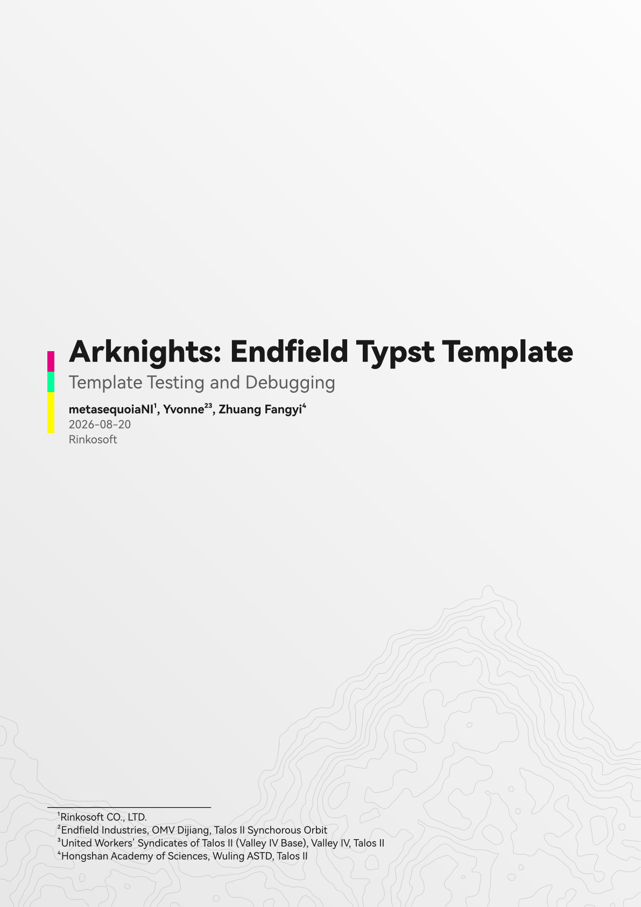
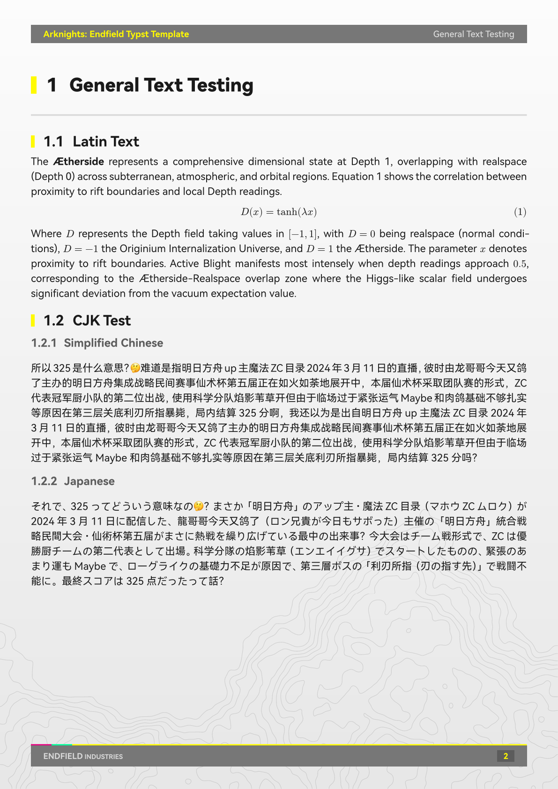
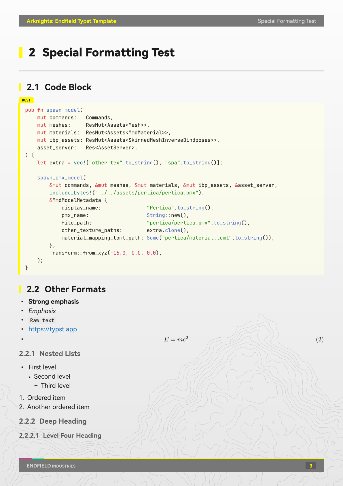
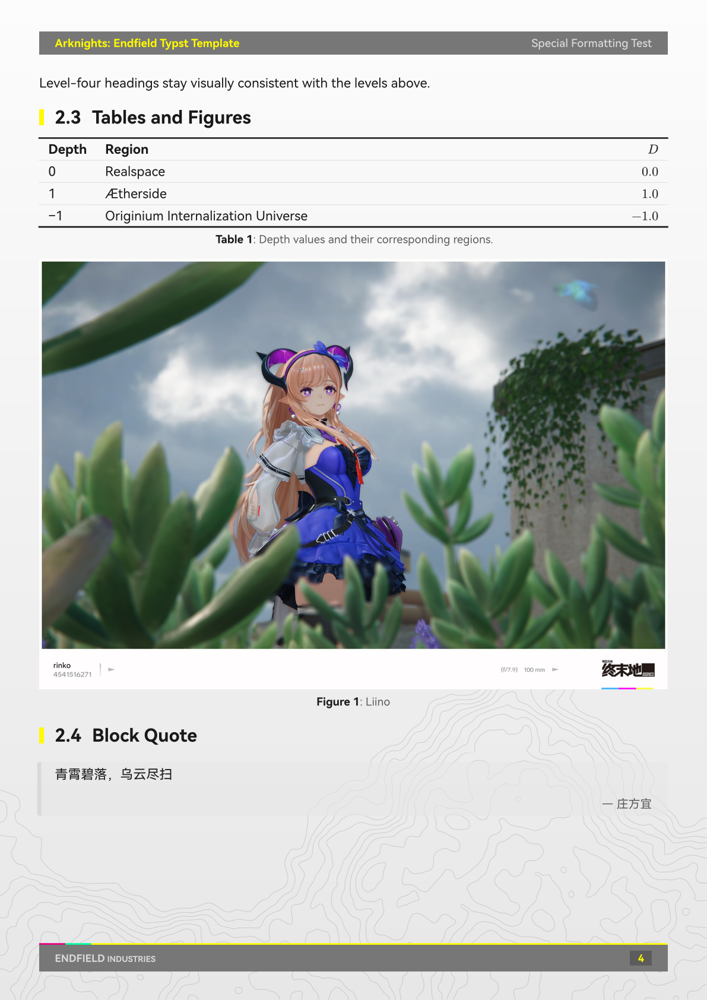

A Typst document template styled after [*Arknights: Endfield*](https://endfield.gryphline.com/en-us#operator) by Hypergryph. Mainly designed for A4 document.

## Preview



<table>
  <tr>
    <td></td>
    <td></td>
    <td></td>
  </tr>
</table>

## Usage

Initialize a new project from the template:

```
typst init @preview/endfield-doc:0.1.2
```

Or import the template directly in an existing file:

```typst
#import "@preview/endfield-doc:0.1.2": endfield-doc

#show: endfield-doc.with(
  title:       [Document Title],
  subtitle:    [Subtitle],
  author:      [Author Name],
  date:        datetime.today().display("[year]-[month]-[day]"),
  institution: [Institution],
  doc-footer:  [Your Organization],
  lang:        "zh",
  region:      "cn",
)

= Introduction

Your document begins here. Text flows automatically across pages.

== A subsection

Level-2 and level-3 headings are also supported.

=== A third-level heading

Inline `code` and block code are styled automatically.

Math equations work out of the box:

$ E = m c^2 $
```

## Parameters

All parameters of `endfield-doc` are optional and have sensible defaults.

| Parameter | Type | Default | Description |
|---|---|---|---|
| `title` | content | `[Document Title]` | Document title — shown on the cover page and in every page header. |
| `subtitle` | content / `none` | `none` | Subtitle shown below the title on the cover page. |
| `author` | content / `none` | `none` | Author(s) shown on the cover page. Footnotes are supported. |
| `date` | content / `none` | `none` | Date shown on the cover page. |
| `institution` | content / `none` | `none` | Institution shown on the cover page. |
| `paper` | string | `"a4"` | Paper size passed to Typst's `page()`. Any Typst-supported value is accepted (e.g. `"a5"`, `"b5"`, `"us-letter"`). See [Known Limitations](#known-limitations). |
| `doc-footer` | content | `[ENDFIELD INDUSTRIES]` | Text shown on the left side of the footer bar. |
| `lang` | string | `"zh"` | Document language (passed to `set text`). Also selects the default table-of-contents title. |
| `region` | string | `"cn"` | Document region (passed to `set text`). |
| `font-cjk` | array | `("HarmonyOS Sans SC", "HarmonyOS Sans")` | CJK font fallback list. |
| `font-latin` | array | `("HarmonyOS Sans",)` | Latin font fallback list. |
| `font-code` | array | `("JetBrains Mono",)` | Monospace font fallback list for code blocks. |
| `font-emoji` | array | `("Apple Color Emoji", "Segoe UI Emoji", "Noto Color Emoji", "Noto Emoji")` | Emoji font fallback list. Covers macOS / Windows / Linux; families that are not installed are skipped (Typst emits a harmless warning). |
| `font-size` | length | `11pt` | Base body font size. |
| `cover` | bool | `true` | Whether to render the cover page. |
| `outline` | bool | `true` | Whether to render the table of contents. |
| `outline-title` | content / `auto` | `auto` | Table-of-contents heading. `auto` picks a title based on `lang`. |
| `heading-pagebreak` | bool | `true` | Whether each level-1 heading starts a new page.<br>**Note: Setting to false is not recommended and may cause mismatch between actual content and header bars.**|
| `page-numbering` | string / `none` | `"1"` | Page numbering pattern used in the footer (e.g. `"i"`, `"1"`). `none` hides the number. |
| `equation-numbering` | string / `none` | `none` | Numbering pattern for block equations, e.g. `"(1)"`. Required if you want to reference equations. |

The document `title` and `author` are also written into the PDF metadata.

## Known Limitations

- **Page size**: the template is designed and visually tuned for A4. Passing a different `paper` value (e.g. `"a5"`) is supported but margins, font sizes, and spacing are not automatically rescaled. Manual adjustments are recommended for non-A4 sizes.
- **CJK emphasis**: most CJK typefaces ship no italic, and a synthesised slant looks wrong for Han glyphs. `_emphasis_` is therefore rendered as bold for CJK runs, while Latin text keeps real italics. Note that `HarmonyOS Sans SC` also covers Latin without providing an italic face, so the template explicitly prefers `font-latin` inside emphasis; keep a Latin family with a real italic in that list.

## License

MIT License. See [LICENSE](LICENSE) for details.

## Acknowledgements

- *Arknights: Endfield* by Hypergryph
- *typst-touying-theme-endfield* by [@leostudiooo](https://github.com/leostudiooo/typst-touying-theme-endfield)

## Contributors

- [PR#1 by Himalian](https://github.com/Ives-Natsume/typst-endfield-doc-theme/pull/1#issue-4838705237)
