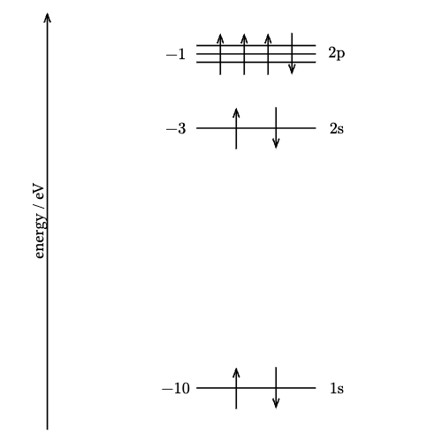
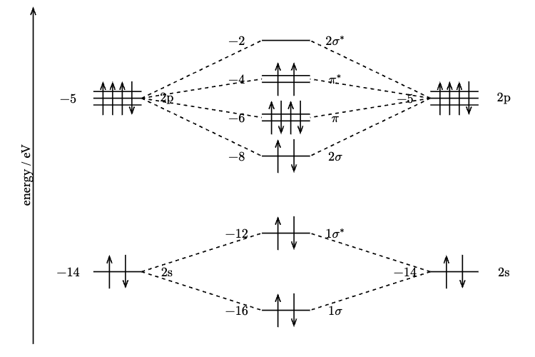
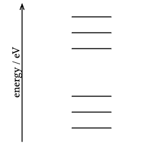

# Energy-Dia

[日本語版](README.ja.md)

**Energy-Dia** is a powerful and intuitive Typst library for creating professional energy diagrams in chemistry and physics. Built on top of CeTZ, it makes drawing atomic orbitals, molecular orbitals, and band structures effortless and beautiful.

## Features

- **Atomic Orbital Diagrams (AO)**: Visualize energy levels and electron configurations with support for degeneracy and spin states
- **Molecular Orbital Diagrams (MO)**: Create comprehensive MO diagrams with orbital mixing and electron distribution
- **Band Structure Diagrams**: Plot band structures quickly with minimal code
- **Customizable**: Full control over diagram size, labels, and styling
- **Simple Syntax**: Intuitive API that's easy to learn and use

## Quick Start

### Installation

```typst
#import "@preview/energy-dia:0.1.0": *
```

### Simple Example

```typst
#ao(
  width: 10,
  height: 10,
  (energy: -10, electrons: 2, caption: "1s"),
  (energy: -3, electrons: 2, caption: "2s"),
  (energy: -1, electrons: 4, degeneracy: 3, up: 3, caption: "2p"),
)
```

## Usage Guide

### Atomic Orbital Diagrams (AO)

Create energy level diagrams for atomic orbitals with electron configurations.

#### Basic Syntax

```typst
#ao(
  width: 10,
  height: 10,
  name: "C",
  exclude_energy: false,
  (energy: -10, electrons: 2, caption: "1s"),
  (energy: -3, electrons: 2, caption: "2s"),
  (energy: -1, electrons: 4, degeneracy: 3, up: 3, caption: "2p"),
)
```

#### Parameters

**Diagram settings:**
- `width` (length): Width of the diagram (default: 5)
- `height` (length): Height of the diagram (default: 5)
- `name` (string): Atom name to display (default: none)
- `exclude_energy` (boolean): Hide energy values (default: false)

**Orbital levels** (positional arguments, each as a dictionary):
- `energy` (number): Energy value of the orbital
- `electrons` (number): Number of electrons (default: 0)
- `degeneracy` (number): Degeneracy of the orbital (default: 1)
- `caption` (string): Label for the orbital (default: none)
- `up` (number): Number of spin-up electrons (optional; if not specified, electrons alternate between up and down spins)

---

### Molecular Orbital Diagrams (MO)

Visualize molecular orbital formation from atomic orbitals with orbital mixing.

#### Basic Syntax

```typst
#mo(
  width: 15,
  height: 10,
  names: ("O", $"O"_2$ , "O"),
  exclude_energy: false,
  atom1: (
    (energy: -14, electrons: 2, label: 1, caption: "2s"),
    (energy: -5, electrons: 4, degeneracy: 3, up: 3, label: 2, caption: "2p"),
  ),
  molecule: (
    (energy: -16, electrons: 2, label: 3, caption: [$1sigma$]),
    (energy: -12, electrons: 2, label: 4, caption: [$1sigma^*$]),
    (energy: -8, electrons: 2, label: 5, caption: [$2sigma$]),
    (energy: -6, electrons: 4, degeneracy: 2, label: 7, caption: [$pi$]),
    (energy: -4, electrons: 2, degeneracy: 2, up: 2, label: 8, caption: [$pi^*$]),
    (energy: -2, electrons: 0, label: 6, caption: [$2sigma^*$]),
  ),
  atom2: (
    (energy: -14, electrons: 2, label: 9, caption: "2s"),
    (energy: -5, electrons: 4, degeneracy: 3, up: 3, label: 10, caption: "2p"),
  ),
  (1, 3), (1, 4), (2, 5), (2, 7), (2, 8), (2, 6),
  (9, 3), (9, 4), (10, 5), (10, 7), (10, 8), (10, 6)
)
```

#### Parameters

**Diagram settings:**
- `width` (length): Width of the diagram (default: 5)
- `height` (length): Height of the diagram (default: 5)
- `names` (array): Names for left atom, molecule, and right atom (default: ())
- `exclude_energy` (boolean): Hide energy labels (default: false)

**Orbital data:**
- `atom1` (array): Orbitals for left atom
- `molecule` (array): Molecular orbitals
- `atom2` (array): Orbitals for right atom

Each orbital is a dictionary with:
- `energy` (number): Energy value
- `electrons` (number): Number of electrons (default: 0)
- `degeneracy` (number): Degeneracy (default: 1)
- `caption` (string): Label (default: none)
- `up` (number): Number of spin-up electrons (optional)
- `label` (number): Unique identifier for connections

**Connections** (positional arguments):
Tuples like `(1, 3)` connect orbitals with labels 1 and 3 using dashed lines.

**Important:** Each orbital array (`atom1`, `atom2`, `molecule`) must be an array, even for a single orbital. Don't forget the trailing comma: `((energy: -5, electrons: 1),)`

---

### Band Structure Diagrams

Plot energy diagram with minimal syntax—ideal-perfect for band structures, which have many orbitals

#### Basic Syntax

```typst
#band(
  width: 5,
  height: 5,
  name: "Si",
  include_energy_labels: true,
  -5, -4, -3, 0, 1, 2
)
```

#### From CSV Data

```typst
#let data = csv("test.csv")
#let energies = data.map(row => float(row.at(0))).flatten()
#band(
  include_energy_labels: false,
  ..energies
)
```

#### Parameters

- `width` (length): Width of the diagram (default: 5)
- `height` (length): Height of the diagram (default: 5)
- `name` (string): Substance name to display (default: none)
- `include_energy_labels` (boolean): Show energy values (default: false)
- Positional arguments: Energy level values

## Examples

### Atomic Orbital Diagram



### Molecular Orbital Diagram



### Band Structure Diagram



**See [demo.typ](demo/demo.typ) for complete working examples!**

## Dependencies

- **[CeTZ](https://github.com/cetz-package/cetz)** v0.4.2 - Drawing library (LGPL-3.0)

## License

This project is licensed under the **GNU General Public License v3.0**. See [LICENSE](LICENSE) for details.

## Contributing

Contributions are welcome! Feel free to open issues or submit pull requests.