# enja-bib
日本語／英語文献 Typstパッケージ

A package for handling BibTeX that includes both English and Japanese.
Licensed under MIT.

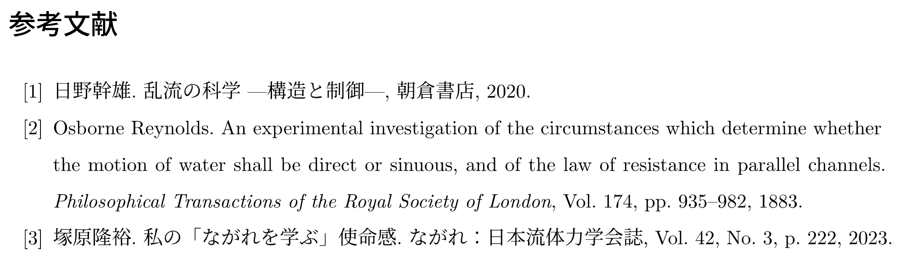

<details><summary>コード</summary>

```typst
#import "@preview/js:0.1.3": *
#import "@preview/enja-bib:0.2.0": *

#show: js
#import bib-setting-plain: *
#show: bib-init


#let bib-text = "
@article{Reynolds:PhilTransRoySoc1883,
    author  = {Reynolds, Osborne},
    title   = {An experimental investigation of the circumstances which determine whether the motion of water shall be direct or sinuous, and of the law of resistance in parallel channels},
    journal = {Philosophical Transactions of the Royal Society of London},
    volume  = {174},
    number  = {},
    pages   = {935--982},
    year    = {1883},
    doi     = {10.1098/rstl.1883.0029},
    url     = {https://royalsocietypublishing.org/doi/abs/10.1098/rstl.1883.0029}
}

@article{塚原:ながれ2023,
    author  = {塚原, 隆裕},
    yomi    = {Tsukahara, Takahiro},
    title   = {私の「ながれを学ぶ」使命感},
    journal = {ながれ：日本流体力学会誌},
    volume  = {42},
    number  = {3},
    pages   = {222},
    year    = {2023},
    url     = {https://www.nagare.or.jp/publication/nagare/archive/2023/3.html},
}

@book{日野:朝倉2020,
    author      = {日野, 幹雄},
    yomi        = {Hino, Mikio},
    title       = {乱流の科学 ---構造と制御---},
    publisher   = {朝倉書店},
    year        = {2020}
}
"

#bibliography-list(
  ..bib-file(bib-text)
)


```

</details>

## 本パッケージの特徴

- 日本語文献と英語文献が混在した文書に対応
    - 日本語文献と英語文献で異なる設定が可能
    - yomiフィールドの利用で，日本語文献のアルファベット順に並び替えが可能．フィールドがない場合でも自動判定可能
- typstで使用される`bibliography`関数を使用しないため，CSLファイルによる設定が不要（代わりに`toml`ファイルで設定）
- 文中のどこでも引用が可能（`citet`，`citep`関数などが利用可能）
- 「アルファベット順並び替え／リスト順」「引用文献のみ／全て表示」「バンクーバー／ハーバード方式表示」の切り替えが可能

> それぞれの関数に引数を加えることで，デフォルトのスタイルの一部を簡単に変更できます．
> 変更方法は以下を参照．

## パッケージの使い方

### Typst Universeを使用する方法

1. 自分のtypstファイルの最初の方に以下を追記
    ```typst
    #import "@preview/enja-bib:0.2.0": *
    #import bib-setting-plain: *
    #show: bib-init
    ```

### フォルダを直接コピーする方法

1. `bib-style`フォルダを自分のディレクトリにコピー
1. 自分のtypstファイルの最初の方に以下を追記
    ```typst
    #import "bib-style/lib.typ": *
    #import bib-setting-plain: *
    #show: bib-init
    ```
1. 自分のtypstファイルの中で文献を挿入したい部分に，`bibliography-list`関数を利用して文献を書く
    ```typst
    #bibliography-list(
        ..bib-file(read("mybib_jp.bib")),
    )
    ```

> 現在すぐに使用可能なスタイル一覧
> - `bib-setting-plain`：bibtexの`jplain`を再現したスタイル
>   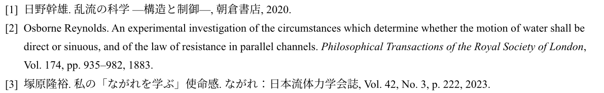
> - `bib-setting-junsrt`：標準日本語スタイル `junsrt`（引用順）
>   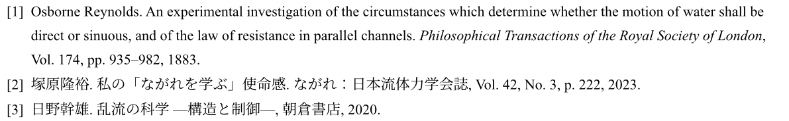
> - `bib-setting-jabbrv`：標準日本語スタイル `jabbrv`（欧文著者名を省略）
>   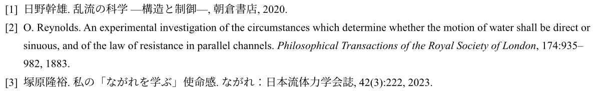
> - `bib-setting-jalpha`：標準日本語スタイル `jalpha`（著者・年ラベル）
>   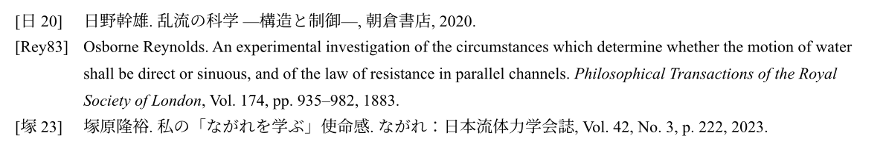
> - `bib-setting-jname`：標準日本語スタイル `jname`（著者名ラベル）
>   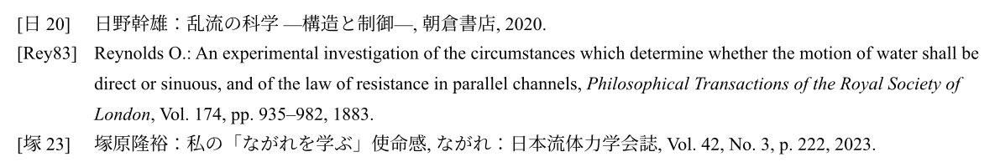
> - `bib-setting-jipsj`：情報処理学会欧文論文誌スタイル `jipsj`
>   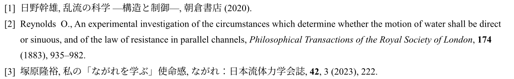
> - `bib-setting-jorsj`：日本オペレーションズ・リサーチ学会論文誌スタイル `jorsj`
>   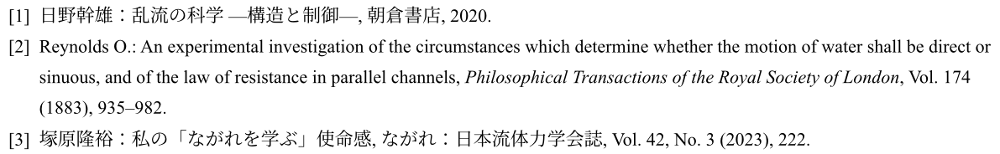
> - `bib-setting-jsme`：日本機械学会の引用を再現したスタイル
>   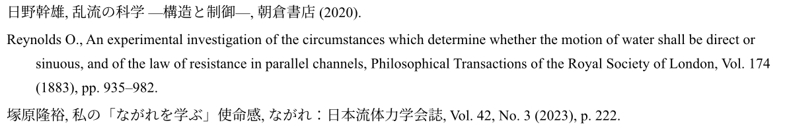
> - `bib-setting-tieice`：電子情報通信学会論文誌スタイル `tieice`
>   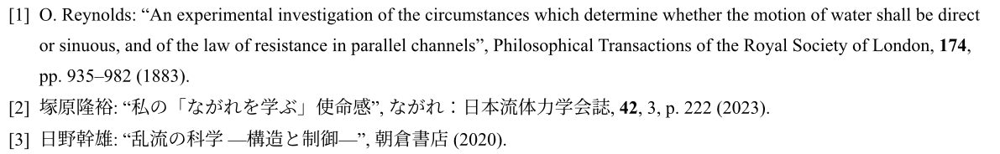
> - `bib-setting-tipsj`：情報処理学会論文誌スタイル `tipsj`
>   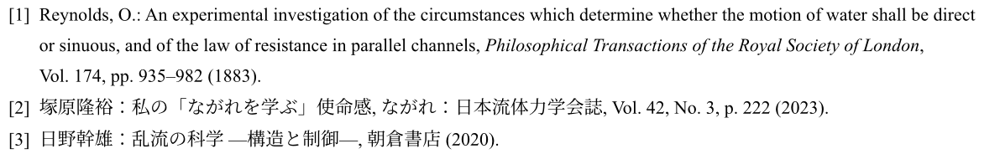

## それぞれの関数の使い方

### `bibliography-list`関数

この関数の中に，`bib-file`，または`bib-item`関数を入れる．
それぞれの文献ごとにカンマで区切ること．

```typst
#bibliography-list(
  ..bib-file(read("mybib_jp.bib")),
  bib-item(
    label: <Reynolds:PhilTransRoySoc1883>,
    author: "Reynolds",
    year: "1883",
    yomi: "reynolds, o.",
    (
        [Reynolds, O., An experimental investigation of the circumstances which determine whether the motion of water shall be direct or sinuous, and of the law of resistance in parallel channels, Philosophical Transactions of the Royal Society of London (1883],
        [), Vol. 174, pp. 935–982]
    )
  ),
  //...複数の項目を追加可能
)
```

任意引数
- `title` : 文献タイトル（デフォルト：日本語環境：`参考文献`，英語環境：`Bibliography`）
- `bib-sort` : 文献をアルファベット順にソートするか（デフォルト：`false`）
- `bib-sort-ref` : 文献を引用順にソートするか（デフォルト：`false`）
- `bib-full` : 引用されている文献だけでなく全ての文献を表示するか（デフォルト：`false`）
- `bib-vancouver` : vancouverスタイル設定時の番号付け（デフォルト：`(1)`）
- `vancouver-style` : vancouverスタイルにするか（デフォルト：`false`）
- `bib-year-doubling` : 重複著者・年号文献を区別するために表示する文字列（デフォルト：`a`）
- `bib-vancouver-manual` : `bib-vancouver = "manual"`のときの設定（デフォルト：`""`）
- `hanging-indent` : 文献リストのインデント（デフォルト：`2em`）
- `year-doubling` : 文献リストの年号の後に付与する特殊文字列（デフォルト：`""`）


### `bib-file`関数

`.bib`形式のファイルを読み込む

例：
```typst
#bibliography-list(
  ..bib-file(read("mybib_jp.bib")),
)
```

`bib-file`関数には，`read`で囲われた`.bib`ファイル名を入れる

> `bib-file`関数は複数文献の配列として返すため，`..`の記述が**必須**であることに注意

### `bib-item`関数

`bib-file`関数の代わりに，文献を直書きする

例：
```typst
#bibliography-list(
  bib-item(
      label: <Reynolds:PhilTransRoySoc1883>,
      author: "Reynolds",
      year: "1883",
      yomi: "reynolds, o.",
      (
          [Reynolds, O., An experimental investigation of the circumstances which determine whether the motion of water shall be direct or sinuous, and of the law of resistance in parallel channels, Philosophical Transactions of the Royal Society of London (1883],
          [), Vol. 174, pp. 935–982]
      )
  ),
)
```

直書き要素には，`content`型か`array`型を利用する．
`array`型では直書き成分を上記のように2つに分けることで，その間に`year-doubling`が設定される．

引数
- `label` : ラベル（引用する際には必須）
- `author` : 著者名（引用時・重複判別に用いられる）
- `year` : 年（引用時・重複判別に用いられる）
- `yomi` : 読み（並び替えに用いられる）

### `citet`，`citep`，`citen`, `citefull`関数

文中で引用するときに使用する関数．`@...`のように書いても引用できるが，
```typst
 #citet(<Reynolds:PhilTransRoySoc1883>)
```
のように書くことで引用も可能．
それぞれの関数は，複数の文献入力にも対応（例：`#citet(<Reynolds:PhilTransRoySoc1883>, <Matsukawa:ICFD2022>)`）

異なる引用形式が必要な場合には，下記の方法に従って新たに設定が可能

---

## 独自のスタイルを適用する方法

上記に示したスタイル以外の独自スタイルを適用する場合は，カスタムした`.toml`ファイルを作成し，`set-style`関数で読み込む．

```typst
#let (bib-init, bibliography-list, bib-tex, bib-file, bib-item, citet, citep, citen, citefull) = set-style(toml("custom.toml"))
```

### `toml`ファイルの書き方

`toml`ファイルは，`src/bib-setting-custom/*.toml`を参考にして作成すると良い．

#### 項目

パラメータ

- `year-doubling` : 著者・年が同じ文献がある場合に番号を付与するため，その番号を付与する位置を指定する特殊文字列（例：`"%year-doubling"`）
- `bib-sort`：アルファベット順に並び替えるかどうか（`true` or `false`）
- `bib-sort-ref`：引用順に並び替えるかどうか（`true` or `false`）
- `bib-full`：引用されていない文献も表示するかどうか（`true` or `false`）
- `bib-vancouver`：vancouverスタイルの番号付けの形式（例：`"[1]"`）
- `vancouver-style`：vancouverスタイルにするかどうか（`true` or `false`）
- `bib-year-doubling`：重複著者・年号文献を区別するために表示する文字列（例：`"a"`）
- `sentence-case-titles`：文献タイトルを文頭大文字にするかどうか（`true` or `false`）

---
`cite`スタイルの設定

- `bib-cite-author`：citeで出力する著者名を出力する関数名（例：`"author-set-cite"`）
- `bib-cite-year`：citeで出力する年を出力する関数名（例：`"year-set-cite"`）

`bib-vancouver = "manual"`のときの設定

- `bib-vancouver-manual`：`bib-vancouver = "manual"`の番号付けをする関数名（例：`"bib-vancouver-manual-default"`）

> `bib-vancouver-manual`は，`bib-vancouver = "manual"`出ない場合でも定義が必須である．
> この場合は，`"bib-vancouver-manual-default"`を指定しておけば良い．

---
各引用の表示形式設定

```toml
[cite]
    bib-cite = ["[", "bib-citen-default", ", ", "]"]
    bib-citet = ["", "bib-citet-default", "; ", ""]
    bib-citep = ["(", "bib-citep-default", "; ", ")"]
    bib-citen = ["[", "bib-citen-default", ", ", "]"]
    bib-citefull = ["", "bib-citefull-default", "; ", ""]
```

- 各項目の意味は以下の通り
    - `bib-cite`：`@...`形式の出力形式設定
    - `bib-citet`：`citet`関数の出力形式設定
    - `bib-citep`：`citep`関数の出力形式設定
    - `bib-citen`：`citen`関数の出力形式設定
    - `bib-citefull`：`citefull`関数の出力形式設定
- 各項目は，4つの要素を持つ配列で定義する
    - 1つ目：引用の前に付与する文字列（例：`[`）
    - 2つ目：引用に用いる関数名（例：`"bib-citen-default"`）
    - 3つ目：2つ以上引用された場合，その間に付与する文字列（例：`, `）
    - 4つ目：引用の後に付与する文字列（例：`]`）

---
各要素の表示形式設定

```toml
[entry.article]
    [entry.article.en]
        author = ["", "", "author-set3", "", ". ", [], "."]
        title = ["", "", "all-return", "", ". ", [], "."]
        journal = ["", "", "all-emph", "", ", ", [], "."]
        volume = ["", "Vol. ", "all-return", "", ", ", [], "."]
        number = ["", "No. ", "all-return", "", ", ", [], ")."]
        pages = ["", "", "page-set", "", ", ", [], "."]
        month = ["", "", "all-return", "", ". ", [], "."]
        year = [" ", "", "all-return", "%year-doubling", ". ", ["month"], "%year-doubling."]
        note = ["", "", "all-return", "", ", ", [], "."]
    [entry.article.ja]
        author = ["", "", "author-set3", "", ". ", [], "."]
        title = ["", "", "all-return", "", ". ", [], "."]
        journal = ["", "", "all-return", "", ", ", [], "."]
        volume = ["", "Vol. ", "all-return", "", ", ", [], "."]
        number = ["", "No. ", "all-return", "", ", ", [], ")."]
        pages = ["", "", "page-set", "", ", ", [], "."]
        month = ["", "", "all-return", "", ". ", [], "."]
        year = [" ", "", "all-return", "%year-doubling", ". ", ["month"], "%year-doubling."]
        note = ["", "", "all-return", "", ", ", [], "."]
```

- `entry.article`：article型の文献の表示形式設定．`article`型以外の文献は，`entry.book`，`entry.inproceedings`などを自身で定義することで，設定可能
- 各エントリ内には`en`と`ja`の2つの設定を入れる
  - `[entry.article.en]`：article型の英語文献の表示形式設定
  - `[entry.article.ja]`：article型の日本語文献の表示形式
- `[entry.article.en]`や`[entry.article.ja]`の中には，文献の各要素（author，title，journal...）などのフィールドを定義する．定義順がそのまま表示順になる
  - 各フィールドは，7つの要素を持つ配列で定義する
    - 1つ目：直前の項目がフィールド名Aのとき，直前の語尾文字列Bを削除して置き換える文字列（例：`" "`）
    - 2つ目：必ず出力する先頭文字列（例：`"("`）
    - 3つ目：項目を出力する関数名（例：`"all-return"`）
    - 4つ目：最後の項目でない限り必ず出力される語尾文字列（例：`"%year-doubling)"`）
    - 5つ目：語尾文字列B（例：`", "`）
    - 6つ目：フィールド名A（例：`["month"]`）
    - 7つ目：最後の項目のとき出力される語尾文字列（例：`"%year-doubling)."`）

#### 関数名

事前に定義されている関数は，以下の通り．

引用の表示形式設定に用いる関数
- `bib-vancouver-manual-default`：`manual`のときのvancouverスタイル番号付け標準形式
- `bib-citet-default`：`citet`関数の標準形式
- `bib-citep-default`：`citep`関数の標準形式
- `bib-citen-default`：`citen`関数の標準形式
- `bib-cite-alpha`：`manual`のときのアルファベット順番号付け標準形式
- `bib-citefull-default`：`citefull`関数の標準形式
- `bib-cite-authoronly`：著者名のみ返す関数
- `bib-cite-yearonly`：年号のみ返す関数

---

フィールドの表示形式設定に用いる関数
- `all-return`：フィールドの内容をそのまま返す関数
- `all-bold`： フィールドの内容を太字にして返す関数
- `all-emph`： フィールドの内容を斜体にして返す関数
- `author-set`： 項目を著者型にして返す関数(英語：`Reynolds, Osborne` → `Reynolds O.`)
- `author-set2`： 項目を著者型にして返す関数(英語：`Reynolds, Osborne` → `O, Reynolds`)
- `author-set3`： 項目を著者型にして返す関数(英語：`Reynolds, Osborne` → `Osborne, Reynolds`)
- `author-set4`： 項目を著者型にして返す関数(英語：`Reynolds, Osborne` → `O. Reynolds`)
- `author-set5`： 項目を著者型にして返す関数(英語：`Reynolds, Osborne` → `REYNOLDS O`)
- `author-set6`： 項目を著者型にして返す関数(英語：`Reynolds, Osborne` → `Reynolds, O.`)
- `author-set-cite`： 項目を`cite`の著者型にして返す関数
- `set-url`： URLかDOIのリンク付きで返す関数
- `page-set`： 頁数を`pp.`付きで返す関数
- `page-set-without-p`： 頁数を`pp.`なしで返す関数

---

自ら定義する関数を追加する場合は，作成した関数と名前を辞書配列にして，`set-style`関数の引数`add-utils`に渡すことで，独自の関数を追加することが可能．

```typst
#let (bib-init, bibliography-list, bib-tex, bib-file, bib-item, citet, citep, citen, citefull) = set-style(
  toml("custom.toml"),
  add-utils: (
      "my-func1": my-func1,
      "my-func2": my-func2,
      //...複数の関数を追加可能
  )
)
```
