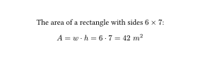
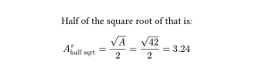
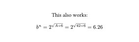

An *eq*uation *run*ner.
You pass an equation through the library, it reads all the variables mentioned in it,
inserts their values, returns the equation with its result and saves that result as a variable.
Then you can use that variable as an input for the next equation.

## Usage

Create the runner providing the initial inputs:

```typst
#import "@preview/eqrun:0.1.1": eqrun-builder

#let init = (
  w: 6,
  h: 7,
)
#let eqrun = eqrun-builder(init)

The area of a rectangle with sides $#init.w times #init.h$:
```

Write an equation and pass it to the runner, optionally specifying the unit:

```typst
#eqrun($A = w dot h$, unit: $m^2$)
```


Now you can use the new variable in other equations:

```typst
Half of the square root of that is:
#eqrun($A^tau_"half sqrt" = sqrt(A) / 2$)
```


And get all the variables out of the runner:
```typst
#context [
  #let state = eqrun()
  A: #state.A\
  A half sqrt that: #state.A-half-sqrt-tau
]
```


You can also change how much it rounds, the default is 2.
It can be specified in the `eqrun-builder` or here:
```typst
Changing the precision:
#eqrun($tau = 2.019 / 2$, precision: 4)
```


Powers and superscript work as you would expect:

```typst
This also works:
#eqrun($b^n = 2^sqrt(A div 6)$)
```



## Contributing

If you find something that doesn't work, please open an issue describing how to reproduce the bug.

You can also try running in debug mode to figure out what's wrong:
```typst
#let eqrun = eqrun-builder(init, debug: true)
```
