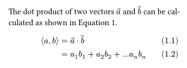
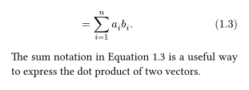

# equate
A package for improved layout of equations and mathematical expressions.

When applied, this package will split up multi-line block equations into multiple elements, so that each line can be assigned a separate number. By default, the equation counter is incremented for each line, but this behavior can be changed by setting the `sub-numbering` argument to `true`. In this case, the equation counter will only be incremented once for the entire block, and each line will be assigned a sub-number like `1a`, `2.1`, or similar, depending on the set equation numbering. You can also set the `number-mode` argument to `"label"` to only number labelled lines. If the label is applied to the full equation, all lines will be numbered.

This splitting also makes it possible to spread equations over page boundaries while keeping alignment in place, which can be useful for long derivations or proofs. Additionally, the alignment of the equation number is improved, so that it always matches the baseline of the equation.

If you want to create a "standard" equation with a single equation number centered across all lines, you can attach the `<equate:revoke>` label to the equation. This will disable the effect of this package for the current equation.

## Usage
The package comes with a single `equate` function that is supposed to be used as a template. It takes two optional arguments for customization:

| Argument        | Type                | Description                                                | Default  |
| --------------- | ------------------- | ---------------------------------------------------------- | -------- |
| `sub-numbering` | `boolean`           | Whether to assign sub-numbers to each line of an equation. | `false`  |
| `number-mode`   | `"line"`, `"label"` | Whether to number all lines or only those with a label.    | `"line"` |

To reference a specific line of an equation, include the label at the end of the line, like in the following example:

```typ
#import "@preview/equate:0.1.0": equate

#show: equate.with(sub-numbering: true)
#set math.equation(numbering: "(1.1)")

The dot product of two vectors $arrow(a)$ and $arrow(b)$ can
be calculated as shown in @dot-product.

$
  angle.l a, b angle.r &= arrow(a) dot arrow(b) \
                       &= a_1 b_1 + a_2 b_2 + ... a_n b_n \
                       &= sum_(i=1)^n a_i b_i. #<sum>
$ <dot-product>

The sum notation in @sum is a useful way to express the dot
product of two vectors.
```

  

