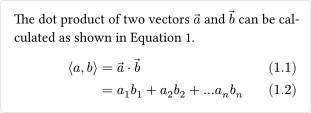
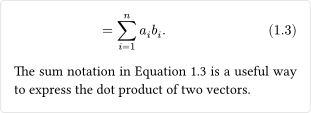

# equate

A package for various enhancements for mathematical expressions.

## Usage

The main function of this package is `equate`, which can be applied in a show-all rule to enable the package features for all equations. The function takes a single positional argument (for the body of the show rule), and several optional keyword arguments for customization:

| Parameter       | Type                | Description                                          | Default  |
| --------------- | ------------------- | ---------------------------------------------------- | -------- |
| `breakable`     | `boolean`, `auto`   | Whether equations can break across pages or columns. | `auto`   |
| `sub-numbering` | `boolean`           | Whether to assign sub-numbers to each equation line. | `false`  |
| `number-mode`   | `"line"`, `"label"` | Which lines of the equation to number.               | `"line"` |

Some notes about these parameters:

- Starting from Typst v0.12.0, there is built-in support for breakable block equations. The `breakable` can still be used to override the default behavior. The value `auto` defers to the `block.breakable` setting in the context of equations.

- When sub-numbering is enabled, the equation numbering format should be set to include the sub-number, such as in `(1.1)`.

- A line can be labeled by inserting a label in code mode at the end of the line, before the line break, for example:

  ```typ
  $ E &= m c^2 #<short> \
      &= sqrt(p^2 c^2 + m^2 c^4) #<long> $
  ```

In Typst versions prior to v0.12.0, equation numbers were centered in equation blocks, even for single-line equations. This package corrects that behavior by aligning numbers with the baseline of the equation lines instead. Typst v0.12.0 has an internal fix for this, but the package's layout adjustments remain in place for backward compatibility with earlier versions.

### The revoke label

The `<equate:revoke>` label can be used on an equation or a specific equation line for the following purposes:

- **For an entire equation:** Disables the package features, allowing you to revert to per-block numbering.

- **For equations in [shared alignment blocks](#shared-alignment-points):** The label will additionally ensure that the equation does not share alignment points with other equations in the block.

- **For a specific line:** Disables numbering on that line. This can be useful when `number-mode` is set to `"line"`, but you wish to exclude certain lines from being numbered.

> **Note:** As Typst currently does not support attaching multiple labels to the same element, using the revoke label means that no other label can be added to the same line or equation.

### Shared Alignment Points

In some cases, you may want to interrupt a multi-line equation with a paragraph of text or other elements. To ensure that equations after the interruption maintain alignment with the previous ones, you can use the `share-align` function to create a shared alignment block. This will make all block equations within the block share their alignment points. Any nested shared alignment blocks will be treated as separate blocks and will not share alignment points with the parent block or with each other.

> **Note:** Sub-numbering is not yet continued across equations in this block, so each new equation will get a new main number.

### Scoped Usage

If you want to use the package features on selected equations only, you can skip the show-all rule and apply the `equate` function directly to individual equations. As the package requires the use of a show rule on the `ref` element for line-specific references, you will also need to use the `equate` function either as a show rule on references, or directly on the reference or label itself.

### Performance Considerations

Since this package reimplements the equation alignment system in pure Typst, it may impact performance due to the high number of measurements and layout passes required. It is recommended to use the package sparingly, especially in large documents with many equations.

## Example

```typ
#import "@preview/equate:0.3.1": equate

#show: equate.with(breakable: true, sub-numbering: true)
#set math.equation(numbering: "(1.1)")

The dot product of two vectors $arrow(a)$ and $arrow(b)$ can
be calculated as shown in @dot-product.

$
  angle.l a, b angle.r &= arrow(a) dot arrow(b) \
                       &= a_1 b_1 + a_2 b_2 + ... a_n b_n \
                       &= sum_(i=1)^n a_i b_i. #<sum>
$ <dot-product>

The sum notation in @sum is a useful way to express the dot
product of two vectors.
```

  

