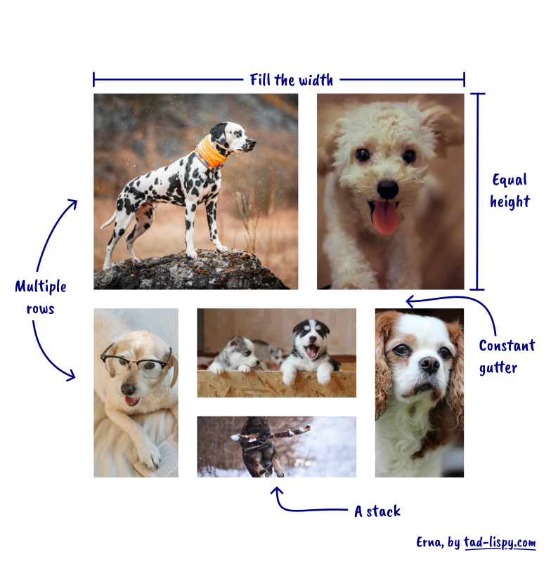

Erna
=====

Erna places her images in neat rows. It's a [Typst](https://typst.app/) library.

Erna is a Typst library for aligning images in neat rows. It's easy to use. I made it for a friend who struggles with aligning images in LibreOffice. It's named after her. With Erna (the library), you can:

  - Cram as many images as you see fit!
  - Bravely mix sizes, resolutions and aspect ratios. Let the computer figure it out!
  - Got some wiiide images? Stack 'em up!

Erna promises to:

  - fill all the available width;
  - arrange the images in a rectangle;
  - preserve all aspect ratios.

See the [preview PDF document](./preview.pdf) for more information.
