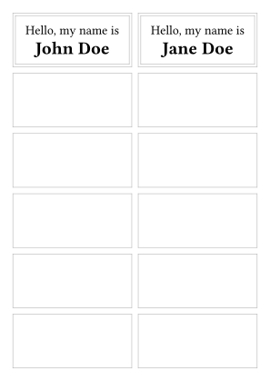

# Etykett

This template helps you print onto label sheets with rectangular grids of labels. It provides you with a grid of rectangular regions that you can draw label content into, potentially customizing the content of each individual label.

The main features are the following:
- configure the page dimensions to match the label sheet from your manufacturer: margins, orientation, number of labels per row and column, gutters between labels
  - "upside-down" support for cases when the paper should be put into the printer flipped 180°
- configure label layout: optional subdivision of labels into sublabels, content orientation (equivalent to [`page.flipped`](https://typst.app/docs/reference/layout/page/#parameters-flipped), but for individual (sub)labels)
  - "debug" mode in which label edges are shown
- apply content to (sub)labels:
  - repeat label contents a specified number of times
  - skip labels that have already been used in a previous print
  - apply a content-creating function to an array of data, taken e.g. from a JSON or CSV file (this is just vanilla Typst)

## Getting Started

Using the Typst web app, you can create a project by e.g. using this link: https://typst.app/?template=etykett&version=latest.

To work locally, use the following command:

```bash
typst init @preview/etykett
```

Usage would the look something like this:


```typ
#import "@preview/etykett:0.1.0"

// maybe load the data for your labels from a file, ignoring the columns header
#let data = csv("data.csv").slice(1)

// define how a label should look
#let name-label((first-name, last-name)) = [
  #set align(center+horizon)
  #set text(14pt)
  Hello, my name is\
  #set text(1.4em)
  *#first-name #last-name*
]

#etykett.labels(
  // define the dimensions of the label sheet you're printing onto
  sheet: etykett.sheet(
    paper: "a6",
    margins: 5mm,
    gutters: (x: 2.5mm),
    rows: 6,
    columns: 2,
  ),
  // when preparing the labels, you can display the label dimensions
  // debug: true,

  // produce the labels for your dataset
  ..data.map(name-label),
)
```

<picture>
  <source media="(prefers-color-scheme: dark)" srcset="./thumbnail-dark.svg">
  
</picture>

## Usage

See the [manual](docs/manual.pdf) for details.
