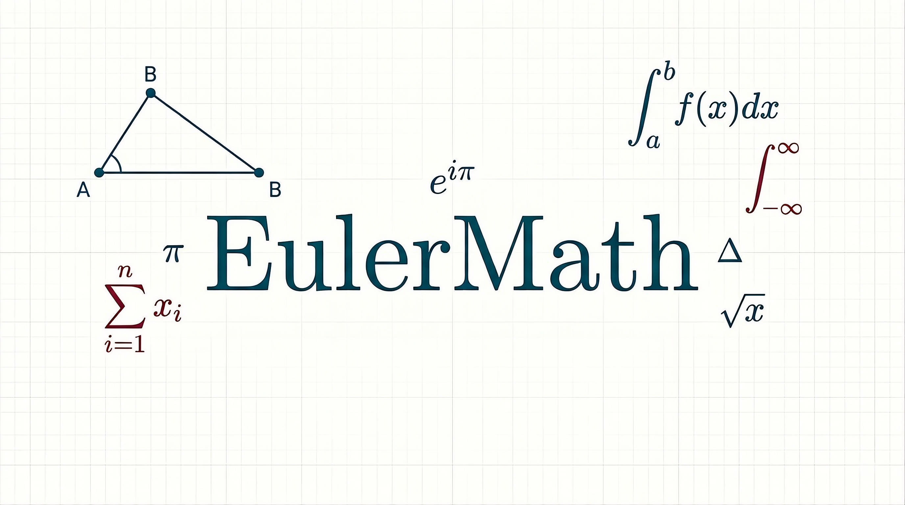
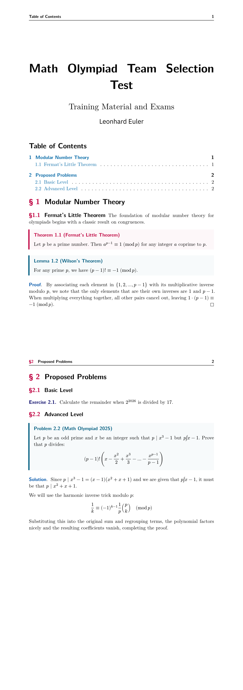

<p align="center">
    
</p>

[EulerMath](https://github.com/gmborjasb/euler-math) is a template for writing Math Olympiad problems, exams, handouts, and solution notes in Typst. 

This package is heavily inspired by the excellent math Olympiad training materials and the renowned [dotfiles by Evan Chen (vEnhance)](https://github.com/vEnhance/dotfiles), bringing that philosophy of efficiency and typographical clarity to the modern Typst ecosystem.

## Features

- **Built for Olympiads:** Specifically designed for the classic format of Math Olympiad problems (IMO, National Olympiads, etc.).
- **Advanced Math Environments:** Native integration with [`theorion`](https://typst.app/universe/package/theorion) for elegant handling of environments (theorems, lemmas, proofs, problems).
- **Minimalism and Clarity:** Clean aesthetic that focuses on mathematical content without distractions.
- **Highly Configurable:** Easily adjustable for short exams, long handouts, or problem sets.

## Quick Start

To use this template in your document, import the package at the top of your `.typ` file and initialize the theme:

```typst
#import "@preview/euler-math:0.1.0": *
```


```typst
// Initialize the template configuration
#show: euler-math-theme.with(
  title: [Math Olympiad Team Selection Test],
  subtitle: [Final Exam],
  author: [Your Name]
)

#problem[
  Let $A B C$ be a triangle with orthocenter $H$. Prove that...
]

#proof[
  We proceed using directed angles modulo $pi$. Note that...
]
```

## Available Environments

Thanks to the `theorion` integration, you can directly use the following commands without additional configuration:

- `#problem[...]` or `#exercise[...]` to state the problem.
- `#theorem[...]`, `#lemma[...]`, `#corollary[...]` for theoretical background.
- `#remark[...]` for claims and notes inside your proofs.

*Note: The visual appearance of each environment has been tweaked to emulate the classic look of LaTeX math handouts.*

## Full Example



```typst
#import "@preview/euler-math:0.1.0": *

// 1. COVER PAGE AND CONFIGURATION
#show: euler-math.with(
  title: [Math Olympiad Team Selection Test],
  subtitle: [Training Material and Exams],
  author: [Leonhard Euler],
)
// Choose the language
#set text(lang: "en")

// 2. TABLE OF CONTENTS
#outline(title: "Table of Contents", indent: auto)

// #pagebreak()

// 3. SECTIONS AND THEORETICAL CONTENT
= Modular Number Theory

== Fermat's Little Theorem
The foundation of modular number theory for olympiads begins with a classic result on congruences.

#theorem(title: "Fermat's Little Theorem")[
  Let $p$ be a prime number. Then $a^(p-1) equiv 1 thick (mod p)$ for any integer $a$ coprime to $p$.
]

#lemma(title: "Wilson's Theorem")[
  For any prime $p$, we have $(p-1)! equiv -1 thick (mod p)$.
]

#proof[
  By associating each element in ${1, 2, ..., p-1}$ with its multiplicative inverse modulo $p$, we note that the only elements that are their own inverses are $1$ and $p-1$. When multiplying everything together, all other pairs cancel out, leaving $1 dot (p-1) equiv -1 thick (mod p)$.
]


// 4. PROBLEMS AND EXERCISES
= Proposed Problems

== Basic Level

#exercise[
  Calculate the remainder when $2^2026$ is divided by $17$.
]

== Advanced Level

#problem(title: "Math Olympiad 2025")[
  Let $p$ be an odd prime and $x$ be an integer such that $p | x^3 - 1$ but $p limits(cancel("|")) x - 1$. 
  Prove that $p$ divides:
  $ (p-1)! ( x - x^2/2 + x^3/3 - dots - x^(p-1)/(p-1) ) $
]

// 5. SOLUTIONS (Using proof or a custom block)
#solution[
  Since $p | x^3 - 1 = (x-1)(x^2+x+1)$ and we are given that $p limits(cancel("|")) x - 1$, it must be that $p | x^2 + x + 1$. 
  
  We will use the harmonic inverse trick modulo $p$:
  $ 1/k equiv (-1)^(k-1) 1/p binom(p, k) quad (mod p) $
  
  Substituting this into the original sum and regrouping terms, the polynomial factors nicely and the resulting coefficients vanish, completing the proof.
]
```

## Contributing

If you want to propose a change, add a new exam style, or report a bug, feel free to open an *Issue* or submit a *Pull Request* on the GitHub repository.

## License

This project is licensed under the MIT License. You are free to use, modify, and distribute this template.
