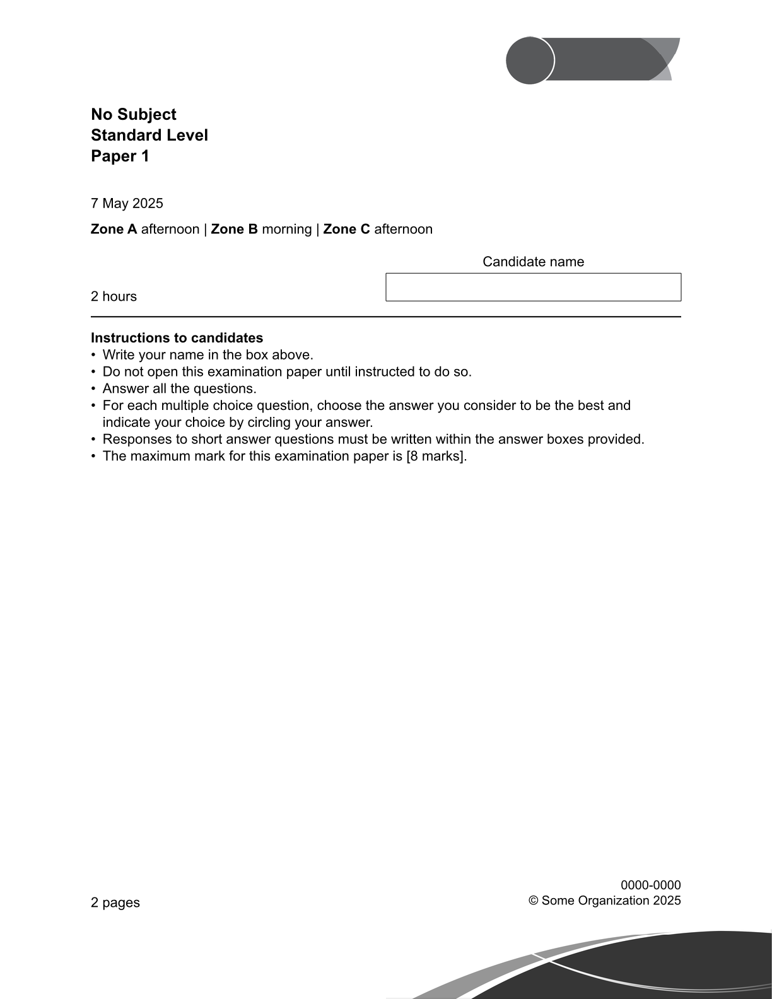
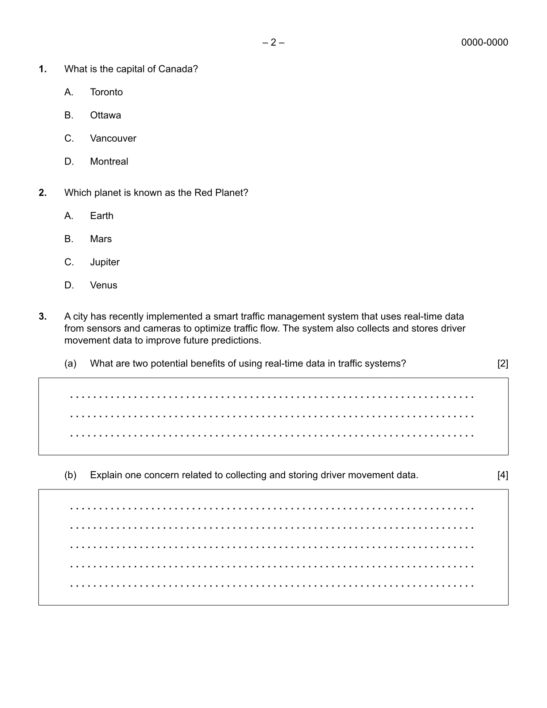

# IB Exam Template (examine-ib)

<div align="center">Version 0.1.1</div>

This is a template for creating exams, tests, quizzes, based on the International Baccalaureate exam formatting for the IB Diploma Programme. This template allows for well formatted multiple choice questions, short answer questions, and title page for exams.

## Example

|          Title Page           |           Questions           |
| :---------------------------: | :---------------------------: |
|  |  |

## Getting Started

```typ
#import "@preview/examine-ib:0.1.1": *

#show: conf.with(exam-id: [0000-0123])
#title-page(
  subject: [General Knowledge],
  date: [7 May 2025],
  time-limit: [55 minutes],
)

#mcq(
  [What is the capital of Canada?],
  [Toronto],
  [Ottawa],
  [Vancouver],
  [Montreal],
)
```

<!-- ### Installation -->
<!---->
<!-- A step by step guide that will tell you how to get the development environment up and running. This should explain how to clone the repo and where to (maybe a link to the typst documentation on it), along with any pre-requisite software and installation steps. -->
<!---->
<!-- ``` -->
<!-- $ First step -->
<!-- $ Another step -->
<!-- $ Final step -->
<!-- ``` -->
<!---->
<!-- ### Fonts -->
<!---->
<!-- Default font for this format is Arial, if you don't have it installed on your system, install Arial. -->

## Usage

For more information, see the [manual](https://github.com/NycRat/typst-ib-exam-template/blob/main/docs/manual.pdf)

```typ
#import "@preview/examine-ib:0.1.1": *

#show: conf.with(exam-id: [0000-0001])

#title-page(
  subject: [General Knowledge],
  level: [Higher Level],
  paper: [Paper 3],
  date: [19 May 2028],
  time-limit: [55 minutes],
)

#mcq(
  [Which Shakespeare play features the characters Rosencrantz and Guildenstern?],
  [Macbeth],
  [Hamlet],
  [King Lear],
  [Othello],
)

#saq(
  [A city has recently implemented a smart traffic management system that uses real-time data from sensors and cameras to optimize traffic flow. The system also collects and stores driver movement data to improve future predictions.],
  (
    question-context: [Another city is considering the implementation of a smart traffic management system.],
    question: [What are two potential benefits of using real-time data in traffic systems?],
    points: 2,
    lines: 3,
  ),
  (
    question: [Explain one concern related to collecting and storing driver movement data.],
    points: 4,
    lines: 5,
  ),
)
```
