# exercise-bank

A comprehensive Typst package for creating and managing exercises with solutions, metadata, filtering, and exercise banks. Perfect for teachers, textbook authors, and educational content creators.

## Gallery

Click on an image to see the source code.

| | | |
|:---:|:---:|:---:|
| [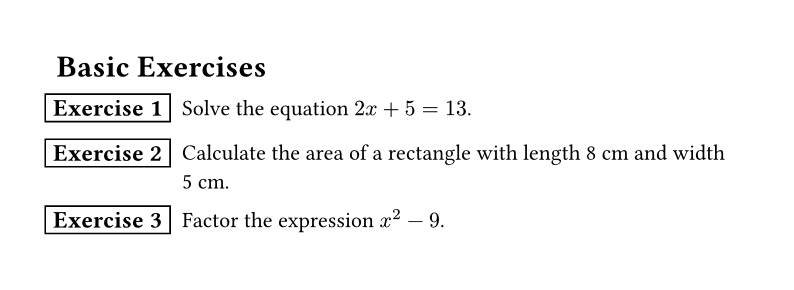](gallery/basic.typ) | [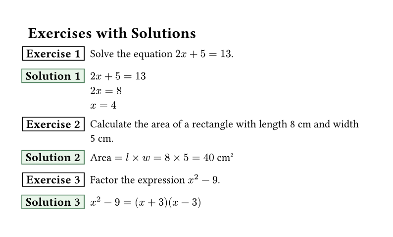](gallery/solutions.typ) | [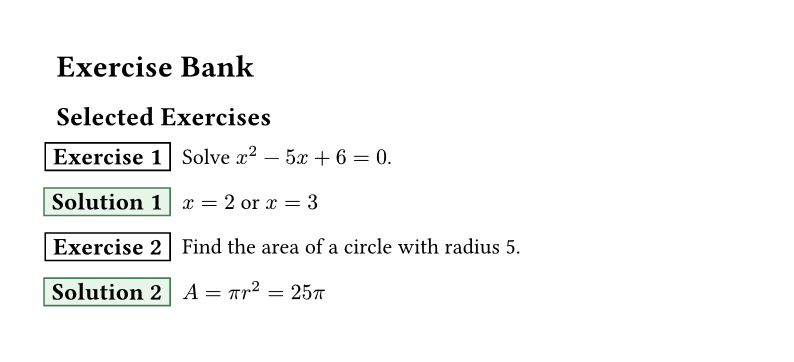](gallery/bank.typ) |
| Basic Exercises | With Solutions | Exercise Bank |
| [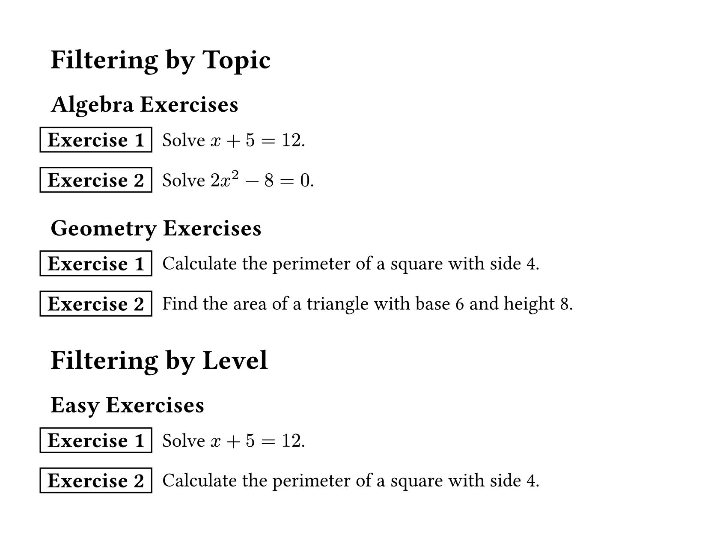](gallery/filtering.typ) | [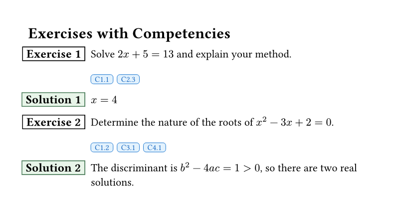](gallery/competencies.typ) | [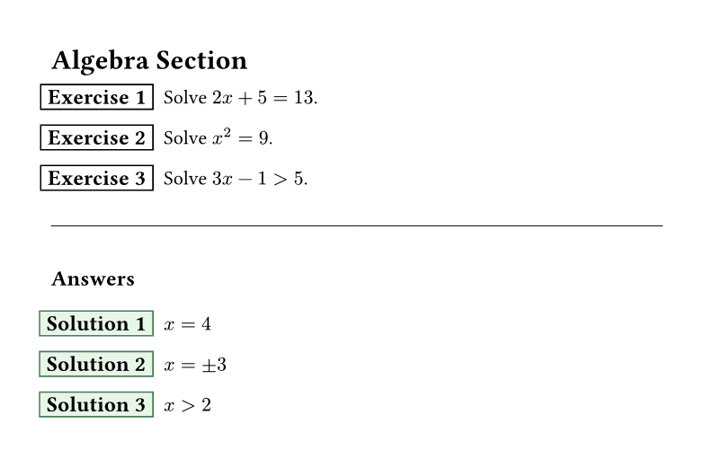](gallery/end-section.typ) |
| Filtering by Topic | Competency Tags | Solutions at End |
| [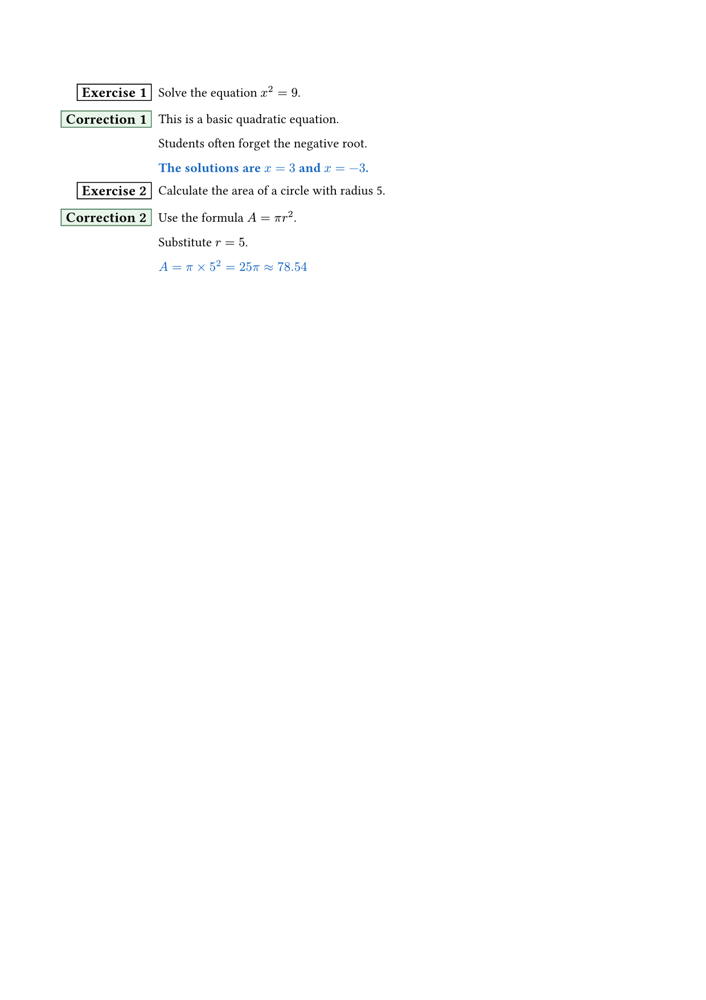](gallery/append-solution.typ) | [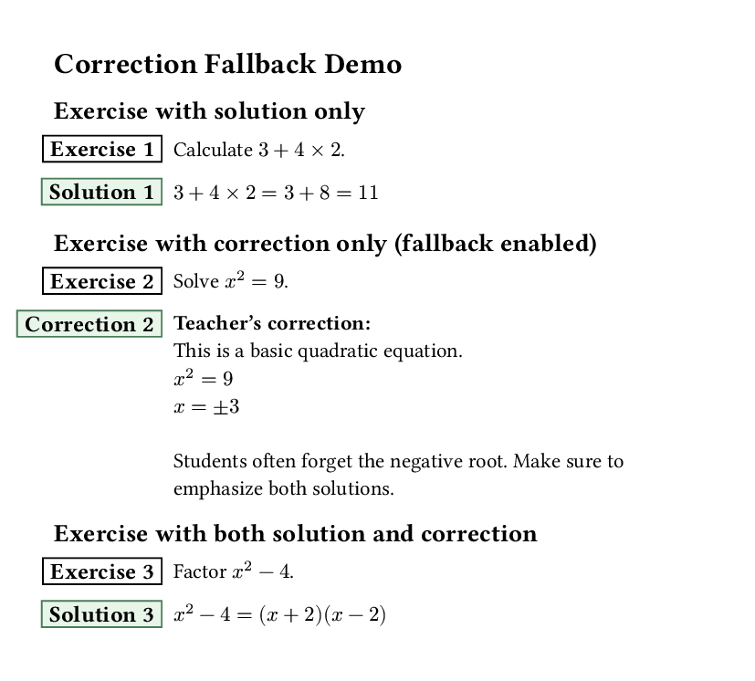](gallery/corrections.typ) | [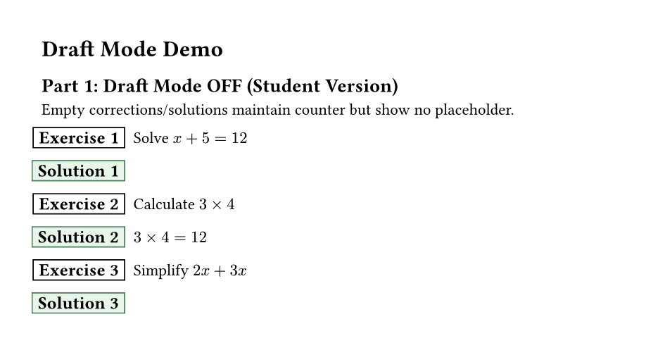](gallery/draft-mode.typ) |
| Append Solution | Teacher Corrections | Draft Mode OFF |
| [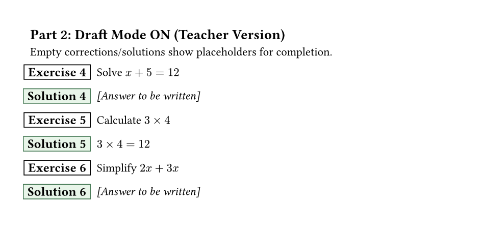](gallery/draft-mode.typ) | [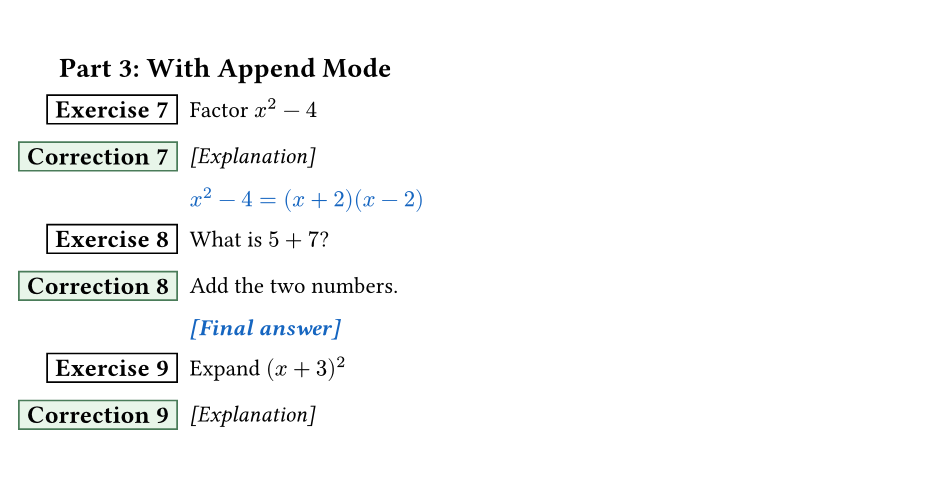](gallery/draft-mode.typ) | |
| Draft Mode ON | Draft with Append | |

## Features

- **Exercises with solutions** - Create exercises with inline or deferred solutions
- **Teacher corrections** - Add detailed corrections for teachers with optional fallback when solutions are missing
- **Append solutions to corrections** - Combine corrections and solutions with custom formatting to avoid duplication
- **Draft mode** - Show placeholders for empty corrections/solutions, or hide them for clean student output
- **Multiple solution modes** - Show solutions inline, at end of section/chapter, or hide them
- **Metadata support** - Tag exercises with topic, level, author, and custom fields
- **Exercise banks** - Define exercises once, display them anywhere
- **Powerful filtering** - Select exercises by topic, level, competency, or custom criteria
- **Competency tags** - Tag and display competency indicators
- **Automatic numbering** - Counter resets per section, chapter, or globally
- **Customizable labels** - Change "Exercise" and "Solution" labels (localization support)
- **Exercise IDs** - Unique identifiers for referencing and bank management
- **g-exam integration** - Optional integration with g-exam for exam-style formatting and features

## Quick Start

```typst
#import "@preview/exercise-bank:0.2.0": exo

#exo(
  exercise: [
    Solve the equation $2x + 5 = 13$.
  ]
)
```

## Basic Usage

### Simple Exercise

```typst
#import "@preview/exercise-bank:0.2.0": exo

#exo(
  exercise: [
    Calculate $3 + 4 times 2$.
  ]
)
```

### Exercise with Solution

```typst
#import "@preview/exercise-bank:0.2.0": exo

#exo(
  exercise: [
    Calculate $3 + 4 times 2$.
  ],
  solution: [
    $3 + 4 times 2 = 3 + 8 = 11$
  ],
)
```

### Multiple Exercises

```typst
#import "@preview/exercise-bank:0.2.0": exo

#exo(exercise: [Simplify $x^2 + 2x + 1$.])
#exo(exercise: [Factor $x^2 - 4$.])
#exo(exercise: [Solve $2x - 6 = 0$.])
```

## Solution Display Modes

Control how and where solutions appear in your document.

### Inline Solutions (Default)

Solutions appear immediately after each exercise:

```typst
#import "@preview/exercise-bank:0.2.0": exo, exo-setup

#exo-setup(solution-mode: "inline")

#exo(
  exercise: [Solve $2x + 5 = 13$.],
  solution: [The answer is $x = 4$.],
)
```

### No Solutions

Hide all solutions:

```typst
#import "@preview/exercise-bank:0.2.0": exo, exo-setup

#exo-setup(solution-mode: "none")

#exo(
  exercise: [Solve this equation.],
  solution: [Hidden solution],
)
```

### Solutions at End of Section

Collect solutions and display them at section end:

```typst
#import "@preview/exercise-bank:0.2.0": exo, exo-setup, exo-print-solutions

#exo-setup(solution-mode: "end-section")

#exo(exercise: [Exercise 1], solution: [Answer 1])
#exo(exercise: [Exercise 2], solution: [Answer 2])
#exo(exercise: [Exercise 3], solution: [Answer 3])

// Print all collected solutions
#exo-print-solutions()
```

### Solutions at End of Chapter

Similar to end-section, but grouped by chapter:

```typst
#import "@preview/exercise-bank:0.2.0": exo, exo-setup, exo-print-solutions, exo-chapter-start

#exo-setup(solution-mode: "end-chapter")

= Chapter 1
#exo-chapter-start()

#exo(exercise: [Exercise 1.1], solution: [...])
#exo(exercise: [Exercise 1.2], solution: [...])

#exo-print-solutions(title: "Chapter 1 Solutions")

= Chapter 2
#exo-chapter-start()

#exo(exercise: [Exercise 2.1], solution: [...])
```

### Solutions Only

Show only the solutions (useful for answer keys):

```typst
#import "@preview/exercise-bank:0.2.0": exo, exo-setup

#exo-setup(solution-mode: "only")

#exo(exercise: [This exercise text is hidden], solution: [This will be shown])
```

## Corrections (Teacher Version)

Corrections are detailed solutions intended for teachers. They can include pedagogical notes, common mistakes, and teaching tips.

### Exercise with Correction

```typst
#import "@preview/exercise-bank:0.2.0": exo

#exo(
  exercise: [Solve $x^2 = 9$.],
  correction: [
    *Teacher's correction:*
    $x = plus.minus 3$

    Common mistake: Students often forget the negative root.
  ],
)
```

### Fallback to Correction

When `fallback-to-correction` is enabled, corrections are shown when solutions are missing:

```typst
#import "@preview/exercise-bank:0.2.0": exo, exo-setup

#exo-setup(
  solution-mode: "inline",
  fallback-to-correction: true,  // Show corrections when solutions are missing
)

// This exercise has only a correction - it will be displayed
#exo(
  exercise: [Simplify $2x + 3x$.],
  correction: [
    $2x + 3x = 5x$
    Teaching tip: Combine like terms.
  ],
)

// This exercise has a solution - solution takes priority
#exo(
  exercise: [Calculate $5 times 6$.],
  solution: [30],
  correction: [Detailed explanation for teachers...],
)
```

### Corrections Only (Teacher Answer Key)

Create teacher answer keys showing only corrections:

```typst
#import "@preview/exercise-bank:0.2.0": exo, exo-setup

#exo-setup(
  solution-mode: "only",
  fallback-to-correction: true,
)

#exo(
  exercise: [Exercise 1 (hidden in output)],
  correction: [Detailed correction for teachers],
)
```

### Appending Solutions to Corrections

When both correction and solution exist, you can append the solution to the correction content with custom formatting. This avoids duplication - write detailed pedagogical notes in the correction, then add the final answer in the solution.

```typst
#import "@preview/exercise-bank:0.2.0": exo, exo-setup

#exo-setup(
  append-solution-to-correction: true,  // Enable appending
  solution-in-correction-style: (        // Customize formatting
    weight: "bold",
    fill: rgb("#1565c0"),  // Blue color
    style: "normal",       // or "italic"
    size: none,           // or specific size like 11pt
  ),
)

#exo(
  exercise: [Solve $x^2 = 9$.],
  correction: [
    This is a basic quadratic equation. The equation $x^2 = 9$ means we're
    looking for values where x squared equals 9.

    Students often forget the negative root when solving this type of equation.
  ],
  solution: [
    The solutions are $x = 3$ and $x = -3$.
  ],
)
```

**How it works:**
- When `append-solution-to-correction: false` (default): Shows solution in its own box (backward compatible)
- When `append-solution-to-correction: true`: Shows correction box with solution appended as a new paragraph
- The appended solution has no "Solution:" label - just the formatted content
- Works with all solution modes (inline, end-section, end-chapter, only)
- Works with exercise banks and filtering

**Default styling:**
- **Weight**: Bold
- **Color**: Blue (`rgb("#1565c0")`)
- **Style**: Normal
- **Size**: Inherited from parent

### Draft Mode and Placeholders

When creating exercise documents, you may have incomplete corrections or solutions. Draft mode allows you to:
- Show placeholder text for empty corrections/solutions (useful for teacher drafts)
- Maintain exercise counters even with empty content
- Hide placeholders in student versions

```typst
#import "@preview/exercise-bank:0.2.0": exo, exo-setup

// Teacher draft version - shows placeholders
#exo-setup(
  draft-mode: true,
  correction-placeholder: [_[To be completed]_],
  solution-placeholder: [_[Answer to be written]_],
)

#exo(
  exercise: [Solve $x + 5 = 12$],
  solution: [],  // Empty - shows placeholder in draft mode
)

#exo(
  exercise: [Calculate $3 times 4$],
  solution: [$3 times 4 = 12$],  // Normal solution
)
```

**Student version (draft mode OFF):**
```typst
#exo-setup(
  draft-mode: false,  // Default - no placeholders
)

#exo(
  exercise: [Solve $x + 5 = 12$],
  solution: [],  // Empty - shows minimal space, no placeholder
)
```

**How it works:**
- `draft-mode: false` (default): Empty corrections/solutions display minimal space to maintain counter, no placeholder text
- `draft-mode: true`: Empty corrections/solutions show customizable placeholder text
- When both correction and solution are empty with `append-solution-to-correction: true`, only one placeholder is shown (not duplicated)
- Placeholders are customizable via `correction-placeholder` and `solution-placeholder` parameters

**Use cases:**
- **Teacher drafts**: Enable draft mode to see which exercises need corrections/solutions
- **Student worksheets**: Disable draft mode for clean output without placeholders
- **Incremental writing**: Add exercises with empty solutions, fill them in later

## Metadata and Filtering

### Adding Metadata

Tag exercises with metadata for organization and filtering:

```typst
#import "@preview/exercise-bank:0.2.0": exo

#exo(
  exercise: [Solve $x + 1 = 5$.],
  topic: "algebra",
  level: "easy",
  authors: ("Prof. Smith",),
)

#exo(
  exercise: [Calculate the area of a circle with radius 5.],
  topic: "geometry",
  level: "medium",
  authors: ("Prof. Jones",),
)

#exo(
  exercise: [Solve $x^3 - 6x^2 + 11x - 6 = 0$.],
  topic: "algebra",
  level: "hard",
  authors: ("Prof. Smith",),
)
```

### Filtering Exercises

Display only exercises matching certain criteria:

```typst
#import "@preview/exercise-bank:0.2.0": exo, exo-filter

// First, define exercises (they display normally)
#exo(exercise: [Exercise 1], topic: "algebra")
#exo(exercise: [Exercise 2], topic: "geometry")
#exo(exercise: [Exercise 3], topic: "algebra")

// Later, filter and redisplay specific exercises
#exo-filter(topic: "algebra")  // Shows exercises 1 and 3
```

## Exercise Banks

Define exercises once, use them anywhere. Perfect for creating exercise collections.

### Defining Bank Exercises

```typst
#import "@preview/exercise-bank:0.2.0": exo-define

// These don't display - just registered
#exo-define(
  id: "quad-1",
  exercise: [Solve $x^2 - 5x + 6 = 0$.],
  topic: "quadratics",
  level: "1M",
  solution: [$x = 2$ or $x = 3$],
)

#exo-define(
  id: "quad-2",
  exercise: [State the quadratic formula.],
  topic: "quadratics",
  level: "2M",
  solution: [$x = frac(-b plus.minus sqrt(b^2 - 4a c), 2a)$],
)

#exo-define(
  id: "geom-1",
  exercise: [Find the area of a circle with radius 5.],
  topic: "geometry",
  level: "1M",
  solution: [$A = pi r^2 = 25pi$],
)
```

### Displaying Bank Exercises

```typst
#import "@preview/exercise-bank:0.2.0": exo-show, exo-show-many

// Show a single exercise by ID
#exo-show("quad-1")

// Show multiple exercises
#exo-show-many("quad-1", "geom-1", "quad-2")
```

### Selecting from Bank

Use powerful filtering to select exercises:

```typst
#import "@preview/exercise-bank:0.2.0": exo-select

// All quadratics exercises
#exo-select(topic: "quadratics")

// Level 1M exercises only
#exo-select(level: "1M")

// Multiple topics
#exo-select(topics: ("quadratics", "geometry"))

// Multiple levels
#exo-select(levels: ("1M", "2M"))

// Limit number of exercises
#exo-select(topic: "algebra", max: 5)

// Custom filter function
#exo-select(where: ex => ex.metadata.level == "hard")
```

## Competency Tags

Tag exercises with competencies and display them visually:

```typst
#import "@preview/exercise-bank:0.2.0": exo-define, exo-show, exo-setup

#exo-setup(show-competencies: true)

#exo-define(
  id: "comp-ex-1",
  exercise: [Solve and explain your reasoning.],
  competencies: ("C1.1", "C2.3", "C4.1"),
  solution: [Solution here],
)

#exo-show("comp-ex-1")
```

### Filter by Competency

```typst
#import "@preview/exercise-bank:0.2.0": exo-select

// Exercises with specific competency
#exo-select(competency: "C1.1")

// Exercises with any of these competencies
#exo-select(competencies: ("C1.1", "C2.3"))
```

## Configuration

### Global Setup

```typst
#import "@preview/exercise-bank:0.2.0": exo-setup

#exo-setup(
  solution-mode: "inline",        // "inline", "end-section", "end-chapter", "none", "only"
  solution-label: "Solution",     // Label for solutions
  correction-label: "Correction", // Label for corrections (teacher version)
  fallback-to-correction: false,  // Show correction when solution is missing
  exercise-label: "Exercise",     // Label for exercises
  counter-reset: "section",       // "section", "chapter", "global"
  show-metadata: false,           // Show metadata in output
  show-id: false,                 // Show exercise ID
  show-competencies: false,       // Show competency tags
  append-solution-to-correction: false,  // Append solution to correction content
  solution-in-correction-style: (        // Formatting for appended solutions
    weight: "bold",
    fill: rgb("#1565c0"),
    style: "normal",
    size: none,
  ),
  draft-mode: false,                     // Show placeholders for empty corrections/solutions
  correction-placeholder: [_To be completed_],  // Placeholder text (draft mode)
  solution-placeholder: [_To be completed_],    // Placeholder text (draft mode)
)
```

### Localization

Change labels for different languages:

```typst
#import "@preview/exercise-bank:0.2.0": exo-setup

// French
#exo-setup(
  exercise-label: "Exercice",
  solution-label: "Solution",
)

// German
#exo-setup(
  exercise-label: "Aufgabe",
  solution-label: "Lösung",
)

// Spanish
#exo-setup(
  exercise-label: "Ejercicio",
  solution-label: "Solución",
)
```

### Counter Reset Options

Control when exercise numbering resets:

```typst
#import "@preview/exercise-bank:0.2.0": exo-setup, exo-section-start, exo-chapter-start

// Reset at each section
#exo-setup(counter-reset: "section")
= Section 1
#exo-section-start()

// Reset at each chapter
#exo-setup(counter-reset: "chapter")
= Chapter 1
#exo-chapter-start()

// Never reset (global numbering)
#exo-setup(counter-reset: "global")
```

### Show Exercise IDs

Display exercise IDs for reference:

```typst
#import "@preview/exercise-bank:0.2.0": exo-setup, exo

#exo-setup(show-id: true)

#exo(
  id: "my-exercise",
  exercise: [
    This exercise shows its ID below the badge.
  ]
)
```

## Utility Functions

### Reset Counter

```typst
#import "@preview/exercise-bank:0.2.0": exo-reset-counter

#exo-reset-counter()  // Reset exercise numbering to 0
```

### Clear Registry

```typst
#import "@preview/exercise-bank:0.2.0": exo-clear-registry

#exo-clear-registry()  // Clear all registered exercises
```

### Count Exercises

```typst
#import "@preview/exercise-bank:0.2.0": exo-count

Total algebra exercises: #exo-count(topic: "algebra")
Level 1M exercises: #exo-count(level: "1M")
```

## Parameters Reference

### `exo` Function

| Parameter | Type | Default | Description |
|-----------|------|---------|-------------|
| `exercise` | content | none | Exercise content (named parameter) |
| `solution` | content | none | Solution content |
| `correction` | content | none | Correction content (teacher version) |
| `id` | string/auto | auto | Unique exercise ID |
| `topic` | string | none | Topic metadata |
| `level` | string | none | Difficulty level |
| `authors` | array | () | Array of author names |
| `..extra` | named | - | Additional metadata fields |

### `exo-define` Function

| Parameter | Type | Default | Description |
|-----------|------|---------|-------------|
| `exercise` | content | none | Exercise content (named parameter) |
| `solution` | content | none | Solution content |
| `correction` | content | none | Correction content (teacher version) |
| `id` | string/auto | auto | Unique exercise ID |
| `competencies` | array | () | List of competency tags |
| `topic` | string | none | Topic metadata |
| `level` | string | none | Difficulty level |
| `authors` | array | () | Array of author names |
| `..extra` | named | - | Additional metadata fields |

### `exo-select` Function

| Parameter | Type | Default | Description |
|-----------|------|---------|-------------|
| `topic` | string | none | Filter by exact topic |
| `level` | string | none | Filter by exact level |
| `author` | string | none | Filter by exact author |
| `competency` | string | none | Filter by single competency |
| `topics` | array | none | Filter by any of these topics |
| `levels` | array | none | Filter by any of these levels |
| `competencies` | array | none | Filter by any of these competencies |
| `where` | function | none | Custom filter function |
| `show-solutions` | bool/auto | auto | Override solution display |
| `renumber` | bool | true | Renumber exercises sequentially |
| `max` | int | none | Maximum exercises to show |

### `exo-setup` Function

| Parameter | Type | Default | Description |
|-----------|------|---------|-------------|
| `solution-mode` | string | "inline" | "inline", "end-section", "end-chapter", "none", "only" |
| `solution-label` | string | "Solution" | Label for solutions |
| `correction-label` | string | "Correction" | Label for corrections |
| `fallback-to-correction` | bool | false | Show correction when solution is missing |
| `exercise-label` | string | "Exercise" | Label for exercises |
| `counter-reset` | string | "section" | "section", "chapter", "global" |
| `show-metadata` | bool | false | Display metadata |
| `show-id` | bool | false | Display exercise ID |
| `show-competencies` | bool | false | Display competency tags |
| `append-solution-to-correction` | bool | false | Append solution to correction content |
| `solution-in-correction-style` | dict | See below | Text styling for appended solutions |
| `draft-mode` | bool | false | Show placeholders for empty corrections/solutions |
| `correction-placeholder` | content | `[_To be completed_]` | Placeholder for empty corrections (draft mode) |
| `solution-placeholder` | content | `[_To be completed_]` | Placeholder for empty solutions (draft mode) |

**Default `solution-in-correction-style`:**
```typst
(
  weight: "bold",
  fill: rgb("#1565c0"),  // Blue
  style: "normal",
  size: none,
)
```

## Complete Example

```typst
#import "@preview/exercise-bank:0.2.0": *

// Setup
#exo-setup(
  solution-mode: "end-section",
  show-competencies: true,
)

= Algebra Exercises

// Define exercises in a bank
#exo-define(
  id: "alg-1",
  exercise: [Solve $2x + 5 = 13$.],
  topic: "equations",
  level: "easy",
  competencies: ("C1.1",),
  solution: [$x = 4$],
)

#exo-define(
  id: "alg-2",
  exercise: [Solve $x^2 = 9$.],
  topic: "equations",
  level: "medium",
  competencies: ("C1.1", "C1.2"),
  solution: [$x = 3$ or $x = -3$],
)

#exo-define(
  id: "alg-3",
  exercise: [Solve $3x - 1 > 5$.],
  topic: "inequalities",
  level: "medium",
  competencies: ("C1.3",),
  solution: [$x > 2$],
)

// Display exercises for this section
#exo-select(level: "easy")
#exo-select(level: "medium", max: 2)

// Print solutions at end of section
#exo-print-solutions(title: "Answers")
```

## Integration with g-exam

The exercise-bank package includes **optional** integration with the [g-exam](https://typst.app/universe/package/g-exam) package for creating exams. The core exercise functionality works completely standalone, but if you want to create exam-style documents, the integration provides additional features.

### What the Integration Provides

When using the g-exam integration, you get:

- **Exam display mode** - Display exercises as exam questions with the g-exam formatting
- **Points display** - Show point values for each exercise/question
- **Exam templates** - Access to g-exam's exam template system
- **Score tables** - Automatically generate score/grading tables
- **Unified workflow** - Define exercises once in your bank, then use them in both worksheets and exams

### Using Exam Mode

Set the display mode to "exam" to use g-exam formatting:

```typst
#import "@preview/exercise-bank:0.2.0": *

// Define exercises with points
#exo-define(
  id: "exam-q1",
  exercise: [Solve $2x + 5 = 13$.],
  points: 3,
  solution: [$x = 4$],
)

#exo-define(
  id: "exam-q2",
  exercise: [Calculate the area of a circle with radius 5.],
  points: 5,
  solution: [$A = 25pi$],
)

// Configure for exam display
#exo-setup(display-mode: "exam")
#exam-setup(show-solutions: false)  // Hide solutions for student version

// Display as exam questions
#exo-show("exam-q1")
#exo-show("exam-q2")

// Or use filtering
#exo-select(level: "1M")
```

### Exam Functions

The package provides exam-specific functions when g-exam integration is active:

```typst
// Configure exam display
#exam-setup(
  show-solutions: false,     // Show/hide solutions in exam
  solution-label: "Answer",  // Label for solution boxes
)

// Display exercises as g-exam questions
#exam-question("exam-q1")
#exam-question-many("q1", "q2", "q3")

// Select and display as exam questions
#exam-select(topic: "algebra", max: 5)

// Generate score table
#exam-score-table("q1", "q2", "q3")

// Access g-exam template directly
#exam-template(
  // g-exam template options
)
```

### Creating Student and Teacher Versions

Use the same exercise bank for both versions:

```typst
#import "@preview/exercise-bank:0.2.0": *

// Define exercises once
#exo-define(id: "q1", exercise: [...], solution: [...], points: 4)
#exo-define(id: "q2", exercise: [...], solution: [...], points: 6)

// Student version: no solutions
#exo-setup(display-mode: "exam")
#exam-setup(show-solutions: false)
#exo-show-many("q1", "q2")

// Teacher version: with solutions
#exo-setup(display-mode: "exam")
#exam-setup(show-solutions: true)
#exo-show-many("q1", "q2")
```

### Standalone vs. Exam Mode

**Standalone mode** (default `display-mode: "exercise"`):
- Uses the exercise-bank's built-in exercise box styling
- No dependency on g-exam features
- Perfect for worksheets, textbooks, and practice materials

**Exam mode** (`display-mode: "exam"`):
- Integrates with g-exam for standardized exam formatting
- Displays points in a consistent exam-style format
- Access to exam-specific features (score tables, etc.)

Both modes share the same exercise bank, filtering, and metadata system - only the visual presentation changes.

## Dependencies

- [g-exam](https://typst.app/universe/package/g-exam) (v0.4.3+) - Optional, only needed if using exam mode integration features

## License

MIT License - see LICENSE file for details.

## Changelog

All notable changes to exercise-bank are documented here.

### [0.2.0] - 2026-01-15

#### Changed (Breaking)
- **`exo` function**: Content parameter changed from positional to named parameter `exercise:`
  - Old: `#exo[Exercise content]`
  - New: `#exo(exercise: [Exercise content])`
  - Migration: Add `exercise:` before content in all `#exo()` calls
- **`exo-define` function**: Content parameter changed from positional to named parameter `exercise:`
  - Old: `#exo-define(id: "ex-1")[Content]`
  - New: `#exo-define(id: "ex-1", exercise: [Content])`
- **Author metadata**: Changed from single `author` to `authors` array
  - Old: `author: "John Doe"`
  - New: `authors: ("John Doe",)` or `authors: ("John", "Jane")`

#### Why These Changes?
- Named `exercise:` parameter provides better consistency with other named parameters (`solution:`, `id:`, etc.)
- Array `authors` supports multiple contributors per exercise
- More explicit and maintainable API

#### Added
- **Append solutions to corrections**: Combine correction and solution content with custom formatting
  - New parameter: `append-solution-to-correction` (default: `false`)
  - New parameter: `solution-in-correction-style` (customizable text styling)
  - Avoids duplication when writing detailed corrections with final answers
- **Draft mode**: Show placeholders for empty corrections/solutions or hide them
  - New parameter: `draft-mode` (default: `false`)
  - New parameter: `correction-placeholder` (default: `[_To be completed_]`)
  - New parameter: `solution-placeholder` (default: `[_To be completed_]`)
  - Useful for teacher drafts to track incomplete exercises
  - Student versions show minimal space without placeholder text
- **Smart empty content handling**
  - Empty corrections/solutions maintain exercise counter
  - No duplicate placeholders when both are empty with append mode enabled

#### Dependencies
- Requires [g-exam](https://typst.app/universe/package/g-exam) v0.4.3 or higher

### [0.1.0] - 2026-01-13

#### Added
- Initial release with exercise management system
- Multiple solution display modes (inline, end-section, end-chapter, none, only)
- Metadata support (topic, level, author, custom fields)
- Exercise bank system for defining and reusing exercises
- Powerful filtering by topic, level, competency, or custom criteria
- Competency tagging system
- Automatic numbering with section/chapter/global reset options
- Customizable labels for localization
- Exercise ID system for referencing
- Utility functions for counter reset, registry management, and counting
