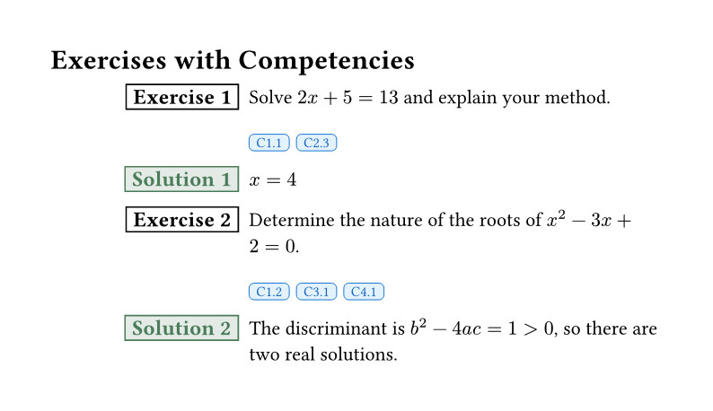
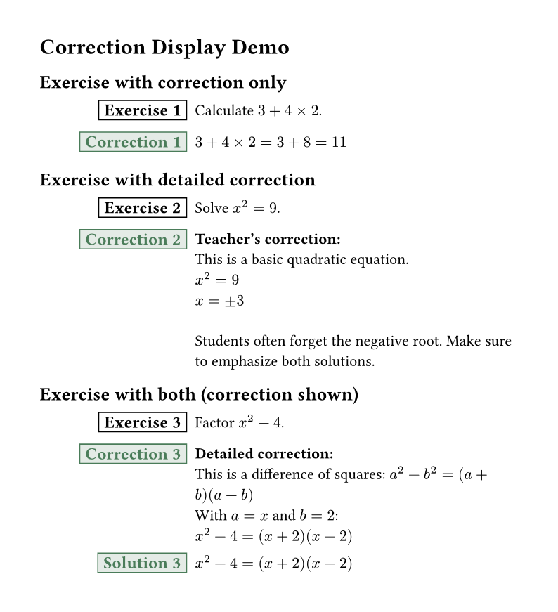
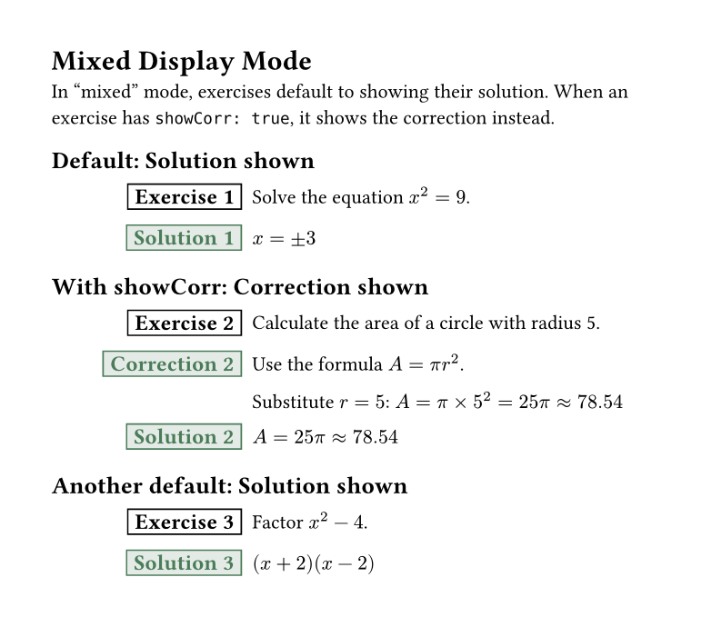

# exercise-bank

A comprehensive Typst package for creating and managing exercises with solutions, metadata, filtering, and exercise banks. Perfect for teachers, textbook authors, and educational content creators.

**[Documentation (PDF)](docs/manual.pdf)**

## Gallery

Click on an image to see the source code.

| | | |
|:---:|:---:|:---:|
| [](gallery/basic.typ) | [](gallery/solutions.typ) | [](gallery/bank.typ) |
| Basic Exercises | With Solutions | Exercise Bank |
| [](gallery/filtering.typ) | [](gallery/competencies.typ) | [](gallery/end-section.typ) |
| Filtering by Topic | Competency Tags | Solutions at End |
| [](gallery/corrections.typ) | [](gallery/mixed-display.typ) | [](gallery/draft-mode.typ) |
| Teacher Corrections | Mixed Display Mode | Draft Mode |
| [](gallery/styles.typ) | [](gallery/pagebreak.typ) | |
| Visual Styles | Solutions with Page Break | |

## Features

- **Exercises with solutions** - Create exercises with inline or deferred solutions
- **9 visual styles** - Box, circled, filled-circle, pill, tag, border-accent, underline, rounded-box, header-card
- **Customizable colors** - Set badge colors for any style
- **Teacher corrections** - Add detailed corrections for teachers
- **Flexible display modes** - Control what to show (exercises, solutions, or both)
- **Multiple location modes** - Show solutions inline, after page break, or at end of section/chapter
- **Draft mode** - Show placeholders for empty corrections/solutions, or hide them for clean student output
- **Metadata support** - Tag exercises with topic, level, author, and custom fields
- **Exercise banks** - Define exercises once, display them anywhere
- **Powerful filtering** - Select exercises by topic, level, competency, or custom criteria
- **Competency tags** - Tag and display competency indicators
- **Automatic numbering** - Counter resets per section, chapter, or globally
- **Customizable labels** - Change "Exercise" and "Solution" labels (localization support)
- **Exercise IDs** - Unique identifiers for referencing and bank management
- **Advanced exercise markers** - Visual cue (customizable symbol) for advanced/challenging exercises
- **g-exam integration** - Optional integration with g-exam for exam-style formatting and features

## Quick Start

```typst
#import "@preview/exercise-bank:0.4.0": exo

#exo(
  exercise: [
    Solve the equation $2x + 5 = 13$.
  ]
)
```

## Basic Usage

### Simple Exercise

```typst
#import "@preview/exercise-bank:0.4.0": exo

#exo(
  exercise: [
    Calculate $3 + 4 times 2$.
  ]
)
```

### Exercise with Solution

```typst
#import "@preview/exercise-bank:0.4.0": exo

#exo(
  exercise: [
    Calculate $3 + 4 times 2$.
  ],
  solution: [
    $3 + 4 times 2 = 3 + 8 = 11$
  ],
)
```

### Multiple Exercises

```typst
#import "@preview/exercise-bank:0.4.0": exo

#exo(exercise: [Simplify $x^2 + 2x + 1$.])
#exo(exercise: [Factor $x^2 - 4$.])
#exo(exercise: [Solve $2x - 6 = 0$.])
```

## Display Control

The package uses three parameters to control how exercises and solutions are displayed:

### `show` - What to Display

Controls what content is displayed:

- `"both"` (default) - Show both exercises and solutions/corrections
- `"ex"` - Show only exercises (hide solutions/corrections)
- `"sol"` - Show only solutions/corrections (hide exercises)

```typst
#import "@preview/exercise-bank:0.4.0": exo, exo-setup

// Student worksheet - exercises only
#exo-setup(display: "ex")

// Answer key - solutions only
#exo-setup(display: "sol")

// Complete document - both
#exo-setup(display: "both")
```

### `corrDisplay` - What Content to Show

Controls whether to show solutions or corrections:

- `"solution"` (default) - Show the solution content
- `"correction"` - Show the correction content (for teachers)
- `"mixed"` - Default to solution, but show correction for exercises with `showCorr: true`

```typst
#import "@preview/exercise-bank:0.4.0": exo, exo-setup

// Student version - show solutions
#exo-setup(corrDisplay: "solution")

// Teacher version - show corrections
#exo-setup(corrDisplay: "correction")

// Mixed mode
#exo-setup(corrDisplay: "mixed")

#exo(
  exercise: [Solve $x^2 = 9$.],
  solution: [$x = plus.minus 3$],
  correction: [Detailed explanation with teaching notes...],
  showCorr: true,  // In mixed mode, show correction for this exercise
)
```

### `corrLoc` - Where to Display

Controls where solutions/corrections appear:

- `"after"` (default) - Show immediately after each exercise
- `"pagebreak"` - Show with a page break between exercise and solution
- `"end-section"` - Collect and show at section end
- `"end-chapter"` - Collect and show at chapter end

```typst
#import "@preview/exercise-bank:0.4.0": exo, exo-setup, exo-print-solutions

// Solutions at end of section
#exo-setup(corrLoc: "end-section")

#exo(exercise: [Exercise 1], solution: [Answer 1])
#exo(exercise: [Exercise 2], solution: [Answer 2])

// Print all collected solutions
#exo-print-solutions(title: "Answers")
```

## Corrections (Teacher Version)

Corrections are detailed solutions for teachers, including pedagogical notes and teaching tips.

### Exercise with Correction

```typst
#import "@preview/exercise-bank:0.4.0": exo, exo-setup

#exo-setup(corrDisplay: "correction")

#exo(
  exercise: [Solve $x^2 = 9$.],
  correction: [
    *Teacher's notes:*
    $x = plus.minus 3$

    Common mistake: Students often forget the negative root.
  ],
)
```

### Corrections Only (Teacher Answer Key)

Create teacher answer keys showing only corrections:

```typst
#import "@preview/exercise-bank:0.4.0": exo, exo-setup

#exo-setup(
  display: "sol",              // Only show solutions/corrections
  corrDisplay: "correction", // Show corrections
)

#exo(
  exercise: [Exercise 1 (hidden in output)],
  correction: [Detailed correction for teachers],
)
```

### Mixed Display Mode

Use `corrDisplay: "mixed"` to default to solutions while showing corrections for specific exercises:

```typst
#import "@preview/exercise-bank:0.4.0": exo, exo-setup

#exo-setup(corrDisplay: "mixed")

// This shows solution (default)
#exo(
  exercise: [Simple problem],
  solution: [Quick answer],
  correction: [Detailed explanation],
)

// This shows correction (because showCorr: true)
#exo(
  exercise: [Complex problem needing explanation],
  solution: [Answer],
  correction: [Detailed step-by-step solution with notes],
  showCorr: true,
)
```

### Exercise-Level Flags

- `showCorr: true` - In "mixed" mode, show correction instead of solution for this exercise
- `solInCorr: true` - Indicates that the correction already includes the solution; in "correction" mode, only correction is shown (not both correction AND solution)

### Draft Mode and Placeholders

When creating exercise documents, you may have incomplete corrections or solutions. Draft mode allows you to:
- Show placeholder text for empty corrections/solutions (useful for teacher drafts)
- Maintain exercise counters even with empty content
- Hide placeholders in student versions

```typst
#import "@preview/exercise-bank:0.4.0": exo, exo-setup

// Teacher draft version - shows placeholders
#exo-setup(
  draft-mode: true,
  correction-placeholder: [_[To be completed]_],
  solution-placeholder: [_[Answer to be written]_],
)

#exo(
  exercise: [Solve $x + 5 = 12$],
  solution: [],  // Empty - shows placeholder in draft mode
)

// Student version (draft mode OFF)
#exo-setup(draft-mode: false)

#exo(
  exercise: [Solve $x + 5 = 12$],
  solution: [],  // Empty - shows only space, no placeholder
)
```

## Metadata and Filtering

### Adding Metadata

Tag exercises with metadata for organization and filtering:

```typst
#import "@preview/exercise-bank:0.4.0": exo

#exo(
  exercise: [Solve $x + 1 = 5$.],
  topic: "algebra",
  level: "easy",
  authors: ("Prof. Smith",),
)
```

### Filtering Exercises

Display only exercises matching certain criteria:

```typst
#import "@preview/exercise-bank:0.4.0": exo, exo-filter

// First, define exercises (they display normally)
#exo(exercise: [Exercise 1], topic: "algebra")
#exo(exercise: [Exercise 2], topic: "geometry")
#exo(exercise: [Exercise 3], topic: "algebra")

// Later, filter and redisplay specific exercises
#exo-filter(topic: "algebra")  // Shows exercises 1 and 3
```

## Exercise Banks

Define exercises once, use them anywhere. Perfect for creating exercise collections.

### Defining Bank Exercises

```typst
#import "@preview/exercise-bank:0.4.0": exo-define

// These don't display - just registered
#exo-define(
  id: "quad-1",
  exercise: [Solve $x^2 - 5x + 6 = 0$.],
  topic: "quadratics",
  level: "1M",
  solution: [$x = 2$ or $x = 3$],
)

#exo-define(
  id: "geom-1",
  exercise: [Find the area of a circle with radius 5.],
  topic: "geometry",
  level: "1M",
  solution: [$A = pi r^2 = 25pi$],
)
```

### Displaying Bank Exercises

```typst
#import "@preview/exercise-bank:0.4.0": exo-show, exo-show-many

// Show a single exercise by ID
#exo-show("quad-1")

// Show multiple exercises
#exo-show-many("quad-1", "geom-1", "quad-2")
```

### Selecting from Bank

Use powerful filtering to select exercises:

```typst
#import "@preview/exercise-bank:0.4.0": exo-select

// All quadratics exercises
#exo-select(topic: "quadratics")

// Level 1M exercises only
#exo-select(level: "1M")

// Multiple topics
#exo-select(topics: ("quadratics", "geometry"))

// Limit number of exercises
#exo-select(topic: "algebra", max: 5)

// Custom filter function
#exo-select(where: ex => ex.metadata.level == "hard")
```

## Competency Tags

Tag exercises with competencies and display them visually:

```typst
#import "@preview/exercise-bank:0.4.0": exo-define, exo-show, exo-setup

#exo-setup(show-competencies: true)

#exo-define(
  id: "comp-ex-1",
  exercise: [Solve and explain your reasoning.],
  competencies: ("C1.1", "C2.3", "C4.1"),
  solution: [Solution here],
)

#exo-show("comp-ex-1")
```

### Filter by Competency

```typst
#import "@preview/exercise-bank:0.4.0": exo-select

// Exercises with specific competency
#exo-select(competency: "C1.1")

// Exercises with any of these competencies
#exo-select(competencies: ("C1.1", "C2.3"))
```

## Configuration

### Global Setup

```typst
#import "@preview/exercise-bank:0.4.0": exo-setup

#exo-setup(
  // Display control
  display: "both",               // "ex", "sol", "both"
  corrDisplay: "solution",    // "solution", "correction", "mixed"
  corrLoc: "after",           // "after", "pagebreak", "end-section", "end-chapter"
  // Labels
  exercise-label: "Exercise",
  solution-label: "Solution",
  correction-label: "Correction",
  // Counter behavior
  counter-reset: "section",   // "section", "chapter", "global"
  // Display options
  show-metadata: false,
  show-id: false,
  show-competencies: false,
  // Draft mode
  draft-mode: false,
  correction-placeholder: [_To be completed_],
  solution-placeholder: [_To be completed_],
  // Spacing
  exercise-above: 0.8em,
  exercise-below: 0.8em,
  solution-above: 0.8em,
  solution-below: 0.8em,
  correction-above: 0.8em,
  correction-below: 0.8em,
  // Advanced exercises
  advanced-symbol: "*",
)
```

### Localization

Change labels for different languages:

```typst
#import "@preview/exercise-bank:0.4.0": exo-setup

// French
#exo-setup(
  exercise-label: "Exercice",
  solution-label: "Solution",
  correction-label: "Corrigé",
)

// German
#exo-setup(
  exercise-label: "Aufgabe",
  solution-label: "Lösung",
)
```

### Visual Styles

Choose from 9 different badge styles:

```typst
#import "@preview/exercise-bank:0.4.0": exo, exo-setup

// Circled number style
#exo-setup(badge-style: "circled")

// Filled circle with custom color
#exo-setup(badge-style: "filled-circle", badge-color: rgb("#2563eb"))

// Tag style
#exo-setup(badge-style: "tag", badge-color: rgb("#1e40af"))

// Custom colors for solutions and corrections
#exo-setup(
  solution-color: rgb("#059669"),    // Green for solutions
  correction-color: rgb("#dc2626"),  // Red for corrections
)

#exo(exercise: [Solve $x + 3 = 7$])
```

Available styles: `"box"` (default), `"circled"`, `"filled-circle"`, `"pill"`, `"tag"`, `"border-accent"`, `"underline"`, `"rounded-box"`, `"header-card"`

### Counter Reset Options

Control when exercise numbering resets:

```typst
#import "@preview/exercise-bank:0.4.0": exo-setup, exo-section-start, exo-chapter-start

// Reset at each section
#exo-setup(counter-reset: "section")
= Section 1
#exo-section-start()

// Reset at each chapter
#exo-setup(counter-reset: "chapter")
= Chapter 1
#exo-chapter-start()

// Never reset (global numbering)
#exo-setup(counter-reset: "global")
```

### Show Exercise IDs

Display exercise IDs for reference:

```typst
#import "@preview/exercise-bank:0.4.0": exo-setup, exo

#exo-setup(show-id: true)

#exo(
  id: "my-exercise",
  exercise: [
    This exercise shows its ID below the badge.
  ]
)
```

### Advanced Exercises

Mark exercises as advanced to display a visual cue before the label:

```typst
#import "@preview/exercise-bank:0.4.0": exo, exo-setup

// Default symbol is "*"
#exo(
  exercise: [This is a challenging problem.],
  advanced: true,
)

// Use a custom symbol
#exo-setup(advanced-symbol: sym.dagger)
#exo(exercise: [Advanced with dagger.], advanced: true)

// Disable the feature
#exo-setup(advanced-symbol: none)
```

## Utility Functions

### Reset Counter

```typst
#import "@preview/exercise-bank:0.4.0": exo-reset-counter

#exo-reset-counter()  // Reset exercise numbering to 0
```

### Clear Registry

```typst
#import "@preview/exercise-bank:0.4.0": exo-clear-registry

#exo-clear-registry()  // Clear all registered exercises
```

### Count Exercises

```typst
#import "@preview/exercise-bank:0.4.0": exo-count

Total algebra exercises: #exo-count(topic: "algebra")
Level 1M exercises: #exo-count(level: "1M")
```

## Parameters Reference

### `exo` Function

| Parameter | Type | Default | Description |
|-----------|------|---------|-------------|
| `exercise` | content | none | Exercise content (named parameter) |
| `solution` | content | none | Solution content |
| `correction` | content | none | Correction content (teacher version) |
| `id` | string/auto | auto | Unique exercise ID |
| `solInCorr` | bool | false | If true, solution is in correction (show only correction, not both) |
| `showCorr` | bool | false | If true, show correction in "mixed" mode |
| `topic` | string | none | Topic metadata |
| `level` | string | none | Difficulty level |
| `authors` | array | () | Array of author names |
| `..extra` | named | - | Additional metadata fields |

### `exo-define` Function

| Parameter | Type | Default | Description |
|-----------|------|---------|-------------|
| `exercise` | content | none | Exercise content (named parameter) |
| `solution` | content | none | Solution content |
| `correction` | content | none | Correction content (teacher version) |
| `id` | string/auto | auto | Unique exercise ID |
| `competencies` | array | () | List of competency tags |
| `solInCorr` | bool | false | If true, solution is in correction (show only correction) |
| `showCorr` | bool | false | If true, show correction in "mixed" mode |
| `topic` | string | none | Topic metadata |
| `level` | string | none | Difficulty level |
| `authors` | array | () | Array of author names |
| `..extra` | named | - | Additional metadata fields |

### `exo-select` Function

| Parameter | Type | Default | Description |
|-----------|------|---------|-------------|
| `topic` | string | none | Filter by exact topic |
| `level` | string | none | Filter by exact level |
| `author` | string | none | Filter by exact author |
| `competency` | string | none | Filter by single competency |
| `topics` | array | none | Filter by any of these topics |
| `levels` | array | none | Filter by any of these levels |
| `competencies` | array | none | Filter by any of these competencies |
| `where` | function | none | Custom filter function |
| `show-solutions` | bool/auto | auto | Override solution display |
| `renumber` | bool | true | Renumber exercises sequentially |
| `max` | int | none | Maximum exercises to show |

### `exo-setup` Function

| Parameter | Type | Default | Description |
|-----------|------|---------|-------------|
| `display` | string | "both" | "ex", "sol", "both" |
| `corrDisplay` | string | "solution" | "solution", "correction", "mixed" |
| `corrLoc` | string | "after" | "after", "pagebreak", "end-section", "end-chapter" |
| `solution-label` | string | "Solution" | Label for solutions |
| `correction-label` | string | "Correction" | Label for corrections |
| `exercise-label` | string | "Exercise" | Label for exercises |
| `counter-reset` | string | "section" | "section", "chapter", "global" |
| `show-metadata` | bool | false | Display metadata |
| `show-id` | bool | false | Display exercise ID |
| `show-competencies` | bool | false | Display competency tags |
| `draft-mode` | bool | false | Show placeholders for empty content |
| `correction-placeholder` | content | `[_To be completed_]` | Placeholder for empty corrections |
| `solution-placeholder` | content | `[_To be completed_]` | Placeholder for empty solutions |
| `badge-style` | string | "box" | Visual style for badges |
| `badge-color` | color | black | Color for exercise badges |
| `solution-color` | color | green | Color for solution badges |
| `correction-color` | color | green | Color for correction badges |
| `exercise-above` | length | 0.8em | Space above exercise boxes |
| `exercise-below` | length | 0.8em | Space below exercise boxes |
| `solution-above` | length | 0.8em | Space above solution boxes |
| `solution-below` | length | 0.8em | Space below solution boxes |
| `correction-above` | length | 0.8em | Space above correction boxes |
| `correction-below` | length | 0.8em | Space below correction boxes |
| `advanced-symbol` | content/none | "*" | Symbol for advanced exercises |

## Complete Example

```typst
#import "@preview/exercise-bank:0.4.0": *

// Setup
#exo-setup(
  corrLoc: "end-section",
  show-competencies: true,
)

= Algebra Exercises

// Define exercises in a bank
#exo-define(
  id: "alg-1",
  exercise: [Solve $2x + 5 = 13$.],
  topic: "equations",
  level: "easy",
  competencies: ("C1.1",),
  solution: [$x = 4$],
)

#exo-define(
  id: "alg-2",
  exercise: [Solve $x^2 = 9$.],
  topic: "equations",
  level: "medium",
  competencies: ("C1.1", "C1.2"),
  solution: [$x = 3$ or $x = -3$],
)

#exo-define(
  id: "alg-3",
  exercise: [Solve $3x - 1 > 5$.],
  topic: "inequalities",
  level: "medium",
  competencies: ("C1.3",),
  solution: [$x > 2$],
)

// Display exercises for this section
#exo-select(level: "easy")
#exo-select(level: "medium", max: 2)

// Print solutions at end of section
#exo-print-solutions(title: "Answers")
```

## Integration with g-exam

The exercise-bank package includes **optional** integration with the [g-exam](https://typst.app/universe/package/g-exam) package for creating exams. The core exercise functionality works completely standalone, but if you want to create exam-style documents, the integration provides additional features.

### Using Exam Mode

Set the display mode to "exam" to use g-exam formatting:

```typst
#import "@preview/exercise-bank:0.4.0": *

// Define exercises with points
#exo-define(
  id: "exam-q1",
  exercise: [Solve $2x + 5 = 13$.],
  points: 3,
  solution: [$x = 4$],
)

// Configure for exam display
#exo-setup(display-mode: "exam")
#exam-setup(show-solutions: false)  // Hide solutions for student version

// Display as exam questions
#exo-show("exam-q1")
```

## Dependencies

- [g-exam](https://typst.app/universe/package/g-exam) (v0.4.4+) - Optional, only needed if using exam mode integration features

## License

MIT License - see LICENSE file for details.

## Changelog

### [0.4.0] - 2026-02-11

#### Changed (Breaking)
- **New display control system**: Replaced `solution-mode`, `fallback-to-correction`, and `append-solution-to-correction` with three clearer parameters:
  - `display`: Controls what to display - `"ex"` (exercises only), `"sol"` (solutions only), `"both"` (default)
  - `corrDisplay`: Controls which content type to show - `"solution"` (default), `"correction"`, `"mixed"`
  - `corrLoc`: Controls where solutions appear - `"after"` (default), `"pagebreak"`, `"end-section"`, `"end-chapter"`

- **New exercise-level flags**:
  - `solInCorr`: If true, correction already contains solution (show only correction, not both)
  - `showCorr`: If true, show correction in "mixed" mode for this exercise

#### Removed
- `solution-mode` parameter (replaced by `show` and `corrLoc`)
- `fallback-to-correction` parameter (behavior controlled by `corrDisplay`)
- `append-solution-to-correction` parameter (use `corrDisplay: "mixed"` instead)
- `solution-in-correction-style` parameter (no longer needed)

#### Migration Guide
| Old Parameter | New Equivalent |
|--------------|----------------|
| `solution-mode: "inline"` | `display: "both", corrLoc: "after"` (default) |
| `solution-mode: "none"` | `display: "ex"` |
| `solution-mode: "only"` | `display: "sol"` |
| `solution-mode: "end-section"` | `corrLoc: "end-section"` |
| `solution-mode: "end-chapter"` | `corrLoc: "end-chapter"` |
| `fallback-to-correction: true` | `corrDisplay: "correction"` |
| `append-solution-to-correction: true` | `corrDisplay: "mixed"` with `showCorr: true` on exercises |

### [0.3.0] - 2026-01-27

#### Added
- **9 visual badge styles**: Configure with `exo-setup(badge-style: "...")`
- **Badge color customization**: `exo-setup(badge-color: rgb("#2563eb"))`
- **Separate solution/correction colors**
- **Advanced exercise markers**: `advanced-symbol` parameter
- **Spacing control**: Independent spacing for exercises, solutions, and corrections

### [0.2.0] - 2026-01-15

#### Changed (Breaking)
- `exo` function: Content parameter changed from positional to named parameter `exercise:`
- `exo-define` function: Content parameter changed from positional to named parameter `exercise:`
- Author metadata: Changed from single `author` to `authors` array

### [0.1.0] - 2026-01-13

- Initial release
