# exercise-bank

[](https://typst.app/universe/package/exercise-bank)
[](https://github.com/nathan-ed/typst-package-exercise-bank/blob/7f849f02142db5fea771d7dfd8c86a978935970a/docs/manual.pdf)
[](LICENSE)

A comprehensive Typst package for creating and managing exercises with solutions, metadata, filtering, and exercise banks. Perfect for teachers, textbook authors, and educational content creators.

## Gallery

Click on an image to see the source code.

| | | |
|:---:|:---:|:---:|
| [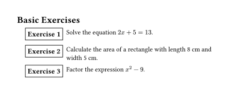](gallery/basic.typ) | [](gallery/solutions.typ) | [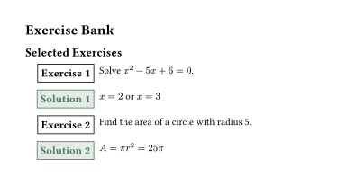](gallery/bank.typ) |
| Basic Exercises | With Solutions | Exercise Bank |
| [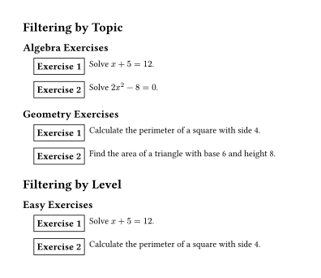](gallery/filtering.typ) | [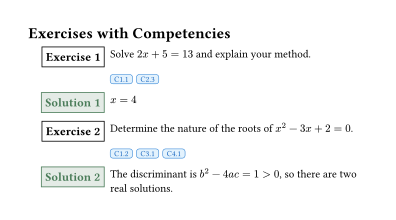](gallery/competencies.typ) | [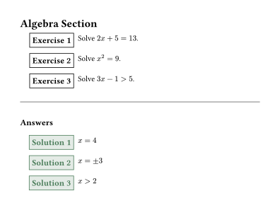](gallery/end-section.typ) |
| Filtering by Topic | Competency Tags | Solutions at End |
| [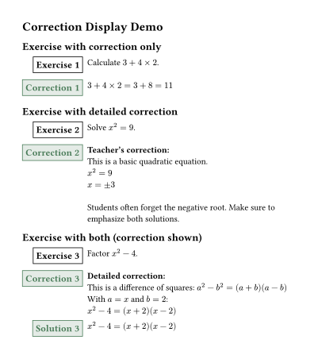](gallery/corrections.typ) | [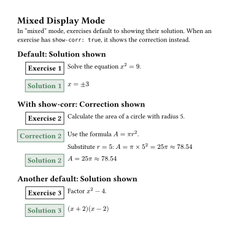](gallery/mixed-display.typ) | [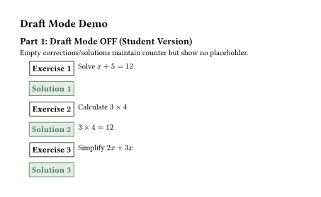](gallery/draft-mode.typ) |
| Teacher Corrections | Mixed Display Mode | Draft Mode |
| [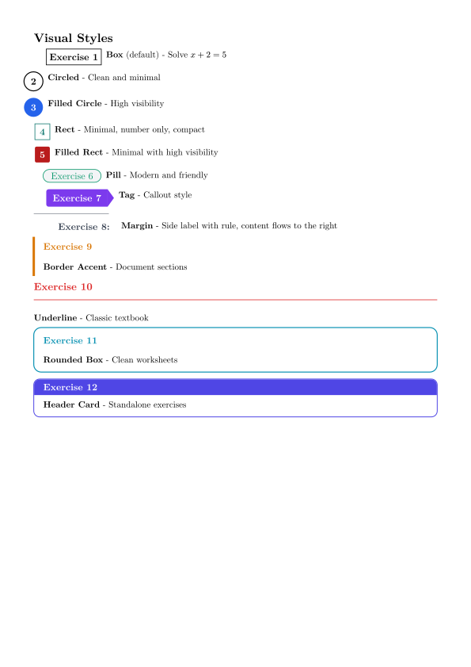](gallery/styles.typ) | [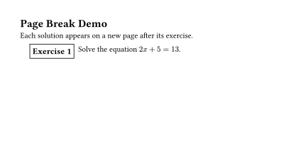](gallery/pagebreak.typ) | [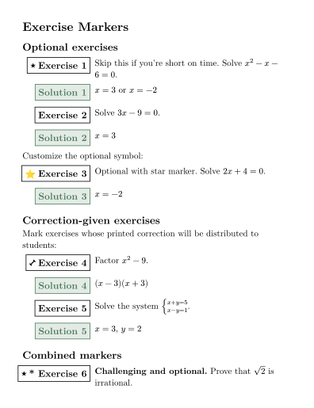](gallery/markers.typ) |
| Visual Styles | Solutions with Page Break | Exercise Markers |
| [](gallery/qr-codes.typ) | [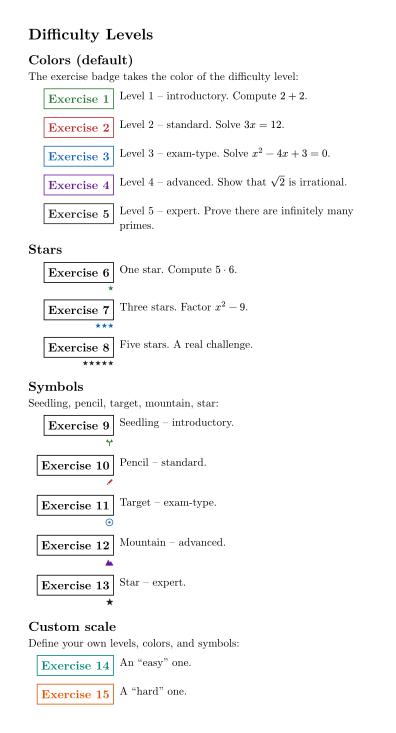](gallery/difficulty.typ) | [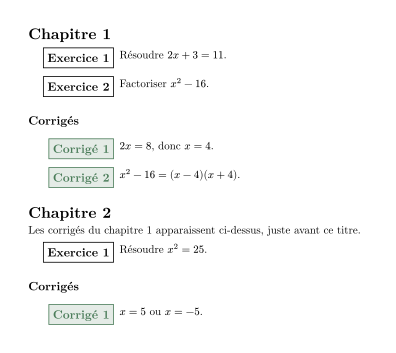](gallery/end-chapter.typ) |
| QR Codes | Difficulty Levels | End-of-Chapter Corrections |
| [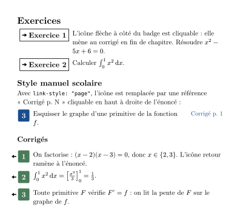](gallery/linked-solutions.typ) | [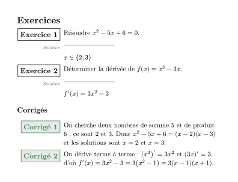](gallery/inline-solutions.typ) | [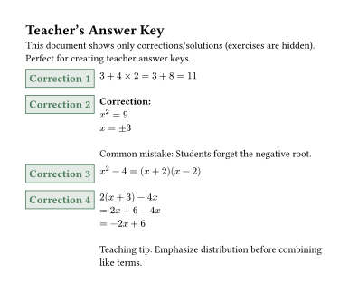](gallery/corrections-only.typ) |
| Linked Corrections | Inline Solutions | Corrections Only |

## Features

- **Exercises with solutions** - Create exercises with inline or deferred solutions
- **12 visual styles** - Box, circled, filled-circle, rect, filled-rect, pill, tag, margin, border-accent, underline, rounded-box, header-card - or pass your own badge function
- **Customizable colors** - Set badge colors for any style
- **Difficulty levels** - Encode up to 5 (or more) difficulty levels as badge colors, stars, or symbols
- **Clickable links** - Jump from an exercise to its deferred correction and back
- **Split solution/correction placement** - Short solution under the statement (epigraph-style), full correction at the end of the chapter
- **Chapter-prefixed numbering** - Number exercises as "3.5" using the current heading number
- **Automatic end-of-chapter corrections** - `#show: exo-auto-chapter` prints pending corrections before each new chapter
- **Teacher corrections** - Add detailed corrections for teachers
- **Flexible display modes** - Control what to show (exercises, solutions, or both)
- **Multiple location modes** - Show solutions inline, after page break, or at end of section/chapter
- **Draft mode** - Show placeholders for empty corrections/solutions, or hide them for clean student output
- **Metadata support** - Tag exercises with topic, level, author, and custom fields
- **Exercise banks** - Define exercises once, display them anywhere
- **Powerful filtering** - Select exercises by topic, level, competency, or custom criteria
- **Competency tags** - Tag and display competency indicators
- **Automatic numbering** - Counter resets per section, chapter, or globally
- **Customizable labels** - Change "Exercise" and "Solution" labels (localization support)
- **Exercise IDs** - Unique identifiers for referencing and bank management
- **Advanced exercise markers** - Visual cue (customizable symbol) for advanced/challenging exercises
- **Optional exercise markers** - Star icon for optional exercises, dumbbell icon for correction-given exercises
- **Exam display mode** - Show points in the exercise badge (`display-mode: "exam"`) without any external dependency
- **QR codes** - Attach a QR code per exercise (e.g. link to a video correction), placed automatically per badge style

## Quick Start

```typst
#import "@preview/exercise-bank:0.6.0": exo

#exo(
  exercise: [
    Solve the equation $2x + 5 = 13$.
  ]
)
```

## Basic Usage

### Simple Exercise

```typst
#import "@preview/exercise-bank:0.6.0": exo

#exo(
  exercise: [
    Calculate $3 + 4 times 2$.
  ]
)
```

### Exercise with Solution

```typst
#import "@preview/exercise-bank:0.6.0": exo

#exo(
  exercise: [
    Calculate $3 + 4 times 2$.
  ],
  solution: [
    $3 + 4 times 2 = 3 + 8 = 11$
  ],
)
```

### Multiple Exercises

```typst
#import "@preview/exercise-bank:0.6.0": exo

#exo(exercise: [Simplify $x^2 + 2x + 1$.])
#exo(exercise: [Factor $x^2 - 4$.])
#exo(exercise: [Solve $2x - 6 = 0$.])
```

## Display Control

The package uses three parameters to control how exercises and solutions are displayed:

### `show` - What to Display

Controls what content is displayed:

- `"both"` (default) - Show both exercises and solutions/corrections
- `"ex"` - Show only exercises (hide solutions/corrections)
- `"sol"` - Show only solutions/corrections (hide exercises)

```typst
#import "@preview/exercise-bank:0.6.0": exo, exo-setup

// Student worksheet - exercises only
#exo-setup(display: "ex")

// Answer key - solutions only
#exo-setup(display: "sol")

// Complete document - both
#exo-setup(display: "both")
```

### `corr-display` - What Content to Show

Controls whether to show solutions or corrections:

- `"solution"` (default) - Show the solution content
- `"correction"` - Show the correction content (for teachers)
- `"mixed"` - Default to solution, but show correction for exercises with `show-corr: true`

```typst
#import "@preview/exercise-bank:0.6.0": exo, exo-setup

// Student version - show solutions
#exo-setup(corr-display: "solution")

// Teacher version - show corrections
#exo-setup(corr-display: "correction")

// Mixed mode
#exo-setup(corr-display: "mixed")

#exo(
  exercise: [Solve $x^2 = 9$.],
  solution: [$x = plus.minus 3$],
  correction: [Detailed explanation with teaching notes...],
  show-corr: true,  // In mixed mode, show correction for this exercise
)
```

### `corr-loc` - Where to Display

Controls where solutions/corrections appear:

- `"after"` (default) - Show immediately after each exercise
- `"pagebreak"` - Show with a page break between exercise and solution
- `"end-section"` - Collect and show at section end
- `"end-chapter"` - Collect and show at chapter end

**Important:** with `"end-section"` and `"end-chapter"`, the solutions are only *collected* - you decide where they appear by calling `#exo-section-end()` / `#exo-chapter-end()` (or `#exo-print-solutions()`) at that point, or by using `exo-auto-chapter` (see below) to do it automatically.

```typst
#import "@preview/exercise-bank:0.6.0": exo, exo-setup, exo-print-solutions

// Solutions at end of section
#exo-setup(corr-loc: "end-section")

#exo(exercise: [Exercise 1], solution: [Answer 1])
#exo(exercise: [Exercise 2], solution: [Answer 2])

// Print all collected solutions
#exo-print-solutions(title: "Answers")
```

### Automatic End-of-Chapter Corrections

Instead of calling `#exo-chapter-end()` manually, wrap your document with `exo-auto-chapter`: the pending solutions/corrections are printed right before each new level-1 heading and at the end of the document, and the exercise counter resets at each chapter.

```typst
#import "@preview/exercise-bank:0.6.0": exo, exo-setup, exo-auto-chapter

#exo-setup(corr-loc: "end-chapter", counter-reset: "chapter")
#show: exo-auto-chapter

= Chapter 1
#exo(exercise: [Exercise 1], solution: [Answer 1])

= Chapter 2  // <- Chapter 1 solutions are printed just before this title
#exo(exercise: [Exercise 2], solution: [Answer 2])
// <- Chapter 2 solutions are printed at the end of the document
```

### `sol-loc` - Separate Solution and Correction Placement

`sol-loc` controls where *solutions* go, independently of corrections (default `auto` = follow `corr-loc`). A typical setup: the short answer right below the statement, the full correction at the end of the chapter.

```typst
#import "@preview/exercise-bank:0.6.0": exo, exo-setup, exo-auto-chapter

#exo-setup(
  corr-display: "correction",  // show both the correction and the solution
  sol-loc: "after",            // short answer below the statement
  corr-loc: "end-chapter",     // full correction at the end of the chapter
  solution-style: "inline",    // optional: epigraph-like short rule, no badge
)
#show: exo-auto-chapter

= Chapter 1
#exo(
  exercise: [Solve $x^2 - 5x + 6 = 0$.],
  solution: [$x in {2, 3}$],
  correction: [Factor: $(x-2)(x-3) = 0$, so $x = 2$ or $x = 3$.],
)
```

With `solution-style: "inline"`, the solution appears under the statement after a short horizontal rule (like an epigraph) instead of a badge box. A small label in the margin (the solution label, in italics) makes clear it is the solution; customize it with `inline-label` (any content, or `none` to hide it). The rule length is configurable via `inline-rule-length` (default `3cm`).

### Clickable Exercise <-> Correction Links

When corrections are deferred (`pagebreak`, `end-section`, `end-chapter`), enable `link-solutions` to get a small clickable arrow next to the exercise badge that jumps to its correction, and a back-arrow on the correction that returns to the statement - handy for students navigating a PDF.

```typst
#exo-setup(corr-loc: "end-chapter", link-solutions: true)
```

The icons are customizable (`link-icon`, `backlink-icon`; set to `none` to hide one side). Exercises without a deferred solution or correction get no icon.

Prefer the textbook look? With `link-style: "page"`, the exercise instead shows a clickable "Solution p. 30"-style reference at the top right of the statement, pointing to the page where the correction was printed:

```typst
#exo-setup(
  corr-loc: "end-chapter",
  link-solutions: true,
  link-style: "page",
)
```

The reference uses the solution/correction label and the badge color; override with `page-ref-color` or a full `page-ref-format: (label, page) => content` function.

## Corrections (Teacher Version)

Corrections are detailed solutions for teachers, including pedagogical notes and teaching tips.

### Exercise with Correction

```typst
#import "@preview/exercise-bank:0.6.0": exo, exo-setup

#exo-setup(corr-display: "correction")

#exo(
  exercise: [Solve $x^2 = 9$.],
  correction: [
    *Teacher's notes:*
    $x = plus.minus 3$

    Common mistake: Students often forget the negative root.
  ],
)
```

### Corrections Only (Teacher Answer Key)

Create teacher answer keys showing only corrections:

```typst
#import "@preview/exercise-bank:0.6.0": exo, exo-setup

#exo-setup(
  display: "sol",              // Only show solutions/corrections
  corr-display: "correction", // Show corrections
)

#exo(
  exercise: [Exercise 1 (hidden in output)],
  correction: [Detailed correction for teachers],
)
```

### Mixed Display Mode

Use `corr-display: "mixed"` to default to solutions while showing corrections for specific exercises:

```typst
#import "@preview/exercise-bank:0.6.0": exo, exo-setup

#exo-setup(corr-display: "mixed")

// This shows solution (default)
#exo(
  exercise: [Simple problem],
  solution: [Quick answer],
  correction: [Detailed explanation],
)

// This shows correction (because show-corr: true)
#exo(
  exercise: [Complex problem needing explanation],
  solution: [Answer],
  correction: [Detailed step-by-step solution with notes],
  show-corr: true,
)
```

### Exercise-Level Flags

- `show-corr: true` - In "mixed" mode, show correction instead of solution for this exercise
- `sol-in-corr: true` - Indicates that the correction already includes the solution; in "correction" mode, only correction is shown (not both correction AND solution)

### Draft Mode and Placeholders

When creating exercise documents, you may have incomplete corrections or solutions. Draft mode allows you to:
- Show placeholder text for empty corrections/solutions (useful for teacher drafts)
- Maintain exercise counters even with empty content
- Hide placeholders in student versions

```typst
#import "@preview/exercise-bank:0.6.0": exo, exo-setup

// Teacher draft version - shows placeholders
#exo-setup(
  draft-mode: true,
  correction-placeholder: [_[To be completed]_],
  solution-placeholder: [_[Answer to be written]_],
)

#exo(
  exercise: [Solve $x + 5 = 12$],
  solution: [],  // Empty - shows placeholder in draft mode
)

// Student version (draft mode OFF)
#exo-setup(draft-mode: false)

#exo(
  exercise: [Solve $x + 5 = 12$],
  solution: [],  // Empty - shows only space, no placeholder
)
```

## Metadata and Filtering

### Adding Metadata

Tag exercises with metadata for organization and filtering:

```typst
#import "@preview/exercise-bank:0.6.0": exo

#exo(
  exercise: [Solve $x + 1 = 5$.],
  topic: "algebra",
  level: "easy",
  authors: ("Prof. Smith",),
)
```

### Filtering Exercises

Display only exercises matching certain criteria:

```typst
#import "@preview/exercise-bank:0.6.0": exo, exo-filter

// First, define exercises (they display normally)
#exo(exercise: [Exercise 1], topic: "algebra")
#exo(exercise: [Exercise 2], topic: "geometry")
#exo(exercise: [Exercise 3], topic: "algebra")

// Later, filter and redisplay specific exercises
#exo-filter(topic: "algebra")  // Shows exercises 1 and 3
```

## Exercise Banks

Define exercises once, use them anywhere. Perfect for creating exercise collections.

### Defining Bank Exercises

```typst
#import "@preview/exercise-bank:0.6.0": exo-define

// These don't display - just registered
#exo-define(
  id: "quad-1",
  exercise: [Solve $x^2 - 5x + 6 = 0$.],
  topic: "quadratics",
  level: "1M",
  solution: [$x = 2$ or $x = 3$],
)

#exo-define(
  id: "geom-1",
  exercise: [Find the area of a circle with radius 5.],
  topic: "geometry",
  level: "1M",
  solution: [$A = pi r^2 = 25pi$],
)
```

### Displaying Bank Exercises

```typst
#import "@preview/exercise-bank:0.6.0": exo-show, exo-show-many

// Show a single exercise by ID
#exo-show("quad-1")

// Show multiple exercises
#exo-show-many("quad-1", "geom-1", "quad-2")
```

### Selecting from Bank

Use powerful filtering to select exercises:

```typst
#import "@preview/exercise-bank:0.6.0": exo-select

// All quadratics exercises
#exo-select(topic: "quadratics")

// Level 1M exercises only
#exo-select(level: "1M")

// Multiple topics
#exo-select(topics: ("quadratics", "geometry"))

// Limit number of exercises
#exo-select(topic: "algebra", max: 5)

// Custom filter function
#exo-select(where: ex => ex.metadata.level == "hard")
```

## Competency Tags

Tag exercises with competencies and display them visually:

```typst
#import "@preview/exercise-bank:0.6.0": exo-define, exo-show, exo-setup

#exo-setup(show-competencies: true)

#exo-define(
  id: "comp-ex-1",
  exercise: [Solve and explain your reasoning.],
  competencies: ("C1.1", "C2.3", "C4.1"),
  solution: [Solution here],
)

#exo-show("comp-ex-1")
```

### Filter by Competency

```typst
#import "@preview/exercise-bank:0.6.0": exo-select

// Exercises with specific competency
#exo-select(competency: "C1.1")

// Exercises with any of these competencies
#exo-select(competencies: ("C1.1", "C2.3"))
```

## Configuration

### Global Setup

```typst
#import "@preview/exercise-bank:0.6.0": exo-setup

#exo-setup(
  // Display control
  display: "both",               // "ex", "sol", "both"
  corr-display: "solution",    // "solution", "correction", "mixed"
  corr-loc: "after",           // "after", "pagebreak", "end-section", "end-chapter"
  // Labels
  exercise-label: "Exercise",
  solution-label: "Solution",
  correction-label: "Correction",
  // Counter behavior
  counter-reset: "section",   // "section", "chapter", "global"
  // Display options
  show-metadata: false,
  show-id: false,
  show-competencies: false,
  // Draft mode
  draft-mode: false,
  correction-placeholder: [_To be completed_],
  solution-placeholder: [_To be completed_],
  // Spacing
  exercise-above: 0.8em,
  exercise-below: 0.8em,
  solution-above: 0.8em,
  solution-below: 0.8em,
  correction-above: 0.8em,
  correction-below: 0.8em,
  // Advanced exercises
  advanced-symbol: "*",
)
```

### Localization

Change labels for different languages:

```typst
#import "@preview/exercise-bank:0.6.0": exo-setup

// French
#exo-setup(
  exercise-label: "Exercice",
  solution-label: "Solution",
  correction-label: "Corrigé",
)

// German
#exo-setup(
  exercise-label: "Aufgabe",
  solution-label: "Lösung",
)
```

### Visual Styles

Choose from 12 different badge styles:

```typst
#import "@preview/exercise-bank:0.6.0": exo, exo-setup

// Circled number style
#exo-setup(badge-style: "circled")

// Filled circle with custom color
#exo-setup(badge-style: "filled-circle", badge-color: rgb("#2563eb"))

// Tag style
#exo-setup(badge-style: "tag", badge-color: rgb("#1e40af"))

// Custom colors for solutions and corrections
#exo-setup(
  solution-color: rgb("#059669"),    // Green for solutions
  correction-color: rgb("#dc2626"),  // Red for corrections
)

#exo(exercise: [Solve $x + 3 = 7$])
```

Available styles: `"box"` (default), `"circled"`, `"filled-circle"`, `"rect"`, `"filled-rect"`, `"pill"`, `"tag"`, `"margin"`, `"border-accent"`, `"underline"`, `"rounded-box"`, `"header-card"`

The `"rect"` and `"filled-rect"` styles show a compact number-only rectangle - a minimal alternative to the circle styles when circles look too large in your font.

#### Custom badge function

For full control without touching the package, pass a function as `badge-style`. It receives `(label, number, font-size, color, is-solution)` and returns the badge content:

```typst
#exo-setup(badge-style: (label, number, font-size, color, is-solution) => {
  box(stroke: (bottom: 1.5pt + color), inset: (x: 4pt, y: 3pt),
    text(weight: "bold", size: font-size, fill: color)[#number.])
})
```

#### Label margin width

For badge styles, the content is indented by `margin-position` so that exercise, solution, and correction boxes all align. By default (`auto`) it is computed from your configured labels with a 3-digit number (e.g. "Correction 100"). Reduce it for a tighter layout:

```typst
#exo-setup(margin-position: 1.6cm)  // narrower label column
#exo-setup(label-extra: 0pt)        // don't extend labels into the page margin
```

If a badge (or QR code) is wider than the configured margin, the label column widens for that box instead of overflowing.

### Counter Reset Options

Control when exercise numbering resets:

```typst
#import "@preview/exercise-bank:0.6.0": exo-setup, exo-section-start, exo-chapter-start

// Reset at each section
#exo-setup(counter-reset: "section")
= Section 1
#exo-section-start()

// Reset at each chapter
#exo-setup(counter-reset: "chapter")
= Chapter 1
#exo-chapter-start()

// Never reset (global numbering)
#exo-setup(counter-reset: "global")
```

### Chapter-Prefixed Numbering

With `number-prefix: "heading"`, the displayed exercise number is prefixed by the current level-1 heading number, e.g. exercise 5 of chapter 3 shows as "3.5" (on the exercise, its solution, and its correction):

```typst
#set heading(numbering: "1.")
#exo-setup(number-prefix: "heading", counter-reset: "chapter")
#show: exo-auto-chapter  // or call #exo-chapter-start() at each chapter

= Equations
#exo(exercise: [Numbered 1.1])
#exo(exercise: [Numbered 1.2])
```

The separator is configurable with `number-separator` (default `"."`).

`number-prefix` also accepts a **counter** or a **function** `() => value`, for heading packages that keep their own chapter counter instead of `counter(heading)`.

Works with [beautitled](https://typst.app/universe/package/beautitled): from beautitled 0.3.0 the native heading counter is kept in sync, so `number-prefix: "heading"` works out of the box (with earlier versions, use `number-prefix: chapter-counter` with beautitled's exported counter; same with `enable-parts: true`, where the first heading level is the part). With beautitled's *direct function calls* (`#chapter(...)` instead of `= headings`), `exo-auto-chapter` has no heading to hook onto - wrap the chapter call instead:

```typst
#let chapitre(..args) = { exo-chapter-end(); chapter(..args); exo-chapter-start() }
```

### Show Exercise IDs

Display exercise IDs for reference:

```typst
#import "@preview/exercise-bank:0.6.0": exo-setup, exo

#exo-setup(show-id: true)

#exo(
  id: "my-exercise",
  exercise: [
    This exercise shows its ID below the badge.
  ]
)
```

### Advanced Exercises

Mark exercises as advanced to display a visual cue before the label:

```typst
#import "@preview/exercise-bank:0.6.0": exo, exo-setup

// Default symbol is "*"
#exo(
  exercise: [This is a challenging problem.],
  advanced: true,
)

// Use a custom symbol
#exo-setup(advanced-symbol: sym.dagger)
#exo(exercise: [Advanced with dagger.], advanced: true)

// Disable the feature
#exo-setup(advanced-symbol: none)
```

### Optional Exercises

Mark exercises as optional — a star icon appears before the label:

```typ
#exo(
  exercise: [Skip this if you're short on time. Solve $x^2 - x - 6 = 0$.],
  optional: true,
)
```

Customize or disable the symbol: `exo-setup(optional-symbol: [⭐])` / `exo-setup(optional-symbol: none)`.

### Correction-Given Exercises

A dumbbell icon signals that the printed correction will be distributed:

```typ
#exo(
  exercise: [Factor $x^2 - 9$.],
  solution: [$(x-3)(x+3)$],
  corr-given: true,
)
```

Customize via `exo-setup(corr-given-symbol: ...)` or disable with `none`.

### Difficulty Levels

Tag each exercise with a `difficulty:` level. The built-in scale has 5 levels; how it shows is controlled by `difficulty-display`:

- `"color"` (default) - the exercise badge takes the level color: green, red, blue, purple, black
- `"stars"` - 1 to 5 small stars before the label (numeric levels)
- `"symbols"` - one icon per level: seedling, pencil, target, mountain, star
- `"none"` - metadata only (still usable for filtering)

```typst
#exo(exercise: [Introductory.], difficulty: 1)
#exo(exercise: [Exam-type.], difficulty: 3)
#exo(exercise: [Advanced.], difficulty: 4)

// Stars or symbols instead of colors
#exo-setup(difficulty-display: "stars")
#exo-setup(difficulty-display: "symbols")
```

Stars and symbols are placed *below* the badge by default so the badge stays compact; use `difficulty-position: "badge"` to put them inline before the label instead.

The scale is fully customizable - any keys, any colors, any symbols:

```typst
#exo-setup(difficulty-scale: (
  "easy": (color: rgb("#00897b")),
  "hard": (color: rgb("#e65100"), symbol: [🔥]),
))
#exo(exercise: [...], difficulty: "hard")
```

Difficulty combines well with the `optional` marker: encode every exercise's level, and use `optional: false/true` to mark which ones are mandatory. You can also filter by difficulty:

```typst
#exo-select(difficulty: 3)          // one level
#exo-select(difficulties: (1, 2))   // any of these levels
#exo-count(difficulty: 4)
```

### QR Codes

Attach a QR code to any exercise (e.g. linking to a video correction or an online version). Pass a URL string — the code is generated with [tiaoma](https://typst.app/universe/package/tiaoma/) — or ready-made content:

```typst
#exo(
  exercise: [Solve $2x + 5 = 13$.],
  qr: "https://example.com/corrections/exo-1",
)

// Works in banks too: the QR is stored and shown by exo-show / exo-select
#exo-define(id: "eq1", exercise: [...], qr: "https://example.com/eq1")
#exo-show("eq1")

// Solutions and corrections can carry their own QR code (e.g. a video walkthrough)
#exo(
  exercise: [...],
  solution: [...],
  qr-sol: "https://example.com/videos/sol-1",   // QR on the solution box
  correction: [...],
  qr-corr: "https://example.com/videos/corr-1", // QR on the correction box
)
```

The placement adapts to the badge style:

- **Badge styles** (`box`, `circled`, `filled-circle`, `pill`, `tag`): the QR sits below the badge in the label margin, and shrinks automatically if you reduce `margin-position`.
- **`margin` style**: the QR sits below the side label in the margin column.
- **Full-width styles** (`border-accent`, `underline`, `rounded-box`, `header-card`): the exercise content wraps around the QR at the top right (via [wrap-it](https://typst.app/universe/package/wrap-it/)).

Global options:

```typst
#exo-setup(
  qr-size: 1.5cm,          // Target size (default 1.5cm)
  qr-min-size: 1cm,        // Never shrink below this — a smaller QR is hard to
                           // scan; past that it extends into the page margin
  qr-color: rgb("#1e3a8a"), // Module color (default black)
  qr-caption: [Corrigé],   // Small caption below every QR (default none)
  qr-position: "wrap",     // "auto" (default, placed per badge style) or "wrap"
                           // (always wrap the exercise content around the QR)
  show-qr: false,          // Master toggle, e.g. for a print version
)
```

## Utility Functions

### Reset Counter

```typst
#import "@preview/exercise-bank:0.6.0": exo-reset-counter

#exo-reset-counter()  // Reset exercise numbering to 0
```

### Clear Registry

```typst
#import "@preview/exercise-bank:0.6.0": exo-clear-registry

#exo-clear-registry()  // Clear all registered exercises
```

### Count Exercises

```typst
#import "@preview/exercise-bank:0.6.0": exo-count

Total algebra exercises: #exo-count(topic: "algebra")
Level 1M exercises: #exo-count(level: "1M")
```

## Parameters Reference

### `exo` Function

| Parameter | Type | Default | Description |
|-----------|------|---------|-------------|
| `exercise` | content | none | Exercise content (named parameter) |
| `solution` | content | none | Solution content |
| `correction` | content | none | Correction content (teacher version) |
| `id` | string/auto | auto | Unique exercise ID |
| `sol-in-corr` | bool | false | If true, solution is in correction (show only correction, not both) |
| `show-corr` | bool | false | If true, show correction in "mixed" mode |
| `optional` | bool | false | Show optional marker before the label |
| `corr-given` | bool | false | Show correction-given marker (dumbbell icon) |
| `topic` | string | none | Topic metadata |
| `level` | string | none | Class/grade level metadata |
| `difficulty` | int/string | none | Difficulty level (key into `difficulty-scale`, e.g. 1-5) |
| `authors` | array | () | Array of author names |
| `..extra` | named | - | Additional metadata fields |

### `exo-define` Function

| Parameter | Type | Default | Description |
|-----------|------|---------|-------------|
| `exercise` | content | none | Exercise content (named parameter) |
| `solution` | content | none | Solution content |
| `correction` | content | none | Correction content (teacher version) |
| `id` | string/auto | auto | Unique exercise ID |
| `competencies` | array | () | List of competency tags |
| `sol-in-corr` | bool | false | If true, solution is in correction (show only correction) |
| `show-corr` | bool | false | If true, show correction in "mixed" mode |
| `optional` | bool | false | Show optional marker before the label |
| `corr-given` | bool | false | Show correction-given marker (dumbbell icon) |
| `topic` | string | none | Topic metadata |
| `level` | string | none | Class/grade level metadata |
| `difficulty` | int/string | none | Difficulty level (key into `difficulty-scale`, e.g. 1-5) |
| `authors` | array | () | Array of author names |
| `..extra` | named | - | Additional metadata fields |

### `exo-select` Function

| Parameter | Type | Default | Description |
|-----------|------|---------|-------------|
| `topic` | string | none | Filter by exact topic |
| `level` | string | none | Filter by exact level |
| `difficulty` | int/string | none | Filter by difficulty level |
| `author` | string | none | Filter by exact author |
| `competency` | string | none | Filter by single competency |
| `topics` | array | none | Filter by any of these topics |
| `levels` | array | none | Filter by any of these levels |
| `difficulties` | array | none | Filter by any of these difficulty levels |
| `competencies` | array | none | Filter by any of these competencies |
| `where` | function | none | Custom filter function |
| `show-solutions` | bool/auto | auto | Override solution display |
| `renumber` | bool | true | Renumber exercises sequentially |
| `max` | int | none | Maximum exercises to show |

### `exo-setup` Function

| Parameter | Type | Default | Description |
|-----------|------|---------|-------------|
| `display` | string | "both" | "ex", "sol", "both" |
| `corr-display` | string | "solution" | "solution", "correction", "mixed" |
| `corr-loc` | string | "after" | "after", "pagebreak", "end-section", "end-chapter" |
| `sol-loc` | string/auto | auto | Same values as `corr-loc`, for solutions only (auto = follow `corr-loc`) |
| `solution-label` | string | "Solution" | Label for solutions |
| `correction-label` | string | "Correction" | Label for corrections |
| `exercise-label` | string | "Exercise" | Label for exercises |
| `counter-reset` | string | "section" | "section", "chapter", "global" |
| `number-prefix` | none/string/counter/function | none | "heading" (level-1 heading number), a custom counter, or a function () => value |
| `number-separator` | string | "." | Separator for chapter-prefixed numbers |
| `show-metadata` | bool | false | Display metadata |
| `show-id` | bool | false | Display exercise ID |
| `show-competencies` | bool | false | Display competency tags |
| `draft-mode` | bool | false | Show placeholders for empty content |
| `correction-placeholder` | content | `[_To be completed_]` | Placeholder for empty corrections |
| `solution-placeholder` | content | `[_To be completed_]` | Placeholder for empty solutions |
| `badge-style` | string/function | "box" | Visual style for badges, or a custom badge function |
| `badge-color` | color | black | Color for exercise badges |
| `solution-color` | color | green | Color for solution badges |
| `correction-color` | color | green | Color for correction badges |
| `exercise-above` | length | 0.8em | Space above exercise boxes |
| `exercise-below` | length | 0.8em | Space below exercise boxes |
| `solution-above` | length | 0.8em | Space above solution boxes |
| `solution-below` | length | 0.8em | Space below solution boxes |
| `correction-above` | length | 0.8em | Space above correction boxes |
| `correction-below` | length | 0.8em | Space below correction boxes |
| `advanced-symbol` | content/none | "*" | Symbol for advanced exercises |
| `optional-symbol` | content/none | star icon | Symbol for optional exercises |
| `corr-given-symbol` | content/none | dumbbell icon | Symbol when correction is handed out |
| `difficulty-display` | string | "color" | "color", "stars", "symbols", "none" |
| `difficulty-scale` | auto/dict | auto | auto = built-in 5-level scale, or dict key -> (color: .., symbol: ..) |
| `difficulty-position` | string | "below" | Stars/symbols "below" the badge or inline in the "badge" |
| `solution-style` | auto/string | auto | "inline" shows solutions as a short rule + content (no badge) |
| `inline-rule-length` | length | 3cm | Rule length for inline solutions |
| `inline-label` | auto/content/none | auto | Small margin label for inline solutions (auto = solution label) |
| `link-solutions` | bool | false | Clickable links between exercises and deferred corrections |
| `link-icon` | content/none | arrow icon | Link icon on the exercise |
| `backlink-icon` | content/none | arrow icon | Back-link icon on the correction |
| `link-style` | string | "icon" | "icon" (arrow) or "page" ("Solution p. 30" reference) |
| `page-ref-format` | auto/function | auto | Custom page reference: (label, page) => content |
| `page-ref-color` | auto/color | auto | Page reference color (auto = badge color) |

## Complete Example

```typst
#import "@preview/exercise-bank:0.6.0": *

// Setup
#exo-setup(
  corr-loc: "end-section",
  show-competencies: true,
)

= Algebra Exercises

// Define exercises in a bank
#exo-define(
  id: "alg-1",
  exercise: [Solve $2x + 5 = 13$.],
  topic: "equations",
  level: "easy",
  competencies: ("C1.1",),
  solution: [$x = 4$],
)

#exo-define(
  id: "alg-2",
  exercise: [Solve $x^2 = 9$.],
  topic: "equations",
  level: "medium",
  competencies: ("C1.1", "C1.2"),
  solution: [$x = 3$ or $x = -3$],
)

#exo-define(
  id: "alg-3",
  exercise: [Solve $3x - 1 > 5$.],
  topic: "inequalities",
  level: "medium",
  competencies: ("C1.3",),
  solution: [$x > 2$],
)

// Display exercises for this section
#exo-select(level: "easy")
#exo-select(level: "medium", max: 2)

// Print solutions at end of section
#exo-print-solutions(title: "Answers")
```

## License

MIT License - see LICENSE file for details.

## Changelog

### [0.6.0] - 2026-07-14

#### Added
- **Difficulty levels** — `difficulty:` on `exo`/`exo-define` with a configurable scale (up to 5 built-in levels); shown as badge colors (default), stars, or drawn symbols (seedling, pencil, target, mountain, star) via `difficulty-display` (stars/symbols sit below the badge by default, `difficulty-position: "badge"` for inline); new `difficulty`/`difficulties` filters on `exo-select`, `exo-filter`, and `exo-count`
- **Clickable exercise ↔ correction links** — `link-solutions: true` adds an arrow icon on the exercise jumping to its deferred correction and a back-link on the correction (customizable `link-icon`/`backlink-icon`); with `link-style: "page"` the exercise instead shows a textbook-style clickable "Solution p. 30" reference at the top right of the statement
- **Split solution/correction placement** — new `sol-loc` setting so solutions and corrections can go to different locations (e.g. solution right after the statement, correction at the end of the chapter)
- **Inline solution style** — `solution-style: "inline"` renders solutions as a short epigraph-like rule + content directly under the statement, with a small margin label (rule length via `inline-rule-length`, label via `inline-label`)
- **Automatic end-of-chapter corrections** — `#show: exo-auto-chapter` prints pending corrections before each new level-1 heading and at the end of the document
- **Chapter-prefixed numbering** — `number-prefix: "heading"` displays exercise numbers as "3.5" using the current level-1 heading number; also accepts a custom counter or function for heading packages with their own counters, e.g. beautitled's `chapter-counter` (`number-separator` configurable)
- **`rect` and `filled-rect` badge styles** — compact number-only rectangles, a minimal alternative to the circle styles
- **Custom badge functions** — `badge-style` accepts a function `(label, number, font-size, color, is-solution) => content`

#### Fixed
- **Markers on all badge styles** — the optional/corr-given/difficulty markers now show on every badge style (`circled`, `filled-circle`, `pill`, `tag`, `rect`, `filled-rect`) and on full-width styles; previously they only appeared with the default `box` style

### [0.5.3] - 2026-07-13

#### Added
- **QR codes** — attach a QR code to any exercise, solution, or correction box via `qr`, `qr-sol`, and `qr-corr` parameters (accepts a URL string or arbitrary content). Generated with [tiaoma](https://typst.app/universe/package/tiaoma/).
- **QR placement per badge style** — in margin/badge styles the code sits below the badge in the label column; in full-width styles the exercise content wraps around the code (via [wrap-it](https://typst.app/universe/package/wrap-it/)).
- **Global QR configuration in `exo-setup`** — `show-qr`, `qr-size`, `qr-min-size`, `qr-color`, `qr-caption`, and `qr-position` to control size, color, caption, placement mode, and a master on/off toggle for print versions.

### [0.5.2] - 2026-07-02

#### Added
- **Optional exercise marker** — `optional: true` on `exo`/`exo-define`/`exo-show` shows a built-in star icon before the label; customize with `exo-setup(optional-symbol: ...)` or set to `none` to disable
- **Correction-given marker** — `corr-given: true` shows a dumbbell icon indicating the printed correction will be distributed to students; customize with `exo-setup(corr-given-symbol: ...)`
- **`margin` badge style** — side-label layout with a fixed-width left column and a horizontal rule; the 10th badge style
- **Per-display overrides in `exo-show`** — `optional`, `optional-symbol`, `corr-given`, `corr-given-symbol` can override bank metadata for a specific display call

### [0.5.1] - 2026-06-19

#### Fixed
- **Documentation link** — the "Documentation (PDF)" link now resolves correctly. It previously pointed to a commit that did not contain `docs/manual.pdf` (the file had been excluded by a `*.pdf` gitignore rule), returning a 404 on GitHub and Typst Universe.

### [0.5.0] - 2026-05-22

#### Removed
- **g-exam integration** — the `exam-question`, `exam-question-many`, and `exam-select` wrapper functions have been removed, along with the unconditional `@preview/g-exam` import. The `display-mode: "exam"` flag (which shows points in the badge via `exo-show`) is retained and requires no external dependency.

### [0.4.0] - 2026-02-11

#### Changed (Breaking)
- **New display control system**: Replaced `solution-mode`, `fallback-to-correction`, and `append-solution-to-correction` with three clearer parameters:
  - `display`: Controls what to display - `"ex"` (exercises only), `"sol"` (solutions only), `"both"` (default)
  - `corr-display`: Controls which content type to show - `"solution"` (default), `"correction"`, `"mixed"`
  - `corr-loc`: Controls where solutions appear - `"after"` (default), `"pagebreak"`, `"end-section"`, `"end-chapter"`

- **New exercise-level flags**:
  - `sol-in-corr`: If true, correction already contains solution (show only correction, not both)
  - `show-corr`: If true, show correction in "mixed" mode for this exercise

#### Removed
- `solution-mode` parameter (replaced by `show` and `corr-loc`)
- `fallback-to-correction` parameter (behavior controlled by `corr-display`)
- `append-solution-to-correction` parameter (use `corr-display: "mixed"` instead)
- `solution-in-correction-style` parameter (no longer needed)

#### Migration Guide
| Old Parameter | New Equivalent |
|--------------|----------------|
| `solution-mode: "inline"` | `display: "both", corr-loc: "after"` (default) |
| `solution-mode: "none"` | `display: "ex"` |
| `solution-mode: "only"` | `display: "sol"` |
| `solution-mode: "end-section"` | `corr-loc: "end-section"` |
| `solution-mode: "end-chapter"` | `corr-loc: "end-chapter"` |
| `fallback-to-correction: true` | `corr-display: "correction"` |
| `append-solution-to-correction: true` | `corr-display: "mixed"` with `show-corr: true` on exercises |

### [0.3.0] - 2026-01-27

#### Added
- **9 visual badge styles**: Configure with `exo-setup(badge-style: "...")`
- **Badge color customization**: `exo-setup(badge-color: rgb("#2563eb"))`
- **Separate solution/correction colors**
- **Advanced exercise markers**: `advanced-symbol` parameter
- **Spacing control**: Independent spacing for exercises, solutions, and corrections

### [0.2.0] - 2026-01-15

#### Changed (Breaking)
- `exo` function: Content parameter changed from positional to named parameter `exercise:`
- `exo-define` function: Content parameter changed from positional to named parameter `exercise:`
- Author metadata: Changed from single `author` to `authors` array

### [0.1.0] - 2026-01-13

- Initial release
