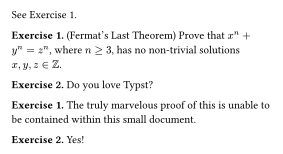

# exercism

A Typst package to organise exercises and defer their solutions.

## Example usage

See the [manual](./manual.pdf) for more details.

```typ
#import "@preview/exercism:1.1.0"

#show ref: exercism.show-ref

#let exercise = exercism.new(
  "exercise",
  supplement: [Exercise],
)

#exercise[Fermat's Last Theorem][
  Prove that $x^n + y^n = z^n$, where $n >= 3$, has no non-trivial solutions $x, y, z in ZZ$.
][
  The truly marvelous proof of this is unable to be contained within this small document.
] <fermat>

See @fermat.

#context exercism.questions("exercise", (
  body,
  supplement,
  number,
  title,
  _,
) => {
  let title = if title != none [(#title)] else []
  block[
    *#supplement #number.* #title
    #body
  ]
})

#exercise[
  Do you love Typst?
][
  Yes!
]

#context exercism.solutions("exercise", (body, _, number, _, _) => {
  block[
    *Exercise #number.*
    #body
  ]
})
```



## Similar packages

There are a couple similar packages on Typst Universe that might be of interest: [stash](https://typst.app/universe/package/stash), [exercise-bank](https://typst.app/universe/package/exercise-bank), and [answerly](https://typst.app/universe/package/answerly).
