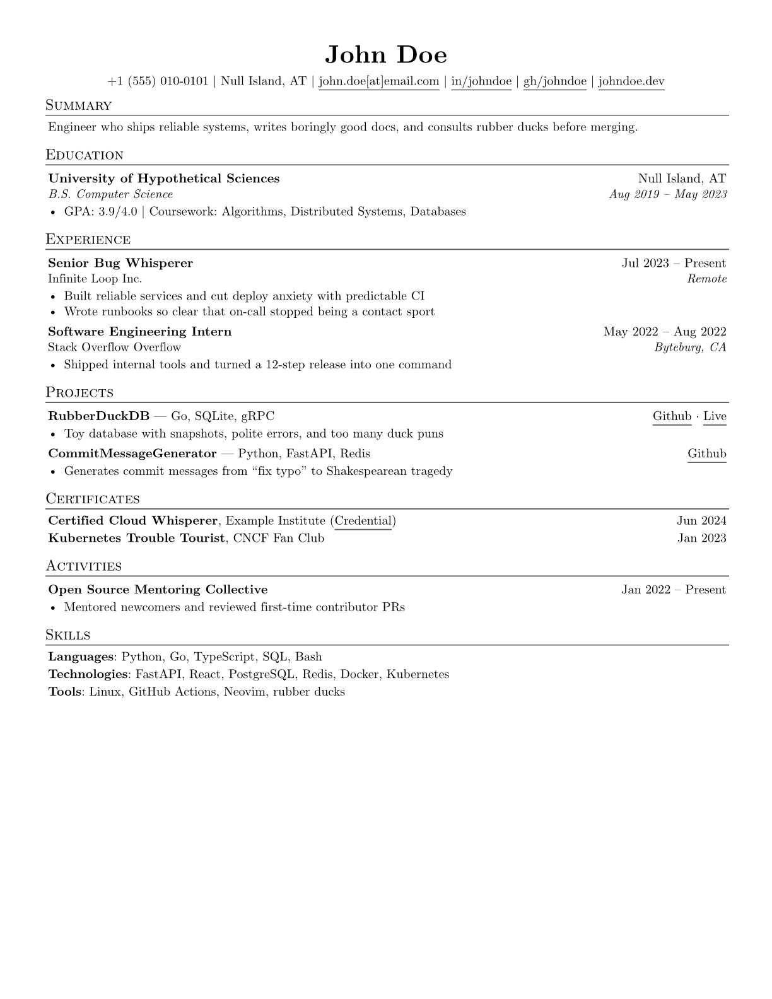

# Exp Resume

This is a simple Typst resume package designed as a practical starting point
for an ATS-friendly resume. The repository contains only reusable package code
and fictional John Doe example content. Keep real resume documents outside the
repository.

## Sample Resume



## Repository Layout

- `src/` contains the reusable implementation and public helpers.
  - `resume.typ` — document shell, contact row, section headings
  - `components.typ` — `summary`, `edu`, `work`, `project`, `certificates`, `skills`, `extracurriculars`
  - `helpers.typ` — layout helpers and `dates-helper`
  - `spacing.typ` — soft-default spacing tokens (`default-spacing`)
  - `lib.typ` — package entrypoint / re-exports
- `template/main.typ` is the John Doe starter copied by `typst init`.
- `tests/` contains regression documents for the implementation.
- `docs/architecture.md` explains the Typst package structure and release flow.
- [Manual](docs/manual.pdf) — full API reference and usage examples.
- `typst.toml` defines the package and template entrypoints.

```typst
#import "exp-resume-template/src/lib.typ": *
```

## Quick Start

Create a document from the published template (version from `typst.toml`):

```sh
typst init @preview/exp-resume:0.1.2
```

The generated `main.typ` contains the complete John Doe placeholder and the
available component functions.

The central pattern is:

```typst
#import "@preview/exp-resume:0.1.2": *

#show: resume.with(
  author: "John Doe",
  email: "john.doe@example.com",
  accent-color: "#26428b",
)

== Experience

#work(
  title: "Software Engineer",
  company: "Example Corporation",
  location: "Example City, EX",
  dates: dates-helper(start-date: "Jun 2024", end-date: "Present"),
)
- Replace this placeholder with an accomplishment.

== Skills

#skills(
  category: "Languages",
  items: "Python, Go, TypeScript, SQL, Bash",
)
```

### Spacing (optional)

Defaults live in `default-spacing` and are applied by `#resume`. Override one
or more keys when needed:

```typst
#show: resume.with(
  author: "John Doe",
  spacing: (gap: 0.85em, row: 0.65em),
)
```

Or merge with the exported defaults:

```typst
#show: resume.with(
  author: "John Doe",
  spacing: default-spacing + (leading: 0.5em),
)
```

Common keys: `leading` (line rhythm), `gap` (paragraph / space above entries),
`row` (certificate & skill rows, and space under an entry title before its
first bullet). See the [manual](docs/manual.pdf) for the full map.

## Local Development

Install the package locally before compiling the package template against the
working tree:

```sh
just install-preview
typst compile template/main.typ /tmp/exp-resume-example.pdf
```

Run the repository checks with:

```sh
just ci
```

Package a release candidate with `just package out`. Generated build and test
artifacts are ignored by Git and excluded from package output.

## Versioning

The package follows [Semantic Versioning 2.0.0](https://semver.org/) and
Typst's requirement for a full `MAJOR.MINOR.PATCH` manifest version:

- Increment the patch number for backward-compatible bug fixes.
- Increment the minor number for backward-compatible public features, and reset
  patch to `0`.
- While the major version is `0`, breaking changes should use the next minor
  version because the API is still unstable.
- After the API stabilizes at `1.0.0`, increment the major number for breaking
  changes and reset minor and patch to `0`.
- Never modify a released package version; publish a new version instead.

Git tags must exactly match the manifest version with a `v` prefix
(`vMAJOR.MINOR.PATCH`). The release workflow checks this before packaging.

Before tagging, run `./scripts/bump.sh` so `typst.toml`, package imports,
changelog, and docs stay in sync. The bump script fills the new CHANGELOG
section from commit messages since the previous tag (edit if you want). See
`CHANGELOG.md` for release history.

## Publishing

The release workflow runs for a tag matching the package version. It packages
the project and pushes a branch containing
`packages/preview/exp-resume/<version>` to `tahzeer/typst-packages`.

The repository needs a `REGISTRY_TOKEN` secret with permission to push to that
package-registry repository. The package can then be submitted to the official
Typst package repository following its publishing process.

## Footer

Based on and inspired by:

- [basic-typst-resume-template](https://github.com/stuxf/basic-typst-resume-template) (`@preview/basic-resume`)
- [Jake's Resume](https://github.com/sb2nov/resume) (Jake Gutierrez / sb2nov LaTeX resume)
