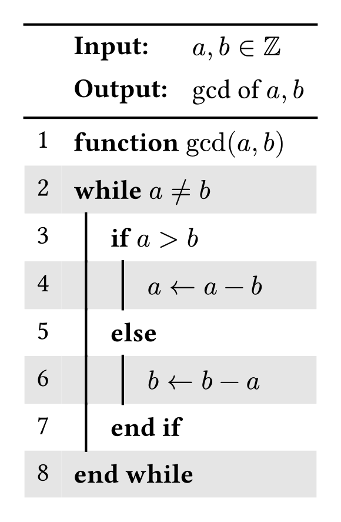
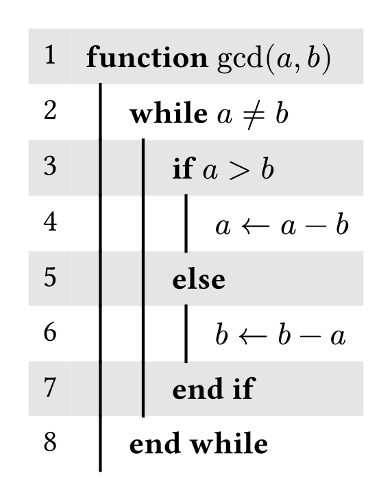

# ez-algo

A package to set algorithms in typst with ease.
It indents and unindents the lines based on some simple keywords, which you can change if you like to.

## Examples

<table><tr>
<td>

```typst
#import "@preview/ez-algo:0.1.0": ez-algo

#ez-algo(
  input: [$a,b in ZZ$],
  output: [gcd of $a,b$],
)[
  *function* $"gcd"(a,b)$ \
  *while* $a != b$ \
  *if* $a>b$\
        $a <- a - b$ \
  *else* \
        $b <- b - a$ \
  *end if* \
  *end while*
]
``` 

</td>
<td>
      
  </td>
  <td>
</tr>
</table>

<table><tr>
<td>

```typst
#import "@preview/ez-algo:0.1.0": ez-algo

#ez-algo(
  unindent-keywords: ([while], [if], [function]),
)[
  *function* $"gcd"(a,b)$ \
  *while* $a != b$ \
  *if* $a>b$\
        $a <- a - b$ \
  *else* \
        $b <- b - a$ \
  *end if* \
  *end while*
]
``` 

</td>
<td>
      
  </td>
  <td>
</tr>
</table>


## Documentation

```typst
#let ez-algo(
               input: none,
              output: none,
                fill: (x, y) =>  if calc.even(y) {gray.lighten(70%)},
          head_color: none,
              stroke: none,
     indent-keywords: ([while], [if], [for]),
     unindent-keywords: ([end while], [end if], [end for]),
      other-keywords: ([else], [else if]),
              indent: true,
               inset: 5pt,
       content_color: (numbers: black, stroke: 1pt +black, lines: black),
                body)
```

**input**: ```string``` or ```array``` sets the input in der heading of the algorithm. To change the keyword input set an array. You can change the language by set input to an array (ie. for german ``` ([*Eingabe:*],[some input variables])```)
Default: ```none```

**output**: ```string``` or ```array``` sets the output in der heading of the algorithm. To change the keyword input set an array.You can change the language by set output to an array (ie. for german ``` ([*Ausgabe:*],[some output variables])```
Default: ```none```

**fill:** ```string``` or ```array``` sets the input in der heading of the algorithm. To change the keyword input set an array.
Default:```(x, y) =>  if calc.even(y) {gray.lighten(70%)}```

**head-color:** 
Default: ```none```

**stroke:** ```none``` or ```length``` or ```color``` or ```gradient``` or ```array``` or ```stroke``` or ```pattern``` or ```dictionary``` or ```function```,
Default: ```none```

**indent-keywords:** ```array```
Default: ```([while], [if], [for])```

**unindent-keywords:** ```array```
Default: ```([end while], [end if])```

**other-keywords:** ```array```
Default: ```([else], [else if], [end for])```

**indent:** ```bool```
Defaut: ```true```

**inset:** 
Default: ```5pt```

**content-color:** ```dictionary```
Default: ```(numbers: black, stroke: 1pt +black, lines: black)```

