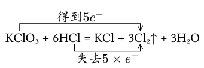
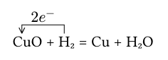
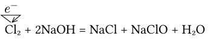
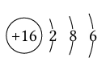
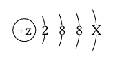

## Introduction
`Draw atomic or ionic structures powered by ctez and single or double line bridge.`


## Usage
```typst
#e-bridge(
  equation: [K] + [Cl<A>O#sub[3] + 6H] + [Cl<B> = KCl + 3] + [Cl<C>#sub[2]$arrow.t$ + 3H#sub[2]O],
  get: (from: <A>, to: <C>, e: 5, tsign: none),
  lose: (from: <B>, to: <C>, e: 5),
)
```


```typst
#e-bridge(
  equation: [Cu<A2>O + H<A1>#sub[2] = Cu + H#sub[2]O],
  get: (from: <A1>, to: <A2>, e: 2, tsign: none),
)
```


```typst
#e-bridge(
  equation: [Cl<B1>#sub[2] + 2NaOH = NaCl + NaClO + H#sub[2]O],
  get: (from: <B1>, to: <B1>, e: 1, tsign: none),
)
```


```typst
#ai-struct(proton: 16, electrons: (2, 8, 6))
```


```typst
#ai-struct(proton: "z", electrons: (2, 8, 8, "X"))
```


more [Online Documentation](https://ezexam.pages.dev/chem)