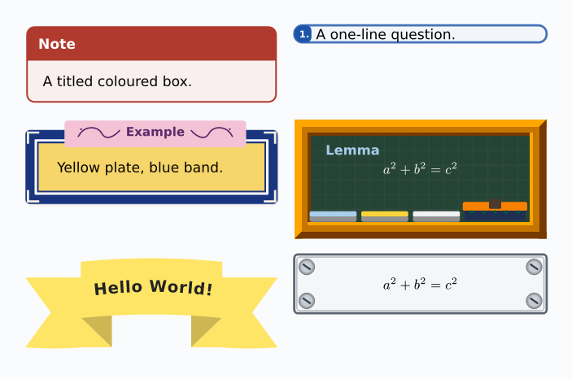

# faboxyst

Coloured, titled boxes for **Typst 0.15.x**, in the spirit of LaTeX’s
*tcolorbox*. Version **0.1.0**.


```typst
#import "faboxyst/lib.typ": *
#show: faboxyst.with(theme: themes.notebook)

#fabox(title: [Note])[A titled box.]
#sashbox(kind: "arch")[Welcome]
#ticket(stub: [12])[ADMIT ONE]
```

`#show: faboxyst.with(…)` is a **theme show rule**, not a document
class: it does not set the page.

## Install

Unzip next to your document so the folder is called `faboxyst/`:

```
your-project/
  doc.typ
  faboxyst/
    lib.typ
    typst.toml
    …
```

```bash
typst compile doc.typ --root .
```

From inside the package folder (manual and examples):

```bash
typst compile manual.typ --root .
typst compile examples/quickstart.typ examples/quickstart.pdf --root .
```

Needs `@preview/cetz:0.5.2` (Typst downloads it on first compile).
`assets/sketch.wasm` ships prebuilt. **No fonts are bundled** — Typst
uses the faces installed on the system (DejaVu, etc.). Optional extras
if you have them: xkcd Script, Bevan, Comic Neue, Tajawal, Lalezar.

Social-network posts live in the separate package **socialyst**.

## What is in the box

- **`fabox`** — the workhorse: titles, tabs (`plaque`, `swoosh`, `fold`,
  `spine`, `ears`, `dots`, …), shadows, zigzag / wave / caution borders.
- **`fabox-sign` / `fabox-note`** — octagonal sign, folded yellow note.
- **Semantic** — `note`, `tip`, `warning`, `example`, `definition`.
- **Paper** — `torn-note`, `ruled-sheet`, `notepad`, `stamp-card`,
  `index-card`, `deckle-tag`, `lesson-card`.
- **Textbook plates** — `iconbox`, `crestbox`, `ribbonbox`, `helixbox`,
  `swooshbox`, `circuitbox`, `keybox`, `ringbox`, `punchbox`,
  `plannerbox`, `filebox`, `stubbox`, `stackbox`, `calloutbox`,
  `tapebox`, `chalkbox`, `markerbox`, `screwbox`.
- **`sashbox` / `ruban`** — folded ribbon (`flat` / `arch` / `hang`),
  `incline` for the bow, `rough` for a closed sloppy outline.
- **`ticket` / `ticketbox`** — torn stub; hole and half-disc flip in RTL;
  digits stay Western.
- **RTL** — tabs, rings, stubs, titles, sashes and tickets follow the
  reading edge (or stay physical where that is the point).

## Manual

The guide is [`manual.typ`](manual.typ) /
[`manual.pdf`](manual.pdf): outline, numbered sections, signatures,
parameter tables, and code | result on every function. A 30-second
smoke test lives in [`examples/quickstart.typ`](examples/quickstart.typ).

## Licence

MIT — see [`LICENSE`](LICENSE). Box families follow *tcolorbox*
(Thomas F. Sturm). The wobble is a Rough.js / TikZ sketch port.
jotter-polylux (Andreas Kröpelin, MIT) inspired the sloppy frame and
the post-it fasteners. 

FERGOUS Abdelhak.
