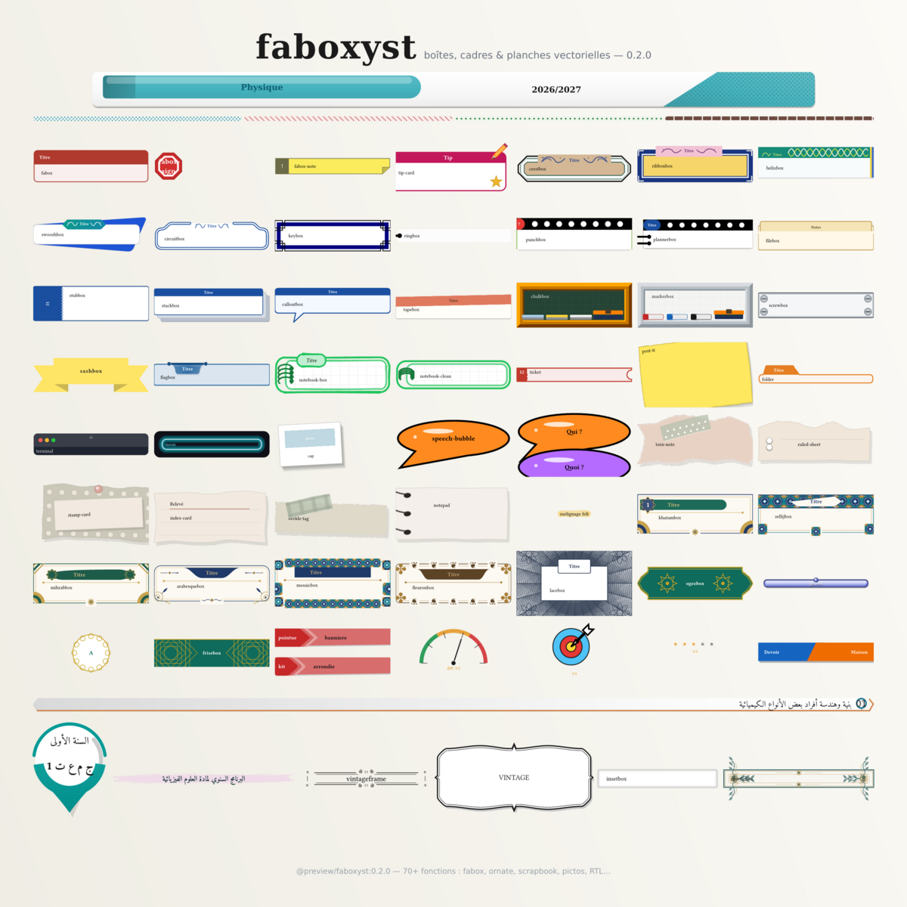

# faboxyst

Coloured, titled boxes for **Typst 0.15.x**, in the spirit of LaTeX’s
*tcolorbox*. Version **0.2.0**. 



```typst
#import "@preview/faboxyst:0.2.0": *
#show: faboxyst.with(theme: themes.notebook)

#fabox(title: [Note])[A titled box.]
#sashbox(kind: "arch")[Welcome]
#ticket(stub: [12])[ADMIT ONE]
#khatambox(title: [الحساب الجبري], badge: [1], badge-label: [تمرين])[An ornate plate.]
#flagbox(title: [Note], tail: "swallow", badge: [2])[A hanging flag title.]
```

`#show: faboxyst.with(…)` is a **theme show rule**, not a document
class: it does not set the page.

## Install

From Typst Universe (package update **0.2.0** of **0.1.0**):

```typ
#import "@preview/faboxyst:0.2.0": *
```

Or unzip next to your document so the folder is called `faboxyst/`.

From inside the package folder (manual and examples):

```bash
typst compile manual.typ --root .
typst compile examples/quickstart.typ examples/quickstart.pdf --root .
typst compile examples/ornate.typ --root .
typst compile examples/arabic-plates.typ --root .
typst compile examples/image-motif.typ --root .
typst compile examples/rtl-boxes.typ --root .
typst compile examples/flow.typ --root .
typst compile examples/covers.typ --root .
typst compile examples/meters.typ --root .
```

Needs `@preview/cetz:0.5.2` (Typst downloads it on first compile).
`assets/sketch.wasm` ships prebuilt. **No fonts are bundled** — Typst
uses the faces installed on the system (DejaVu, etc.). Optional extras
if you have them: xkcd Script, Bevan, Comic Neue, Tajawal, Lalezar.

Social-network posts live in the separate package **socialyst**.

## What’s new (0.2.0)

Classroom pictos after *customenvs*, extra meters, and highlight marks.

- `#meter` — `battery`, `speedo`, `chrono` (`#pictochrono`), `wifi`, `cible`; `size` on every instrument. Chili style removed.
- `#competence-crayon` — vertical pencil; RTL pencil on the right, pills against it, text right-aligned.
- `#sale-poster` — AfficheSoldes (slanted SOLDES; Arabic + mirrored layout in RTL).
- `#banner-tri` — nested chevrons; LTR arrow →, RTL arrow ←; text not slanted.
  `style: "arrondi"` softens tips and panel (the arabic-exam-kit header
  variant; fillet radii via `round` / `body-round`), `style: "pointu"` is
  the default sharp look.
- `#bicolor-title`, `#highway-sign`, `#level-counter`, `#tkzpicto`.
- `#mark` / `#highlight-formula` / `#highlight-text`.

```typ
#import "@preview/faboxyst:0.2.0": *
#meter(3, style: "wifi", size: 1.3cm, max: 4)
#banner-tri(title: [01], direction: rtl)[فصل]
#sale-poster(old: [19,90 €], new: [9,90 €], reduction: [−50%])
```

## What is in the box

- **`fabox`** — the workhorse: titles, tabs (`plaque`, `swoosh`, `fold`,
  `spine`, `ears`, `dots`, …), shadows, zigzag / wave / caution borders.
- **`fabox-sign` / `fabox-note`** — octagonal sign, folded yellow note.
- **Semantic** — `note`, `tip`, `warning`, `example`, `definition`.
- **Paper** — `torn-note`, `ruled-sheet`, `notepad`, `stamp-card`,
  `index-card`, `deckle-tag`, `lesson-card`.
- **Textbook plates** — `iconbox`, `crestbox`, `ribbonbox`, `helixbox`,
  `swooshbox`, `circuitbox`, `keybox`, `ringbox`, `punchbox`,
  `plannerbox`, `filebox`, `stubbox`, `stackbox`, `calloutbox`,
  `tapebox`, `chalkbox`, `markerbox`, `screwbox`.
- **`plankbox` / `pancarte`** — a rustic wooden sign: light golden-beige
  planks with cut/torn notched ends, wavy edges, darker rim, grain,
  cracks, scratches, spots, a faint shadow and a very slight lean; title
  on the top plank, body below, or a single centred 2.4:1 plank without
  a title. The lean mirrors in RTL.
- **`tornpage` / `page-dechiree`** — a paper note after the tcolorbox
  `tcbnote` (TeX.SE 586474, CC BY-SA 4.0): straight top and sides, sharp
  corners, a fractal-torn bottom edge (ragged base refined by recursive
  midpoint displacement), blurred shadow, papyrus mottle and a bold
  centred title.
- **`coilbox` / `cahier`** — a spiral-notebook page after the clip-art:
  rounded pink double frame with a 3D lip, pink spine, black punch holes
  and alternating pink/purple 3D coils whose rings overflow the sheet
  edge (left in LTR, right in RTL) as in the reference artwork; punch
  holes stay visible on the inner side of the spine in both directions.
- **`volutebox` / `volute-pages`** — fine double-line stationery frame with
  scrolled volute corners, as a box or on every page; **`parchemin`** —
  the rolled pink scroll of an old letter with signing ribbon.
- **`ogeebox` / `frisebox`** — teal-and-gold ogee banners with rosettes,
  numbered badge and girih frieze bands, plus scalloped `medallion`s.
- **`gelbox` / `bouton`** — glossy aqua buttons (gradient gel, gloss
  cap, rim, drop shadow, glossy ball on the top edge).
- **`leconbox` / `lecon`, `pinbox` / `epingle`, `brushbox` / `pinceau`,
  `matierebox` / `cartouche`** — the annual-programme plate: numbered
  lesson bar with chevron, underline and comma badge; map-pin badge;
  watercolour brush-stroke banner; subject-and-year ribbon.
- **`vintageframe` / `cadre-vintage`, `vintagebox` / `plaque-vintage`** —
  eight scrollwork line-art frames (SVG sheet) and six bracket plaques
  with double rule and drop shadow (EPS sheet).
- **`halftone` / `trame`** — dot-screen `tiling` fill (staggered or square,
  optional backdrop paint); `examples/gallery.typ` maps every family.
- **`tikzpattern` / `motif-tikz`** — TikZ `patterns`/`patterns.meta` motifs
  as `tiling` paints: "horizontal lines", "vertical lines",
  "north east lines", "north west lines", "hatch", "lines", "grid",
  "crosshatch", "dots", "crosshatch dots", "checkerboard", "bricks",
  "fivepointed stars", "sixpointed stars"; options `distance`, `angle`,
  `line-width`, `radius`, `color`, `backdrop`. Line families are seamless
  at any angle (lattice-cell tile); `grid`/`crosshatch` exact at 45°
  multiples.
- **`smooth-pts`** — quadratic-Bézier corner fillets on a point list;
  powers `banner-tri(style: "arrondi")` and any custom polygon.
- **`banner-tri-bis`** — the arabic-exam-kit `exam-exercise-box` layout:
  a compact three-layer rounded-arrow ribbon hugging its
  `title : (points)` label, seated above the body on the leading edge
  (right in RTL, left in LTR); `arrow-gap`, `ribbon-width`, `style`.
- **Fancy paper family** (`src/fancy.typ`) — `post-it`, `vignette`,
  `spread-box`, `ticket` / `ticketbox`, `folder`, `terminal`, `neon`,
  `polaroid`, `mark` / `hl` and friends. `polaroid` is a tilted
  instant-photo card whose photo zone is a real content area: drop an
  image in it or write — the body is centred on the tinted `photo-fill`
  (`none` for transparent); `width` (card width, default 7 cm),
  `photo-height`, `caption`, `angle`, `shadow`, `rough`.
- **`rosettebox` / `cadre-rosette`, `rosette-pages`** (`src/rosette.typ`) — the
  dedication-sheet ornaments (triple rule, interlaced corner curves with
  sage leaves and eight-petal rosettes, diamond rows, centre medallions)
  as a content-adaptive LTR/RTL box and as a page frame; `scale`,
  `corners`, `diamonds`, `medallions`, `ink` / `gold` / `leaf` / `paper`.
- **Relief shadows** — after the `shadowed` package (SVG + Gaussian
  blur): `insetbox` / `boite-creusee` for the symmetric inner shadow,
  `fabox` `shadow: "creuse"` / `"bombe"`, `relief()` for custom boxes.
- **`plankbox` sketchy-pencil styles** — `style: "sketch"` (wavy double
  graphite outline with radiating pencil ticks) and `style: "hatch"`
  (rough rectangle in a scribbled hatch halo) reproduce the hand-drawn
  banner looks on off-white paper.
- **Page frames** — `plank-pages`, `torn-pages` and `coil-pages` seat any
  of the three as a frame on every page (like `ornate-pages`); the boxes
  also take `height:` to stretch on demand. Use them as `#show:` rules
  for a whole document, or call them directly per section to chain
  several frames in one document with correct margins everywhere.
- **`sashbox` / `ruban`** — folded ribbon (`flat` / `arch` / `hang`),
  `incline` for the bow, `rough` for a closed sloppy outline.
- **`ticket` / `ticketbox`** — torn stub; hole and half-disc flip in RTL;
  digits stay Western.
- **Ornate frames** — `ornatebox` builds a frame by repeating vector
  *motifs* along concentric rules: sides, corners, centres, a title sash
  with nine cap shapes or a course of zellij tiles with a pennant, and a
  khatam badge. Presets: `khatambox`, `zellijbox`, `arabesquebox`,
  `mihrabbox`, `mosaicbox`, `fleuronbox`; `ornate-pages` draws one on
  every page.
- **`flagbox`** — a title hanging from a rod (*tcolorbox*'s flag style,
  improved): gradient banner, finials, gloss, stitched hem, soft shadow,
  three tails (`drape` / `point` / `swallow`), badge, end motif,
  `flag-align`, breakable body.
- **RTL** — tabs, rings, stubs, titles, sashes and tickets follow the
  reading edge (or stay physical where that is the point); so do the
  ornate frames and the flag.
- **Guilloche lace** — `lace()` draws four security-print line families
  (`spiral`, `engine`, `braid`, `moire`); `lacebox` frames a body in a
  banknote band with rosettes and a title plaque (models `band` /
  `double` / `scallop` / `corners`, hand-drawn `rough` mode, ornament
  corners); `book-cover(style: "guilloche")` dresses a full page.
- **`pgfornament`** — all 276 engraved ornaments of the CTAN package
  *pgfornament* (196 vectorian, 78 han, 2 am) drawn at any width:
  `pgfornament(n, family:, width:, paint:, thickness:)`.

## Ornate frames (0.2.0)

Every box takes `direction: auto` (force `ltr` / `rtl`) and aligns its body
to `start`, so RTL documents set their content right with no extra
`align(right)`. `mark` and `highlight` cover multi-line runs; `post-it`
grows `tape-wide`; `def-card` / `sketch-box` take `breakable: true`.

A motif is a dictionary `(aspect: (w, h), draw: (size, palette) => content)`,
and three sources of motifs are interchangeable:

- the built-in ones — `edge: "rosette"`, `corner: "scroll"` (19 in `motifs`);
- any glyph of any font — `glyph-motif("\u2766")`, or a dedicated ornament
  face: `glyph-motif("\U0001F66A", font: "Noto Sans Symbols 2")`;
- any SVG read as text — `image-motif(read("assets/corner5.svg"))`,
  recoloured black \u2192 ink, white \u2192 paper;
- or your own: a function, or any content.

Unlike image-asset frame packages, a box recolours from three values
(`colour`, `gold`, `paper`), scales to any size, and the package ships no
images for them. Everything logical flips in RTL (`start` / `end`, the
badge, the pennant, `(bottom-end: \u2026)` corners).

```typ
#import "@preview/faboxyst:0.2.0": *

#khatambox(title: [الحساب الجبري والمرافق], badge: [1], badge-label: [تمرين])[\u2026]
#flagbox(title: [ملاحظة], badge: [1], tail: "swallow", end-motif: "finial")[\u2026]
#show: ornate-pages.with(preset: arabesquebox, margin: 1cm)   // a frame on every page
```

## Manual

The guide is [`manual.typ`](manual.typ) /
[`manual.pdf`](manual.pdf): outline, numbered sections, signatures,
parameter tables, and code | result on every function — including the
*Ornate frames* and *Flag box* chapters. Smoke tests live in
[`examples/quickstart.typ`](examples/quickstart.typ),
[`examples/ornate.typ`](examples/ornate.typ),
[`examples/arabic-plates.typ`](examples/arabic-plates.typ) and
[`examples/image-motif.typ`](examples/image-motif.typ),
[`examples/rtl-boxes.typ`](examples/rtl-boxes.typ) (right-to-left
documents: mirrored fasteners, flipped corners, forced direction)
and [`examples/flow.typ`](examples/flow.typ) (multi-line marks,
`tape-wide`, breakable boxes, seated ribbon and ogee sash).

[`examples/covers.typ`](examples/covers.typ) shows the three full-page book covers
(`book-cover`: guilloche, wedges, spine, medallion, compass,
openbook, sunburst, dice, scatter);
[`examples/covers-duo.typ`](examples/covers-duo.typ) shows each of them in Arabic and in French) and [`examples/meters.typ`](examples/meters.typ) the
difficulty meters (`meter` / `difficulty`: gauge, thermo, battery, bars).
[`examples/lace.typ`](examples/lace.typ) draws the four guilloche families on covers and on
`lacebox` frames — every box in hand-drawn `rough` mode, plus two pages
seating `pgfornament` pieces in the corners.

## Licence

The manifest states `MIT AND LPPL-1.3c AND MIT-0`; per file:

- all package code — MIT, see [`LICENSE`](LICENSE);
- `src/pgfornament.typ` — LPPL-1.3c, a derivative of the CTAN package
  *pgfornament* v1.3 (Alain Matthes, LPPL 1.3 or later; original idea of
  F. Fradin and H. Voss; `han` family by LIM LianTze); the attribution
  header in the file stays;
- the three SVGs in `examples/assets/` — MIT-0, from *fancy-frames*
  (Daniel Ayala); they only demonstrate `image-motif` — delete them and
  nothing breaks;
- `src/tornpage.typ` — CC-BY-SA-4.0, a derivative of the `tcbnote`
  answer by Ignasi (TeX.SE 586474); every other file stays MIT.

The box families follow *tcolorbox* (Thomas F. Sturm) and the wobble is a
Rough.js / TikZ sketch port as inspirations, not derived works;
jotter-polylux (Andreas Kröpelin, MIT) likewise inspired the sloppy frame
and the post-it fasteners.

FERGOUS Abdelhak.
