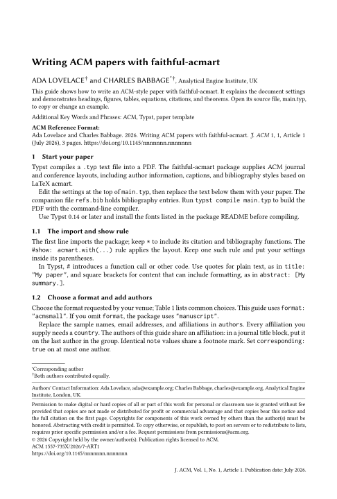
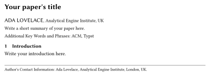
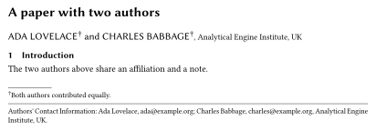
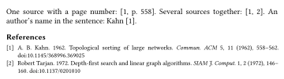
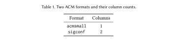
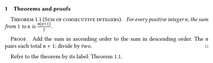

<!--
Typst Universe displays this README on the package page, so it serves as both a showcase and a getting-started guide.
Help prospective users assess the package through representative examples and a clear account of its capabilities and limits.
Write for human readers: use clear, concise, precise language and lists or tables where they make information easier to scan.
Prefer rendered SVG examples when they explain the output better than prose.
Keep detailed option contracts in the reference; do not shorten this README merely to avoid overlap with the other documentation.
-->

# faithful-acmart

Write ACM-style papers in Typst, with journal and conference layouts, author metadata, ACM bibliography styles, and theorem environments.
Typst compiles a plain-text source file into a PDF; this package supplies the ACM formatting.
The package follows LaTeX `acmart` 2.21 and tests its output against equivalent LaTeX documents.

**[Get started](#getting-started)** · **[Look up an option](docs/reference.md)** · **[Browse the starter](template/main.typ)** · **[Changelog](docs/changelog.md)**



*The [starter guide](template/main.typ) explains how to use the package while demonstrating the `acmsmall` journal format.*

- **Journal and conference formats:** choose `acmsmall`, `acmlarge`, `acmtog`, `sigconf`, or one of the other supported layouts.
- **Front matter:** supply affiliations, author notes, ORCIDs, CCS concepts, publication metadata, and translations.
- **Three bibliography backends:** ACM BibTeX formatting, ACM BibLaTeX formatting, or Typst's native CSL implementation.
  All run in Typst; compiling a paper does not require TeX or Biber.
- **Ordinary Typst content:** write headings, paragraphs, equations, figures, and references as usual; use the package's helpers for ACM tables and theorem environments.

TeX and Typst can produce different line and page breaks.
See [compatibility](docs/reference.md#compatibility) for the specific limits of the port.
Set `fix-quirks: true` to apply [corrections to inherited LaTeX quirks](docs/reference.md#corrections).

## Getting started

Use Typst 0.14 or later and install the [required fonts](#fonts), then create a project:

```sh
typst init @preview/faithful-acmart:0.2.0 my-paper
cd my-paper
typst compile main.typ
```

The starter includes `main.typ`, a guide with working examples, and `refs.bib`, a sample bibliography.
Read the guide alongside its source to see how the examples are written, then replace the sample metadata and content with your own.
Keep one `#show: acmart.with(...)` rule near the top of your paper and add options to that rule as needed.

For an existing document, import the package and apply `acmart`:

<!-- render: getting-started compact -->
```typst
#import "@preview/faithful-acmart:0.2.0": *

#show: acmart.with(
  format: "acmsmall",
  nonacm: true,
  title: "Your paper's title",
  authors: ((
    name: "Ada Lovelace",
    affiliation: (
      institution: "Analytical Engine Institute",
      city: "London",
      country: "UK",
    ),
  ),),
  abstract: [Write a short summary of your paper here.],
  keywords: ("ACM", "Typst"),
)

= Introduction
Write your introduction here.
```



*Title block and contact information, with the intervening page space omitted.*

This example uses `nonacm: true` to suppress ACM publication notices while you try the layout.
For a publication, use the metadata and settings supplied by your venue; the [publication reference](docs/reference.md#publication-metadata) explains where they go.

Keep the wildcard import (`*`): it brings in the package's `cite` and `bibliography` replacements as well as the document style.
The `#import` line loads those functions; the `#show` rule applies the layout to the document.

## Fonts

The package uses **Libertinus Serif**, **Libertinus Sans**, **Libertinus Math**, and **Inconsolatazi4**.
Download them from the repository's [fonts directory](https://github.com/fzaiser/faithful-acmart/tree/v0.2.0/fonts), which also contains their licenses and provenance.
They are not included in the published package.

| Where you compile | How to provide the fonts |
|---|---|
| Your computer | Install the fonts, or pass their directory with `--font-path`. |
| Typst's web app | Upload the font files into your project. |

```sh
typst compile --font-path ./fonts main.typ
```

## Choose a format

Use the format requested by your venue:

| `format` | Layout |
|---|---|
| `manuscript` | Single-column manuscript; the default |
| `acmsmall`, `acmlarge` | Single-column journals |
| `acmtog` | Two-column TOG journal |
| `sigconf` | Conference proceedings |
| `siggraph`, `sigchi` | Aliases of `sigconf`, as in acmart |
| `sigplan` | SIGPLAN proceedings |
| `acmengage` | EngageCSEdu |
| `sigchi-a` | Legacy landscape extended abstract, with a margin-note column |
| `acmcp` | Cover-page format; requires a journal logo supplied by you |

The reference covers [format options](docs/reference.md#format-and-page-settings), [conference metadata](docs/reference.md#publication-metadata), and [special formats](docs/reference.md#special-formats).

## Add authors and paper metadata

Each author can have multiple affiliations and notes, an email address, and an ORCID link.
The package also supports shared author notes, a corresponding-author mark, translated titles and abstracts, and receipt history.

<!-- render: authors compact -->
```typst
#show: acmart.with(
  format: "acmsmall",
  nonacm: true,
  title: "A paper with two authors",
  authors: (
    (
      name: "Ada Lovelace",
      note: [Both authors contributed equally.],
      email: "ada@example.org",
    ),
    (
      name: "Charles Babbage",
      note: [Both authors contributed equally.],
      email: "charles@example.org",
      affiliation: (institution: "Analytical Engine Institute", country: "UK"),
    ),
  ),
)

= Introduction
The two authors above share an affiliation and a note.
```



*Title block and author footnotes, with the intervening page space omitted.*

Identical notes share a mark.
In a journal title block, placing a shared affiliation on the last author groups the authors above it.
See [authors and affiliations](docs/reference.md#authors-and-affiliations) for the data shapes and other grouping options.

## Cite sources

Choose a bibliography backend to control how references are formatted:

| `bib-backend` | Formatting |
|---|---|
| `"bibtex"` | Default; follows ACM's `ACM-Reference-Format.bst`. |
| `"biblatex"` | Follows ACM's BibLaTeX styles, including software artifacts. |
| `"typst"` | Uses Typst's built-in ACM CSL style. |

With the first two backends, set `cite-style: "author-year"` for author–year citations.

<!-- render: citations -->
```typst
One source with a page number: @Kahn1962[p. 558].
Several sources together: #cite(<Kahn1962>, <Tarjan1972>).
An author's name in the sentence: #cite-text(<Kahn1962>).

#bibliography("refs.bib")
```



The keys above come from the starter's [refs.bib](template/refs.bib).
Use your own bibliography file and keys in your paper.
For multiple files, citation variants, and backend-specific arguments, see the [citation reference](docs/reference.md#citations-and-bibliographies).

## Tables

Use `tabular` with the rule helpers for booktabs-style tables.
It adds rule spacing and can tag the first row as a header.

<!-- render: table -->
```typst
#figure(
  tabular(
    columns: 2,
    toprule(),
    [Format], [Columns],
    midrule(),
    [`acmsmall`], [1],
    [`sigconf`], [2],
    bottomrule(),
  ),
  caption: [Two ACM formats and their column counts.],
)
```



*Rendered with `acmsmall` styling.*

Pass `columns` directly to `tabular`.
For multiple header rows or positioned cells, see [tables](docs/reference.md#tables).

## Theorems and proofs

The theorem environments share a counter within each numbered section and support ordinary Typst labels and references.

<!-- render: theorem -->
```typst
= Theorems and proofs

#theorem(name: "Sum of consecutive integers")[
  For every positive integer $n$, the sum from $1$ to $n$ is $n(n + 1) / 2$.
] <sum-theorem>

#proof[
  Add the sum in ascending order to the sum in descending order.
  The $n$ pairs each total $n + 1$; divide by two.
]

Refer to the theorem by its label: @sum-theorem.
```



*Rendered with `acmsmall` styling.*

There are also lemmas, corollaries, propositions, conjectures, definitions, examples, and remarks.
See [theorems and acknowledgments](docs/reference.md#theorems-and-acknowledgments) for naming and numbering.

## Documentation

Use the starter to learn the package and the reference to look up a setting:

- [Reference](docs/reference.md): options, examples, and compatibility limits.
- [Starter guide](template/main.typ): explanations and working examples of figures, tables, citations, and theorems.
- [Changelog](docs/changelog.md): release notes and instructions for upgrading.

## Development and contributing

The repository includes paired Typst and LaTeX documents for checking the port's behavior.
To work on the package, see:

- [Contributing](https://github.com/fzaiser/faithful-acmart/blob/v0.2.0/CONTRIBUTING.md): setup, comparisons, and documentation checks.
- [Design](https://github.com/fzaiser/faithful-acmart/blob/v0.2.0/DESIGN.md): the implementation and its relationship to LaTeX.
- [Publishing](https://github.com/fzaiser/faithful-acmart/blob/v0.2.0/PUBLISHING.md): release preparation.

The project was developed with AI coding assistance and human review.

## License

The package is [MIT licensed](LICENSE); the [starter template is MIT-0](template/LICENSE).
The [Creative Commons badges](src/assets/cc/README.md) are trademarks covered by their own usage policy.
The ACM journal logo must be supplied by the user.
