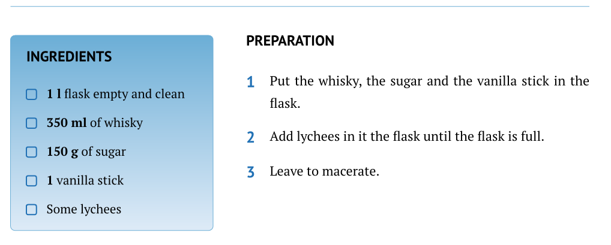
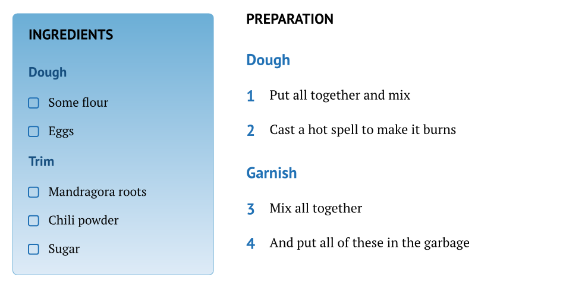

# Fancy Cookbook

Inspired by the excellent [chef-cookbook](https://typst.app/universe/package/chef-cookbook) by PaulMue0 with some significant differences.

So this is a template to write some recipes in a coherent cookbook with beautiful colors, appendices, indexes, and other stuffs in your language.

## How to use it ?

You can use this template in the Typst web app by clicking "Start from template" on the dashboard and searching for `fancy-cookbook`.

Alternatively, you can use the CLI:

```bash
typst init @preview/fancy-cookbook
```

## What's in it ?

There is different functions to make your cookbook :
* `recipe` : This function will help you write recipes with a very simple syntax, but it has advanced function too to customize the render.
* `cookbook` : This function will help you for the book itself, it's the most important part. All of this needs the usage of *cookbook* and *recipe*.
  You'll use this one before everything else, but for a better comprehension, I will describe this one after the *recipe*.
* `not-a-recipe` : This one is here to help you write text in sections that not look like the recipes (there is more space here).
* `set-theme` : This function can change the colors of the next chapters and recipes.
* `cover-image` : This one will help you put a cover image with a good integration to the cookbook.
* `back-cover-image : This one is the same as the previous but for the back cover.

## Recipe

Minimal syntax to use it with an example :

```typ
#recipe(
  [Lychee whiskey],
  description: [Perfumed Whisky],
  servings: 6,
  prep-time: [2 min],
  cook-time: [10 min],
  ingredients: [
    - *1 l* flask empty and clean
    - *350 ml* of whisky
    - *150 g* of sugar
    - *1* vanilla stick
    - Some lychees
  ],
  instructions: [
    + Put the whisky, the sugar and the vanilla stick in the flask.
    + Add lychees in it the flask until the flask is full.
    + Leave to macerate.
  ]
)
```
The first part, with the name, the description, servings, prep-time and cook-time is for the header part of the recipe that you can see here :


You can see the page header with the book's title on the left and chapter title on the right and a line to separate from the header of the recipe which is also closed by a line

The second mandatory part is **ingredients** which as you can see is a content with a list.
The third mandatory part is **instructions** which is a content with a numbered list.

This two parts wil be separate in two columns. And all the body part of the recipe will be in the left or the right column. Here it is :



That's it for the simplest recipe, but we have other options. First of all we can have groups of ingredients and groups of instructions.

### Groups of Ingredients or Instructions

```typ
#recipe([Something Cool],
  description: [An imaginary recipe],
  servings: 6,
  prep-time: [2 min],
  cook-time: [10 min],
  ingredients: (
    (
      title: [Dough],
      items: [
        - Some flour
        - Eggs
      ]
    ),
    (
      title: [Trim],
      items: [
        - Mandragora roots
        - Chili powder
        - Sugar
      ]
    )
  ),
  instructions: (
    (
      title: [Dough],
      steps: [
        + Put all together and mix
        + Cast a hot spell to make it burns
      ]
    ),
    (
      title: [Garnish],
      steps: [
        + Mix all together
        + And put all of these in the garbage
      ]
    )
  )
)
```

So you can see that we have replaced the content with lists of dictionaries. The two known dictionaries have a key named *title*.
For the ingredients, the key *items* will accept a content with a list, as it was before.
For the instructions, the key *steps* will accept a content with a numbered as it was before.

And the result is :



As you can see the numbering continue even if the lists are in different groups.

### Other optional properties

#### *image-left* and *image-right*

```typ
#recipe(
  [Lychee whiskey],
  description: [Perfumed Whisky],
  image-left: image("asset/whisky.png)  // image-right or both
)
```
You can add images to the recipe, one is for the left column and the other for the right one. This option can let you adjust your recipe to fit in one page if you want.

#### *notes* and *notes-right*
```typ
#recipe(
  [Lychee whiskey],
  description: [Perfumed Whisky],
  notes: [If you add some coriander at the end, il will be amazing.]
)
```
notes will be placed in a block in the left column.
This is the default behavior and that's why it's not named *notes-left*.
But sometimes, the only way for the recipe to fit in one page is to have notes on the right side, so you have *notes-right*.

#### *author*
If you want like me to tell, recipe by recipe, who is the author like your grandmother this property is for you.

```typ
#recipe(
  [Banana Jam],
  description: [Sweet Jam],
  author: [GrandMa]
)
```

#### *label*

This one is very important for me. You can add a label for your recipe and use it as a reference in other recipe.
For example, you have a recipe for Pizza Dough and different pizza recipes.
In the ingredients part of each of them you can reference the first recipe and the reference will be replaced by something like "Pizza Dough(p. 17)".

Here is a small example of usage :

```typ
#recipe(
  [Pizza Dough],
  description: [Base Dough for Pizza],
  label: <pizzaDough>
)
  
  
#recipe(
    [Peperoni Pizza],
    ingredients: [
      - @pizzaDough
    ]
)
```


#### *tags*
The tags will not be seen in the recipe but will be used to create indexes that we will see in the *cookbook* part.
But one thing to know is that if you put only one tag in a recipe, you'll have an appendices part with an index at the end of the book.

```typ
#recipe(
  [Banana Jam],
  description: [Sweet Jam],
  tags: ("Banana", "Sweet", "Breakfast")
)
```

I prefer to use dictionaries for my tags, it can help you avoid mistakes (different spelling). Here is an example :

```typ
#let country = (
    france: "France",
    spain: "Spain"
)

#recipe(
  [Banana Jam],
  description: [Sweet Jam],
  tags: (country.spain)
)
   
#recipe(
  [Paella],
  description: [Very good],
  tags: (country.spain)
)
```

And you will see how it can help you build custom indexes in the *cookbook* part.

## Cookbook

The minimal cookbook usage :

```typ
#show: cookbook.with(
  title: "My Cookbook",
  subtitle: "All that good"
)

= Soups

#recipe(
    [Soup of the day]
)
```
You just need a title and a subtitle to make your cookbook.
And then you can add chapter and recipes. But you can customize your cookbook with all the next properties.

### paper
This property is used to define the size of the pages.
You can see all the available options here [Page Function](https://typst.app/docs/reference/layout/page/) at the paper property.
The default size is "a4" and it was not tested with all the options.

### *subtitle*, *date* and *cover-image*

All of these properties are used in the cover page with the title. Set values to see what changes.

By default, *date* is set as today and you can see the month and the year at the page bottom.

For the *cover-image* property, I recommend to use the built-in function *cover-image* like this:

```typ
cover-image: cover-image("assets/TonkotsuRamen.jpg"),
```

this will ensure that your image integrate with the cover with efficiency.

### *back-cover-content*, *back-cover-image* and *book-author*

The back-cover is optional.
But if you set a value for *back-cover-content* or *back-cover-image* the back-cover will appear.
As the cover is at page 1 (impair page), the back-cover will always be in a pair page, to close your book.

As the name said, the *back-cover-content* property accept a content.

For the *back-cover-image* property, I recommend to use the built-in function *back-cover-image* like this:

```typ
back-cover-image: back-cover-image("assets/hearts.jpg"),
```

Finally, the *book-author* is visible only in the back cover page. So, if you set a value, you will see it in this page.

### *theme* and *style*

*fancy-cookbook* loves colors and is available with 10 colored themes :

* blue
* brown
* green
* grey (the default one, not so fancy)
* indigo
* lime
* orange
* pink
* purple
* teal

A theme is something like this :

```typ
#let theme-lime = (
  dark: rgb("#4d9221"),
  medium: rgb("#a6d96a"),
  light: rgb("#f7fcb9")
)
```

So when you need to set a theme you can use one of these and I will show you how, or create your own. You only need to respect the 3 keys : *dark*, *medium*, and *light*.

For the *cookbook* function, the theme should be set like this :

```typ
#show: cookbook.with(
  title: "My Cookbook",
  subtitle: "All that good",
  theme: themes.blue
)
```
to use one of the themes in the package.

Or you can do this :

```typ
#let theme-lime = (
  dark: rgb("#4d9221"),
  medium: rgb("#a6d96a"),
  light: rgb("#f7fcb9")
)

#show: cookbook.with(
  title: "My Cookbook",
  subtitle: "All that good",
  theme: theme-lime
)
```
to use yours. In this example, I used the theme *lime* that is already in the package.

Now it's time to talk about *style*.
This property has only effect on the ingredients block. There is 2 styles available :
* **flat**: which is the default one, medium color for the border, light color for the background and dark color for the groups titles.
* **gradient** : there is 2 differences.
  * The background is now a gradient between the medium color and the light one.
  * And to preserve contrast on the upper part, the dark color used for the groups titles is a little darker.

To set the gradient style for your book you can write :

```typ
#show: cookbook.with(
  title: "My Cookbook",
  subtitle: "All that good",
  style: style.gradient
)
```


### custom-i18n

Translations is a part of this package.
I have provided 4 languages in this version (and you can suggest others if you want on Github), but you can also provide your own version of the different labels.

The 4 languages are :
* **fr** : for french
* **en** : for english
* **es** for spanish
* **por** : for portuguese

To set the current language in any part of the document you can use this instruction (which I recommend you to do every time, in all your document), example with french :

```typ
#set text (lang:"fr")
```

Do it before calling the *cookbook* function. You can also switch between recipe your language with this instruction, but I don't know why you would do that.

#### What can you do if your language is missing ?
You can add your own language by setting a dictionary with the labels to translate and use the *custom-18n* property. Here is the English version :

```typ
#let english = (
    en: (
      toc: "Table of Contents",
      ingredients: "INGREDIENTS",
      preparation: "PREPARATION",
      notes: "CHEF'S NOTES",
      author: "AUTHOR",
      annexes: "Appendices",
      index: "Thematic Index"
    )
)

#show: cookbook.with(
  title: "My Cookbook",
  custom-i18n: english
)
```
And it will add your dictionary to the others. But you need to set the languages (`#set text (lang:"fr")`) with the one you have just added.

#### What if there is my language, but I want to use custom labels ?
Because the English language already exists, the previous example will not really add English (but this is true for an unknown one), your version will replace mine.
But you can also, only change one label at a time like this :

```typ
#let english = (
    en: (
      toc: "Recipes"
    )
)

#show: cookbook.with(
  title: "My Cookbook",
  custom-i18n: english
)
```
And only the toc label will be changed.

### chapter-start-right
The chapters appear as a separation page with a big title in the middle (it's more like a part separation).
I like when this page is on the right side, so impair numbering page.

If you like it too, just add this property set to true like this :

```typ
#show: cookbook.with(
  title: "My Cookbook",
  chapter-start-right: true
)
```
### custom-appendices
The appendices section appears at the end if you set this property or if you add some tags to the recipes.

This property adds what you want in the part, because it's simply a content. In my cookbook I used it to add a glossary, but you can add a bibliography or whatever you want.

To set this property, I recommend to do it like that :

```typ
#let appendices = [
    = Nice
    Some cool stuffs
]

#show: cookbook.with(
  title: "My Cookbook",
  custom-appendices: appendices
)
```

### indexes
As I have said for the tags in the *recipe* function or just before in the *custom-appendices* properties, the appendices section appears with a tag in a recipe.
And if we do nothing it will have an index called in English "Thematic Index". This default index looks like the toc, but smaller.
It will have all the keys you used as tags and the recipes that have this tags.

If you only have one type of information in your tags, it's a good thing.
But if you have different information like me (I used the location and type of recipe), you'll probably want 2 different indexes.
So with this property, you'll replace the default index with yours.

Here is an example with locations and types :

```typ
#let location = (
    france: "France",
    spain: "Spain"
)

#let type = (
    dessert: "Dessert",
    meal: "Meal"
)

// a function to transform a dictionary to a list
#let dict-values(d) = d.keys().map(k => d.at(k))

#let indexes = (
  (
    title: [Recipe by Locations],
    tags: dict-values(location)
  ),
  (
    title: [Recip by Types],
    tags: dict-values(type)
  )
)

#show: cookbook.with(
  title: "My Cookbook",
  indexes: indexes
)

#recipe(
  [Banana Jam],
  description: [Sweet Jam],
  tags: (country.france, type.dessert)
)
  
  
#recipe(
  [Paella],
  description: [Very good],
  tags: (country.spain, type.meal)
)
```

## not-a-recipe

Simple to use but it's optional. I have tried to minimize as much as possible the size of a recipe.
So certain rules are not so nice when it's not a recipe.

To add more space to a section with text, for explanations for example, I have made this function. So use it like this :

```typ
#not-a-recipe(name: "Introduction")[
    A lot of things to say with *bold text* and whatever you want.
]
```

## set-theme
You can change the colors anywhere in your document by using this command :

```typ
#set-theme(themes.green)
```

or another one or your custom theme. I used it for each chapter of my book (Starter, Main, Dessert, ...) with different colors.


