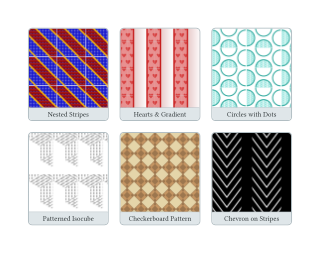

# fancy-tiling

A Typst library for beautiful tiling patterns to use as fills in your documents.


## Features

Create seamless tiling patterns with 10 ready-to-use functions:

| Pattern | Description |
|---------|-------------|
| `diagonal-stripes` | Diagonal stripe patterns at any angle |
| `orthogonal-stripes` | Horizontal or vertical stripes |
| `checkerboard` | Classic checkerboard pattern |
| `checkerboard-45` | Diamond/rotated checkerboard |
| `honeycomb` | Hexagonal honeycomb with stroked edges |
| `honeycomb-content` | Honeycomb with custom content in cells |
| `hex-triangles` | Hexagons divided into alternating triangles |
| `isocube` | Isometric 3D cube illusion |
| `chevron` | Arrow/zigzag patterns |
| `grid-content` | Grid cells with custom content |

## Installation

```typst
#import "@preview/fancy-tiling:1.0.0": *
```

## Quick Start

<details closed>
<summary>See code</summary>

```typst
#import "@preview/fancy-tiling:1.0.0": *

// Diagonal stripes
#rect(fill: diagonal-stripes(stripe-color: blue))

// Checkerboard
#rect(fill: checkerboard(cell-color: red, background-color: white))

// Honeycomb
#rect(fill: honeycomb(radius: 10pt, cell-stroke: 1pt + orange))

// Isometric cubes
#rect(fill: isocube(
  radius: 15pt,
  color-top: blue.lighten(50%),
  color-left: blue,
  color-right: blue.darken(30%),
))
```

</details>

## Examples

### Diagonal Stripes

<details closed>
<summary>See code</summary>

```typst
#rect(
  width: 100pt, height: 100pt,
  fill: diagonal-stripes(
    size: 8pt,
    angle: 60deg,
    stripe-color: navy,
    thickness-ratio: 40%,
  ),
)
```

</details>

### Orthogonal Stripes

<details closed>
<summary>See code</summary>

```typst
#rect(
  width: 100pt, height: 100pt,
  fill: orthogonal-stripes(
    size: 10pt,
    orientation: "horizontal",
    thickness-ratio: 30%,
    stripe-color: red,
  ),
)
```

</details>

### Checkerboard

<details closed>
<summary>See code</summary>

```typst
#rect(
  width: 100pt, height: 100pt,
  fill: checkerboard(
    width: 20pt, height: 20pt,
    cell-color: yellow,
    background-color: lime,
  ),
)
```

</details>

### Honeycomb

<details closed>
<summary>See code</summary>

```typst
#rect(
  width: 100pt, height: 100pt,
  fill: honeycomb(
    radius: 12pt,
    orientation: "pointy",
    cell-stroke: 2pt + purple,
  ),
)
```

</details>

### Honeycomb with Content

<details closed>
<summary>See code</summary>

```typst
#rect(
  width: 100pt, height: 100pt,
  fill: honeycomb-content(
    radius: 15pt,
    content: emoji.bee,
  ),
)
```

</details>

### Isometric Cubes

<details closed>
<summary>See code</summary>

```typst
#rect(
  width: 100pt, height: 100pt,
  fill: isocube(
    radius: 12pt,
    color-top: teal.lighten(60%),
    color-left: teal,
    color-right: teal.darken(40%),
  ),
)
```

</details>

### Chevron

<details closed>
<summary>See code</summary>

```typst
#rect(
  width: 200pt, height: 200pt,
  fill: chevron(
    width: 60pt,
    height: 40pt,
    thickness: 5pt,
    spacing: 10pt,
    stripe-color: maroon,
  ),
)
```

</details>

## More Inspiration

Make sure you use tiling patterns in strokes, tables, elements from other libraries, and more.


## Advanced tiling

You can mix and match tiling patterns, using one inside another for complex effects. Here is a selection of some examples:



<details closed>
<summary>See code</summary>

```typst

// Stripes within stripes

#let t1-stripes = orthogonal-stripes(size: 1mm, background-color: rgb("#0505bf"), stripe-color: rgb("#1e1ece"))

#let t2-stripes = orthogonal-stripes(
  size: 1mm,
  background-color: rgb("#8a0808"),
  stripe-color: rgb("#a91515"),
  orientation: "horizontal",
)

#let t-stripes = diagonal-stripes(
  background-color: t1-stripes,
  stripe-color: t2-stripes,
  size: 1cm,
  angle: 45deg,
  thickness-ratio: 50%,
  stripe-stroke: 0.5mm + rgb("#ffbf00")
)

// Stripes with hearts and gradient

#let t1-hearts = honeycomb-content(
  orientation: "pointy",
  background-color: rgb("#e89090"), 
  content: text(fill: rgb("#d84444"),"♥", size:7pt),
  radius: 4.5pt,
)

#let t-hearts = orthogonal-stripes(
  background-color: gradient.linear(rgb("#cd9696"), white, dir: ltr),
  stripe-color: t1-hearts,
  stripe-stroke: 0.5mm + rgb("#c71e1e"),
  size: 27pt)


// Circles with dots

#let t1-circles = honeycomb-content(background-color: rgb("#92e4dd"), radius:0.04cm, content: circle(radius: 0.6pt, fill: white))

#let t-circles = honeycomb-content(background-color: white, radius:0.4cm, content: circle(radius: 8pt, fill: t1-circles, stroke: 1pt + rgb("#26a69a")))

#let t1-iso = orthogonal-stripes(size:2.43pt, stripe-color: gray)
#let t2-iso = diagonal-stripes(angle:30deg, size:4.85pt, thickness-ratio:50%, stripe-color: gray)
#let t3-iso = diagonal-stripes(angle:30deg, mirror:true, size:4.85pt, thickness-ratio:50%, stripe-color: gray)

#let t-iso = isocube(
  radius: 14pt,
  orientation: "pointy",
  color-top: t1-iso,
  color-left: t2-iso,
  color-right: t3-iso,
  cell-stroke: none,
)

// Checkers within checkers

#let t1-checkers = checkerboard-45(background-color: rgb("#9c764e"), cell-color: rgb("#c69663"), height:7pt, width: 7pt)

#let t-checkers = checkerboard-45(
  width: 14pt,
  height: 14pt,
  cell-color: t1-checkers,
  background-color: rgb("#e5d5a9"),
  cell-stroke: 0.5pt + rgb("#9c764e"),
)

// Chevron on stripes

#let t1-chevron = chevron(width: 30pt, height:20pt, spacing: 10pt, thickness: 5pt)

#let chevron = orthogonal-stripes(
  size: 40pt,
  background-color: black,
  thickness-ratio: 75%,
  stripe-color: t1-chevron,
  stripe-stroke: 1pt + rgb("#000000"),
)

```

</details>

## Parameters Reference

All patterns support customizable colors via `background-color` and pattern-specific color parameters. Most also support optional `stroke` parameters for outlined effects.

### Common Parameters

- **size/width/height/radius**: Control the scale of the pattern
- **background-color**: Fill color behind the pattern
- **cell-stroke / stripe-stroke**: Optional outline stroke

### Pattern-Specific

- **diagonal-stripes**: `angle`, `thickness`, `thickness-ratio`
- **orthogonal-stripes**: `orientation` ("vertical"/"horizontal"), `thickness-ratio`
- **checkerboard / checkerboard-45**: `cell-color`
- **honeycomb / honeycomb-content**: `orientation` ("flat"/"pointy")
- **hex-triangles**: `color-a`, `color-b` for alternating triangles
- **isocube**: `color-top`, `color-left`, `color-right` for 3D shading
- **chevron**: `thickness`, `spacing`, `orientation`

## License

MIT-0 — Use freely with no attribution required.
