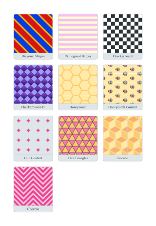
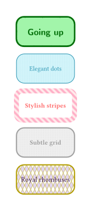
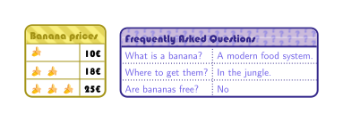

# fancy-tiling

A Typst library for beautiful tiling patterns to use as fills in your documents.



## Features

Create seamless tiling patterns with 10 ready-to-use functions:

| Pattern | Description |
|---------|-------------|
| `diagonal-stripes` | Diagonal stripe patterns at any angle |
| `orthogonal-stripes` | Horizontal or vertical stripes |
| `checkerboard` | Classic checkerboard pattern |
| `checkerboard-45` | Diamond/rotated checkerboard |
| `honeycomb` | Hexagonal honeycomb with stroked edges |
| `honeycomb-content` | Honeycomb with custom content in cells |
| `hex-triangles` | Hexagons divided into alternating triangles |
| `isocube` | Isometric 3D cube illusion |
| `chevron` | Arrow/zigzag patterns |
| `grid-content` | Grid cells with custom content |

## Installation

```typst
#import "@preview/fancy-tiling:1.0.0": *
```

## Quick Start

```typst
#import "@preview/fancy-tiling:1.0.0": *

// Diagonal stripes
#rect(fill: diagonal-stripes(stripe-color: blue))

// Checkerboard
#rect(fill: checkerboard(cell-color: red, background-color: white))

// Honeycomb
#rect(fill: honeycomb(radius: 10pt, cell-stroke: 1pt + orange))

// Isometric cubes
#rect(fill: isocube(
  radius: 15pt,
  color-top: blue.lighten(50%),
  color-left: blue,
  color-right: blue.darken(30%),
))
```

## Examples

### Diagonal Stripes

```typst
#rect(
  width: 100pt, height: 100pt,
  fill: diagonal-stripes(
    size: 8pt,
    angle: 60deg,
    stripe-color: navy,
    thickness-ratio: 40%,
  ),
)
```

### Orthogonal Stripes

```typst
#rect(
  width: 100pt, height: 100pt,
  fill: orthogonal-stripes(
    size: 10pt,
    orientation: "horizontal",
    thickness-ratio: 30%,
    stripe-color: red,
  ),
)
```

### Checkerboard

```typst
#rect(
  width: 100pt, height: 100pt,
  fill: checkerboard(
    width: 20pt, height: 20pt,
    cell-color: yellow,
    background-color: lime,
  ),
)
```

### Honeycomb

```typst
#rect(
  width: 100pt, height: 100pt,
  fill: honeycomb(
    radius: 12pt,
    orientation: "pointy",
    cell-stroke: 2pt + purple,
  ),
)
```

### Honeycomb with Content

```typst
#rect(
  width: 100pt, height: 100pt,
  fill: honeycomb-content(
    radius: 15pt,
    content: emoji.bee,
  ),
)
```

### Isometric Cubes

```typst
#rect(
  width: 100pt, height: 100pt,
  fill: isocube(
    radius: 12pt,
    color-top: teal.lighten(60%),
    color-left: teal,
    color-right: teal.darken(40%),
  ),
)
```

### Chevron

```typst
#rect(
  width: 200pt, height: 200pt,
  fill: chevron(
    width: 60pt,
    height: 40pt,
    thickness: 5pt,
    spacing: 10pt,
    stripe-color: maroon,
  ),
)
```

## More Inspiration




## Parameters Reference

All patterns support customizable colors via `background-color` and pattern-specific color parameters. Most also support optional `stroke` parameters for outlined effects.

### Common Parameters

- **size/width/height/radius**: Control the scale of the pattern
- **background-color**: Fill color behind the pattern
- **cell-stroke / stripe-stroke**: Optional outline stroke

### Pattern-Specific

- **diagonal-stripes**: `angle`, `thickness`, `thickness-ratio`
- **orthogonal-stripes**: `orientation` ("vertical"/"horizontal"), `thickness-ratio`
- **checkerboard / checkerboard-45**: `cell-color`
- **honeycomb / honeycomb-content**: `orientation` ("flat"/"pointy")
- **hex-triangles**: `color-a`, `color-b` for alternating triangles
- **isocube**: `color-top`, `color-left`, `color-right` for 3D shading
- **chevron**: `thickness`, `spacing`, `orientation`

## License

MIT-0 — Use freely with no attribution required.
