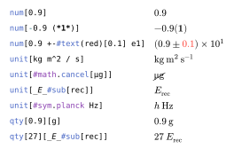

# fancy-units

The package fancy-units enables you to format numbers and units with support for styling with Typst functions.
While the naming convention for the functions and parameters is very similar to siunitx, this is not supposed to be a port thereof.

The input of the numbers and units passed to the functions `num()`, `unit()` and `qty()` is regular markup content while the output is nicely formatted in math mode.
There are no macros or variables required for the units since you can just write them down directly without the limitations of the math mode.
This includes Unicode characters such as the common prefix `micro`.
You can either directly use the character μ or you can use the corresponding escape sequence `\u{03bc}`.
And if you want to change the look of (some of) the numbers or units, you can use the styling functions built into Typst.

<p align="center">
  <picture>
    
  </picture>
</p>

## Documentation

To start using fancy-units, add the following import to your project

```typ
#import "@preview/fancy-units:0.1.0": fancy-units-configure, num, unit, qty
```

If you want to change the default settings in your project, you can configure the output format with the function

```typ
#let fancy-units-configure(
  decimal-separator: auto | str | content,
  uncertainty-mode: str,
  unit-separator: content,
  per-mode: str,
  quantity-separator: content
)
```

The functions `num()` and `unit()` each accept a body of type `content` and (optional) arguments to overwrite the format.
The function `qty()` just combines the two functions `num()` and `unit()` and joins their results with the `quantity-separator`.

```typ
#let num(
  decimal-separator: auto | str | content = auto,
  uncertainty-mode: auto | str = auto,
  body: content
)

#let unit(
  decimal-separator: auto | str | content = auto,
  unit-separator: auto | content = auto,
  per-mode: auto | str = auto,
  body: content
)

#let qty(
  decimal-separator: auto | str | content = auto,
  uncertainty-mode: auto | str = auto,
  unit-separator: auto | content = auto,
  per-mode: auto | str = auto,
  quantity-separator: auto | content = auto,
  number: content,
  unit: content
)
```

For the extensive documentation of the package please look into the [manual.pdf](https://github.com/janekfleper/typst-fancy-units/releases/download/v0.1.0/manual.pdf).

## Multilingual support

If the `decimal-separator` is set to `auto`, the symbol will be picked based on the document language (in the current context).
I grabbed the conventions from [wikipedia](https://en.wikipedia.org/wiki/Decimal_separator#Conventions_worldwide) for almost all of the languages supported by the [hyphenate](https://typst.app/tools/hyphenate/) tool.
If a language is not supported, the symbol will fall back to a decimal point.

## Changelog

### Version 0.1.0

_Initial release_
