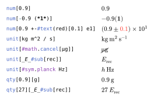

# fancy-units

The package fancy-units enables you to format numbers and units with support for styling with Typst functions.
While the naming convention for the functions and parameters is very similar to siunitx, this is not supposed to be a port thereof.

The input of the numbers and units passed to the functions `num()`, `unit()` and `qty()` is regular markup content while the output is nicely formatted in math mode.
If you want to change the look of (some of) the numbers or units, you can use the styling functions built into Typst.
By default there are no macros or variables required, you can just write the units down directly without the limitations of the math mode.
Unicode characters such as the common prefix `μ` or the units `Ω` and `Å` are directly supported.
Alternatively you can use the corresponding escape sequences or the symbols from the `sym` module.

<p align="center">
  <picture>
    
  </picture>
</p>

## Introduction

To start writing fancy units and numbers, add the following import to your project

```typ
#import "@preview/fancy-units:0.1.1": num, unit, qty, fancy-units-configure, add-macros
```

If you would like to change the default settings in your project, call the function `fancy-units-configure()` at the beginning of your document.
You only need to pass the arguments that you want to change.
Just to give you an example, if you want to format units as fractions with a dot as the unit separator, use the following code snippet:

```typ
#fancy-units-configure(
  per-mode: "fraction",
  unit-separator: sym.dot,
)
```

Custom units that you are using repeatedly should be added as macros.
The same goes for prefixes and units that are either long or inconvenient to write out every time.
A common example here would be the prefix `μ` if you cannot directly type this on your keyboard.
The function `add-macros()` allows you to define macros that will be replaced by the content, string or symbol passed as the value.
The macros will be inserted automatically after the interpretation of the units.
Changes to the marcos on a per-unit basis are not possible.
If you want to use `u` as a macro for the prefix `μ` and `aB` as a macro for the unit `[_a_#sub[B]]`, just call the function at the beginning of your document:

```typ
#add-macros(
  u: sym.mu,
  aB: [_a_#sub[B]],
)
```

The functions `num()` and `unit()` each accept a body of type `content` and (optional) arguments to override the default format.
And the function `qty()` just combines the two functions `num()` and `unit()` and joins their results with the `quantity-separator`.
This is all you need to know to get started, I promise!
If you are (hopefully) curious by now, you can try the following examples as an inspiration to see what the package can do

```typ
#fancy-units-configure(
  uncertainty-mode: "conserve",
  per-mode: "fraction"
)

$
  #num[123*(4)*e5] \
  #unit[kg m / s^2] \
  #qty[137][#text(red)[μ]:m] \
  #qty[1][M:#sym.Omega] \
  #unit(per-mode: "power")[kg / m^-2] \
  #unit[F] = #unit(per-mode: "fraction", unit-separator: sym.dot)[(s C)^2 / (m^2 kg)] \
  #unit[kg#math.cancel[^2] / #math.cancel[kg]] = #unit[kg]
$
```

For the extensive documentation of the package please look into the [manual.pdf](https://github.com/janekfleper/typst-fancy-units/releases/download/v0.1.1/manual.pdf).

## Multilingual support

If the `decimal-separator` is set to `auto`, the symbol will be picked based on the document language (in the current context).
I grabbed the conventions from [wikipedia](https://en.wikipedia.org/wiki/Decimal_separator#Conventions_worldwide) for almost all of the languages supported by the [hyphenate](https://typst.app/tools/hyphenate/) tool.
If a language is not supported, the symbol will fall back to a decimal point.

## Changelog

### Version 0.1.1 (2025-03-11)

#### Added

- Macros for units and prefixes
- Unit tests with [tytanic](https://github.com/tingerrr/tytanic)
- Compatibility with Typst 0.13

### Version 0.1.0 (2025-01-02)

_Initial release_
