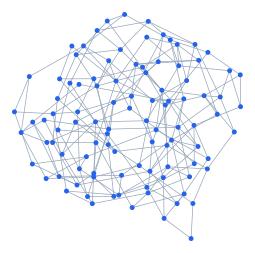

# fast-layout

Compute fast layouts for graph plots with a bundled Rust/WASM engine.
Recompute coordinates as you edit your document in live preview.
Stress, spring, spectral, shell, and tree layouts return coordinates for drawing
with CeTZ or another plotting package. No Julia, Python, Graphviz, or native
math runtime is needed.
Drawing belongs to the calling document. The manual uses
[CeTZ](https://typst.app/universe/package/cetz/) 0.5.2 for rendering.

[Download the manual (PDF)](manual.pdf)



The original algorithms and behavioral tests are adapted from
[NetworkLayout.jl](https://github.com/JuliaGraphs/NetworkLayout.jl) 0.4.10.
We thank its contributors and retain their [MIT license](NETWORKLAYOUT-LICENSE.md)
and attribution in [third-party notices](THIRD_PARTY-NOTICES.md).

Requires Typst 0.14.2 or newer. Compute positions, then draw them with CeTZ:

```typst
#import "@preview/fast-layout:0.1.0": layout
#import "@preview/cetz:0.5.2"

#let edges = ((0, 1), (1, 2), (2, 3), (3, 0))
#let points = layout(4, edges).positions
#cetz.canvas(length: 1cm, {
  import cetz.draw: *
  for (a, b) in edges {
    line(points.at(a), points.at(b))
  }
  for point in points {
    circle(point, radius: 3pt, fill: white)
  }
})
```

Use `dim` for higher-dimensional numerical layouts:

```typst
#import "@preview/fast-layout:0.1.0": layout
#let result = layout(
  4, ((0, 1), (1, 2), (2, 3)),
  algorithm: "stress", dim: 3, seed: 42,
)
#result.positions
```

Node indices start at zero. Position `i` belongs to node `i`. An explicit node
count preserves isolated nodes. Inputs are edge pairs, with no DOT syntax.

## Algorithms

| `algorithm` | Dimensions | Method |
| --- | --- | --- |
| `"stress"` | 1–4096 | Weighted stress; default pairwise SGD, or majorization with constrained Cholesky solves |
| `"spring"` | 1–4096 | Fruchterman–Reingold; Barnes–Hut acceleration in 2D and 3D |
| `"spectral"` | 1–4096 | Generalized Laplacian eigenvectors; sparse partial iteration for larger graphs |
| `"shell"` or `"circular"` | 2 | Equally spaced circular shells |
| `"buchheim"` | 2 | Ordered tidy tree with variable node sizes |

Stress and spectral currently accept at most 4096 nodes. Stress majorization stores dense
pair matrices and factors a dense Laplacian, so its setup costs O(n³) time and
O(n²) memory. SGD stores O(n²) pairs and distances and spends
O(iterations × n² × dim) time on updates, after shortest-path initialization. Spectral uses a dense solve below 128 nodes or when requesting
many dimensions; otherwise it computes a small subspace using sparse shifted
solves. Spring uses exact pair forces outside 2D and 3D.

## Options

Typst names use hyphens. Rust and CBOR use underscores.

| Option | Default | Meaning |
| --- | --- | --- |
| `algorithm` | `"stress"` | One of the names above |
| `stress-method` | `"sgd"` | Stress optimizer: `"majorization"` or `"sgd"`; stress only |
| `dim` | `2` | Coordinates per node |
| `seed` | `1` | Deterministic initialization, collision handling, and SGD pair order |
| `iterations` | `none` | Maximum numerical updates, from 1 to 100000; 15 for stress SGD and 100 for other numerical methods when omitted |
| `tolerance` | `1e-5` | Algorithm-specific stopping threshold, described below |
| `initial` | `()` | Stress/spring positions in node order; `none` or omitted entries use seeded coordinates in [-1, 1] |
| `pins` | `()` | Stress/spring boolean masks per node and coordinate; omitted or empty rows are free |
| `edge-weights` | `()` | One positive value per input edge, otherwise all 1 |
| `theta` | `none` | Spring Barnes–Hut opening angle; 0 means exact, smaller positive values improve accuracy |
| `c` | `none` | Spring spacing factor, default 2; natural length is `c * sqrt(4 / node-count)` |
| `temperature` | `none` | Spring movement cap numerator, default 2; cap at update `i` is `temperature / i` |
| `node-weights` | `()` | Spectral node affinities, one per node, otherwise all 1 |
| `shells` | `()` | Shell node groups, in inner-to-outer order |
| `node-sizes` | `()` | Buchheim diameters in node order; omitted values default to 1 |
| `root` | `0` | Buchheim root node |

Weights and sizes must be finite and within [1e-9, 1e9]. Initial coordinates
must be finite and within [-1e9, 1e9]. A pinned coordinate without an explicit
initial value stays at its seeded value. Invalid or incompatible options return
an error.

For example, this holds node 0 fixed and holds only node 1's x coordinate:

```typst
#import "@preview/fast-layout:0.1.0": layout
#let result = layout(
  3, ((0, 1), (1, 2)),
  initial: ((0, 0), (2, 1), none),
  pins: ((true, true), (true, false)),
  edge-weights: (2, 1),
)
```

SGD is the default stress method with 15 updates. It updates shuffled node pairs
on a decaying schedule and may reach a lower objective on some graphs.
Majorization uses constrained global solves and enforces a non-increasing
objective. Select it explicitly; its automatic budget is 100 updates:

```typst
#import "@preview/fast-layout:0.1.0": layout
#let major = layout(
  4, ((0, 1), (1, 2), (2, 3), (3, 0)),
  algorithm: "stress",
  stress-method: "majorization",
)
```

An explicit `iterations` value overrides the automatic budget for either method
and for the other numerical algorithms. In Rust, use `iterations: None` for
automatic selection or `iterations: Some(30)` for an explicit limit. `stress-method: "majorization"` is only
valid with `algorithm: "stress"`; the default `"sgd"` value is ignored by other
algorithms.

### Graph conventions

Stress, spring, and spectral treat edges as undirected and ignore self-loops.
Repeated or reversed edges merge if their weights agree; conflicting weights
return an error. Stress weights are target edge lengths, summed along shortest
paths. Spectral weights are affinities, multiplied by the geometric mean of the
two endpoint node weights. Spring uses connectivity and ignores weight magnitude,
as NetworkLayout.jl does.

Stress assigns a finite target distance between disconnected components using
the maximum finite distance times the cube root of the component count. The
maximum defaults to 1 when every node is isolated. Spectral embeds each connected
component separately, then places the components along x with a unit gap.
Unavailable spectral coordinates are zero. Empty graphs return no positions.

Shell ignores connectivity. Unlisted nodes form a final outer shell. Empty
groups, repeated nodes, and invalid indices are errors. A singleton first shell
has radius 0; otherwise the first radius is 1. Each following radius increases
by 1, with the first node on the positive x axis.

Buchheim requires a connected rooted tree with parent-to-child edges. Input
edge order determines sibling order. Cycles, multiple parents, and unreachable
nodes are errors. The implementation uses explicit stacks for deep trees.

### Results and convergence

The result contains `positions`, `iterations`, `converged`, and `objective`.
`iterations` counts actual numerical updates, excluding initialization. Hitting
the work limit returns `converged: false`.

Stress majorization stops when the relative objective change or the norm of the
coordinate change meets `tolerance`. SGD may stop after its schedule no longer
clips pair steps and the largest pair-endpoint movement meets `tolerance`.
With `tolerance: 0`, nontrivial SGD runs with movable coordinates use the
requested budget and report `converged: false`. Both stress methods return
zero updates and convergence when every coordinate is pinned. The stress objective sums `(euclidean / target - 1)^2` over
unordered node pairs. Both methods preserve pins. Coincident free positions
receive a small seeded perturbation.

Spring stops when the largest node movement meets `tolerance`. Its objective is
the exact spring energy, or `none` for Barnes–Hut runs to avoid a quadratic
postprocessing pass. `theta: none` chooses exact forces below 256 nodes and
`theta: 0.7` from 256 nodes in 2D/3D. Set `theta: 0` for reference comparisons.

For stress and spring, `tolerance: 0` disables early stopping. Sparse spectral
stops when every requested normalized eigenpair has residual norm at most
`tolerance`; zero selects a numerical target of 1e-10. Dense spectral validates
residuals against 1e-8 and reports zero outer iterations. Shell, Buchheim, and
trivial empty/singleton numerical cases report zero iterations and convergence.
Spectral and geometric layouts return `objective: none`.

Identical requests are deterministic with the same engine build. Eigenvector
signs and bases in repeated eigenvalue spaces can differ across implementations;
compare geometry or eigenspaces. Cross-platform floating-point results need
numerical tolerances rather than byte comparison.

The boundary caps inputs at 1 million nodes, 2 million edges, 4 million output
coordinates, and 32 MiB of encoded CBOR. These are allocation guards, not promises
of interactive runtime. Stress majorization additionally caps its pair/factor matrices at
512 MB; other buffers add memory. Extreme weight ratios may return a numerical
conditioning error even when individual weights are valid.

### Version information

`fast-layout-version` is the package version string, currently `"0.1.0"`.
`engine-version()` returns the bundled engine string, currently
`"fast-layout-engine 0.1.0"`. Both are exported alongside `layout`.

## License

The Typst wrapper and layout implementation are covered by the [MIT license](LICENSE).
The bundled WASM also contains dependencies under the licenses listed in
[third-party notices](THIRD_PARTY-NOTICES.md), with complete texts in
[THIRD-PARTY-LICENSES.txt](THIRD-PARTY-LICENSES.txt).
