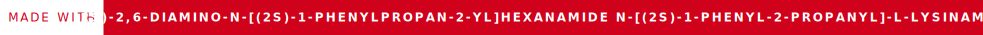

# Fauxreilly




A Typst package for creating **O'RLY?**-style cover pages.  See [here](https://boyter.org/2016/04/collection-orly-book-covers/) for general examples.

Tested on Typst versions ``0.11.1`` and ``0.12``.

## Usage

Import the package at the top of your Typst file: 

```typst
#import "@preview/o-rly-typst:0.1.1": orly
```

Only one function is exposed, ``#orly()``.  This will create its own page in the document at whatever location you call the function.  In other words, any content in the Typst document that appears before ``#orly()`` is called will be before the O'Rly? page in the PDF that Typst renders.  Anything after the function call will be on subsequent page(s).

All content for the title page is passed as options to ``#orly()``.  I included what I figured were the most likely things you'd want to customize without having a million options.  Meanwhile, most of the layout parameters (font sizes, the heights of individual pieces, etc.) are variables within the code, so hopefully aren't too hard to alter if need-be.  None of the options are strictly required, although the text fields are the only ones that can be left empty without potentially breaking the layout.   A few have defaults instead, and those are listed below where applicable.

### Options
The order that the options appear in the table is the order they must be sent to the function, unless you specify the option's key along with its value.

Data types listed are based on Typst's internal types, so are entered the same way as they would be in any other function that takes that data type.  For example, the data type needed for the ``font`` option is the same as what is used for Typst's built-in ``#text()`` function, which is linked in the table below.  (All links go to their specific usage in the Typst documentation.)

Option | Description | Type | Default |
| :----- | :------- | :-------: | :-------: |
| ``font`` | The font for all text except the "publisher" in the bottom-left corner | [``string(s)``](https://typst.app/docs/reference/text/text/#parameters-font) |  Whatever is set in the document context |
| ``color`` | Accent color.  Used for the background of the title block and of the colored bar at the very top. | [``color``](https://typst.app/docs/reference/visualize/color/) | ``blue`` (typst built-in) |
| ``top-text`` | The text at the top, just under the color bar | [``string``](https://typst.app/docs/reference/foundations/str/) | Empty |
| ``pic`` | Content to be used above the title block.  Usually an [``image``](https://typst.app/docs/reference/visualize/image/), but can be any type of ``content`` (such as a CeTZ drawing) | ``content`` | Empty |
| ``title`` | The title of the book | [``string``](https://typst.app/docs/reference/foundations/str/) | Empty |
| ``title-align`` | How the text is aligned (horizontally) in the title block | [``alignment``](https://typst.app/docs/reference/layout/alignment/) | ``left`` |
| ``subtitle`` | Text that appears just below the title block | [``string``](https://typst.app/docs/reference/foundations/str/) | Empty |
| ``publisher`` | The name of the "publisher" in the bottom-left | [``string``](https://typst.app/docs/reference/foundations/str/) | O RLY<sup>?</sup> (see example below) |
| ``publisher-font`` | Font to be used for "publisher" name | [``string(s)``](https://typst.app/docs/reference/text/text/#parameters-font) | Noto Sans, Arial Rounded MT, document context (in that order) |
| ``signature`` | Text in the bottom-right corner | [``string``](https://typst.app/docs/reference/foundations/str/) | Empty |
| ``margin`` | Page margins | [``length`` or ``dictionary``](https://typst.app/docs/reference/layout/page/#parameters-margin) | ``top: 0``, all others will use the document context |

### Usage Notes

There are a couple quirks to data types and the like that may not be obvious.

1. ``pic``: Because of how Typst handles paths, this can't be just a filename.  So if you want to pull in an external image file, you *must* set this option to an ``image()`` call (see example below).  Anything that returns content should work here, although bear in mind that you may have to make some additional adjustments for things to be spaced and/or aligned correctly.
1. ``string``s typically must be contained in quotation marks.  But note that this will render quotation marks *within* those strings without using [smartquotes](https://typst.app/docs/reference/text/smartquote/).  To avoid this, you may use content mode instead (done by enclosing the text in square brackets ``[]``).  For example, ``"Some title"`` → ``[Some title]``
   - Similarly, you can use this to toggle italics (e.g. ``[Italic text, _except_ this one]``) or apply other formatting
2. Other types may look like strings but do **not** take quotes, specifically ``color`` (including when using the built-in color names) and ``alignment``
3. With the ``margin`` type, if a single value is entered (without quotes), that value is applied to all four sides.  All other usage must be done as a dictionary (meaning enclosed in parentheses), even if you're only specifying one side.  For example, the default is written ``(top: 0in)``.
   - If you're going to pass any value other than the top as an option, you'll likely want to add ``top: 0in`` back in to avoid a gap between the top of the page and the color bar
   - Any values passed to the function (or the default value if none are) will override any margin(s) set earlier in the Typst file.  So you can use a ``set`` rule at the beginning of the document without affecting the cover page

## Example

Below is some example Typst code using this package and its result:

```typst
#import "@preview/o-rly-typst:0.1.0": *

#orly(
    color: rgb("#85144b"),
    title: "Learn to Stop Worrying and Love Metathesis",
    top-text: "Axe nat why (or do)",
    subtitle: "Free yourself from prescriptivism",
    pic: image("chomskydoz.png", width: 100%, fit: "contain"),
    signature: "Dr. N. Supponent"
)
```


## Changelog

**0.1.1**: Changed ``pic`` to require ``content`` rather than just a path.

**0.1.0**: Initial release.  As it turns out this didn't work properly from Typst Universe due to the image-path issue mentioned above.

## Special Thanks
- [Dherse](https://github.com/Dherse) for reporting the image-path issue
- [jneug](https://github.com/jneug) for fixing it.
- [Arthur Beaulieu](https://github.com/ArthurBeaulieu), whose [web-based generator](https://arthurbeaulieu.github.io/ORlyGenerator/) was the ~~source of the layout~~ inspiration for this project
