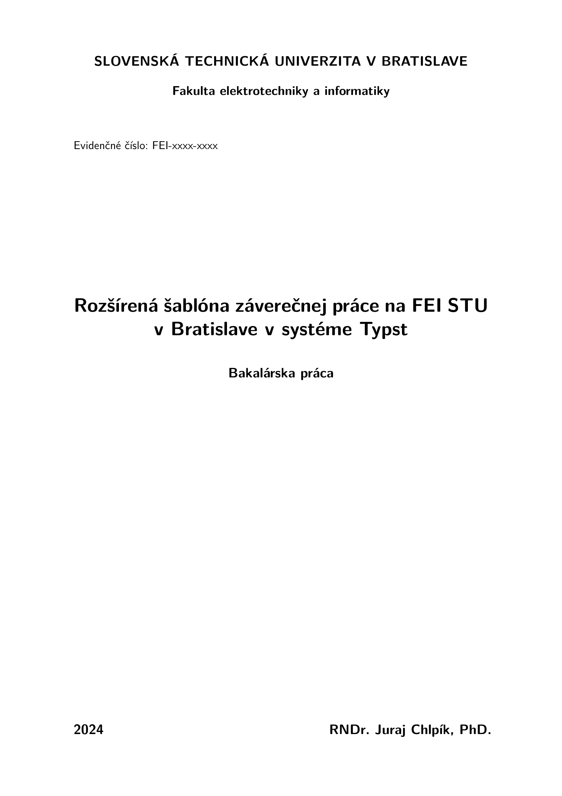

# FEI thesis Typst

Official [Typst](https://typst.app) template for final theses at the
[Faculty of Electrical Engineering and Information Technology, STU in Bratislava (STU FEI)](https://www.fei.stuba.sk/en).

It gives you the mandated cover and title pages, the assignment insert, abstracts with
keywords, all the required lists (contents, abbreviations, listings, figures and tables),
the AI-usage declaration and lettered appendices — so you only write the text.



**[See the full example thesis (PDF)](https://github.com/OskarMihalik/fei-thesis/blob/release/example.pdf)** — the template ships with this document
as its demo content, so a fresh project compiles straight into it.

## Requirements

- Typst **0.14 or newer** (the assignment insert relies on embedding PDF pages as images).
- No font installation needed — the template uses *New Computer Modern*, which ships with Typst.
- The demo content is written in Slovak; the template is available in Slovak and English.

## Getting started

Pick whichever of the three you are most comfortable with. All of them create the same project.

### Typst app (easiest, nothing to install)

1. Go to [typst.app](https://typst.app) and create an account.
2. Start a new project from a template and search for **fei-thesis**.
3. Create the project — you get `main.typ` plus the whole folder structure described below.

### VS Code

1. Install [VS Code](https://code.visualstudio.com/download).
2. Install the [Tinymist Typst](https://marketplace.visualstudio.com/items?itemName=myriad-dreamin.tinymist)
   extension, which compiles the document and gives you a live preview.
3. Open the Tinymist view in the sidebar, click **Template Gallery**, and find **fei-thesis**.
4. Click the **+** to create a project from it.
5. Open `main.typ`. The buttons in the top-right corner start the live preview or export a PDF.

### Command line

```sh
# install Typst first: https://typst.app/open-source/#download
typst init @preview/fei-thesis:0.0.7 my-thesis
cd my-thesis

typst watch main.typ     # live rebuild while you write
typst compile main.typ   # one-off PDF
```

## Project structure

`main.typ` is the entry point you compile — it wires everything together and holds your
metadata. In short: `includes/` holds the important files — everything you write goes there,
while `assets/` is for your own files, such as images and figures.

| Path | What it is |
| --- | --- |
| `main.typ` | Entry point: metadata and document assembly. Edit the metadata, rarely the rest. |
| `includes/core.typ` | **The body of your thesis.** This is where you spend your time. |
| `includes/introduction.typ` | Introduction (Úvod). |
| `includes/conclusion.typ` | Conclusion (Záver). |
| `includes/abstractSK.typ` / `abstractEN.typ` | Slovak and English abstracts. |
| `includes/thanks.typ` | Acknowledgements. |
| `includes/ai_declaration.typ` | Declaration of AI-tool usage. |
| `includes/appendixA.typ`, `appendixB.typ`, `appendixC.typ` | Appendices. Add or remove freely. |
| `includes/glossary.csv` | Abbreviations, expanded automatically in the text. |
| `includes/manual_glossary.typ` | Hand-written list of symbols, if you prefer it over the CSV. |
| `includes/assignment.pdf` | **Replace this** with your assignment exported from AIS. |
| `includes/listings/` | Source files you want to print as code listings. |
| `assets/` | Images and figures. |
| `bibliography.bib` | Your sources, in BibTeX format. |

The demo files are filled with the example thesis — overwrite their contents, keep the file names,
and everything stays wired up.

## Filling in your thesis

### Metadata

All fields go into `fei-setup`. Every one of them has a default, so nothing will crash if you omit
one — but the default is placeholder text (`"tituly Meno Priezvisko, tituly"`) that will be printed
on your title page, so fill them all in.

| Field | Notes |
| --- | --- |
| `title` | Thesis title. |
| `author` | Your full name with degrees. |
| `reg-nr` | Registration number, e.g. `FEI-xxxx-xxxx`. |
| `date` | Printed as given — write it out, e.g. `"31. decembra 2024"`. |
| `year` | Year of submission. |
| `thesis-type` | e.g. `"Bakalárska práca"`, `"Diplomová práca"`. |
| `study-programme`, `study-field` | From your study plan. |
| `school`, `faculty` | Pre-filled with STU / FEI. |
| `supervisor`, `consultant` | With degrees. Leave `consultant` out if you have none. |
| `training-workplace` | Your supervising department. |

### The assignment

Export the assignment from AIS, save it as `includes/assignment.pdf`, and set `pages:` to the number
of pages that PDF has — each page is inserted full-bleed:

```typst
#fei-assignment(read("includes/assignment.pdf", encoding: none), pages: 2)
```

### Abbreviations

`includes/glossary.csv` is a two-column CSV — short form, then full form:

```csv
CDMA,Code Division Multiple Access
GSM,Global System for Mobile communication
```

Use them in the text with the `abbr` package; the first occurrence is expanded automatically and the
list at the front of the thesis is generated for you. If you would rather write the list by hand
(useful when you need symbols and units), delete `#fei-list-of-glossaries(...)` from `main.typ` and
uncomment `#fei-list-of-manual-glossaries(...)` instead.

### Appendices

All appendices go into a single `#fei-appendix[...]` block. Every level-1 heading inside it
becomes one lettered appendix — the heading text is printed as *Dodatok A: Algoritmus* and the
lettering continues automatically. To reference an appendix, put a label on its heading:

```typst
// includes/appendixA.typ
= Algoritmus <alg:1>
```

and cite it in the text with `@alg:1`. Add or remove appendices by adding or removing includes
(or headings) inside the block.

### Language

`fei-thesis` takes `language: "sk"` (default) or `language: "en"`, which switches all generated
headings and labels — *Literatúra* / *Bibliography*, *Dodatok* / *Appendix*, and so on. It does not
translate the demo text, which is Slovak.

```typst
#show: fei-thesis.with(language: "en")
```

## main.typ

The full entry point, as shipped:

```typst
#import "@preview/fei-thesis:0.0.7": *

#show: fei-thesis.with(language: "sk")

#show: fei-setup.with((
  title: [Rozšírená šablóna záverečnej práce na FEI STU v~Bratislave v systéme Typst],
  author: "RNDr. Juraj Chlpík, PhD.",
  reg-nr: [FEI-xxxx-xxxx],
  date: [31. decembra 2024],
  year: [2024],
  thesis-type: [Bakalárska práca],
  study-programme: [názov študijného programu],
  study-field: [názov študijného odboru],
  school: [Slovenská technická univerzita v Bratislave],
  faculty: [Fakulta elektrotechniky a informatiky],
  supervisor: [tituly Meno Priezvisko, tituly],
  consultant: [tituly Meno Priezvisko, tituly],
  training-workplace: [Názov školiaceho pracoviska],
))

#fei-cover-page()
#fei-title-page()
#fei-assignment(read("includes/assignment.pdf", encoding: none), pages: 2)

#fei-thanks[#include "includes/thanks.typ"]

#fei-abstract(
  [#include "includes/abstractSK.typ"],
  lang: "sk",
  [záverečná práca, šablóna, Typst, formátovanie textu, citácie],
)

#fei-abstract(
  [#include "includes/abstractEN.typ"],
  lang: "en",
  [Final thesis, template, Typst, text formatting, citations],
)

#show: start-numbering.with()

#fei-outline()
#fei-list-of-glossaries[#abbr.load("includes/glossary.csv")]
#fei-outline-code()
#fei-outline-figures-tables()
// #fei-list-of-manual-glossaries[#include "includes/manual_glossary.typ"]

#fei-introduction[#include "includes/introduction.typ"]
#fei-core[#include "includes/core.typ"]
#fei-conclusion[#include "includes/conclusion.typ"]

#bibliography("bibliography.bib")
#fei-ai-declaration[#include "includes/ai_declaration.typ"]

#fei-appendix[
  #include "includes/appendixA.typ"
  #include "includes/appendixB.typ"
  #include "includes/appendixC.typ"
]
```

## Function reference

| Function | Purpose |
| --- | --- |
| `fei-thesis(language: "sk", bibliography-style: "iso-690-numeric", body)` | Document-wide rules: page size, fonts, headings, figures. Apply as a `#show` rule first. |
| `fei-setup(vars, body)` | Registers your metadata. Apply as a `#show` rule second. |
| `fei-cover-page()` / `fei-title-page()` | The two mandated front pages. |
| `fei-assignment(pdf, pages: 1)` | Inserts your assignment PDF, one full page each. |
| `fei-thanks(body)` | Acknowledgements page. |
| `fei-abstract(body, lang: "sk", keywords)` | Abstract plus its keywords. Call once per language. |
| `start-numbering(body)` | Starts page numbering here. Apply as a `#show` rule after the front matter. |
| `fei-outline()` | Table of contents. |
| `fei-list-of-glossaries(body)` | List of abbreviations, generated from `abbr.load(...)`. |
| `fei-list-of-manual-glossaries(body)` | Same heading, but with a hand-written list. |
| `fei-outline-code()` | List of code listings. |
| `fei-outline-figures-tables()` | List of figures and tables. |
| `fei-introduction(body)`, `fei-core(body)`, `fei-conclusion(body)` | The three main parts, each with the right heading and page break. |
| `fei-ai-declaration(body)` | Declaration of AI-tool usage. |
| `fei-appendix(body)` | Wraps all appendices at once. Every level-1 heading inside becomes a lettered appendix — *Dodatok A*, *B*, *C*… |
| `noindent(body)` / `indent(body)` | Suppress or force the first-line indent for a block of text. |

## Packages

The template itself pulls in [`abbr`](https://typst.app/universe/package/abbr) and
[`numbly`](https://typst.app/universe/package/numbly); you get both for free through the import.

The demo content additionally imports
[`algorithmic`](https://typst.app/universe/package/algorithmic),
[`mitex`](https://typst.app/universe/package/mitex),
[`physica`](https://typst.app/universe/package/physica) and
[`chemformula`](https://typst.app/universe/package/chemformula)
in the files that use them. They are not loaded automatically — if you want algorithms, LaTeX math,
physics notation or chemical formulas in your own text, import them yourself; if you don't, deleting
the demo content removes the dependency. All packages are downloaded on first compile, so the very
first build needs an internet connection.

## Development

The published package is built into `dist/` with [tyler](https://github.com/mkpoli/tyler),
which rewrites the template's relative `../lib.typ` imports to `@preview/fei-thesis:<version>`.
Work on the sources in the repository root, then rebuild `dist/` before publishing.

Run the following command in your typst package will check the package and build it, then install the built package to Typst local package group (-i) as well as prepare the package for publish and display instructions to create a PR (-p):
`tyler build -i -p`

## License

MIT — see [LICENSE](LICENSE).
