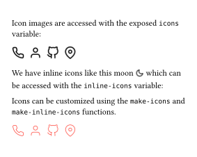

# Feather icons for Typst!
This is a simple Typst package for using [Feather Icons](https://feathericons.com/) in your Typst documents.

## Documentation
API Documentation and more examples can be found in the [documentation PDF](./docs.pdf).

## Example

```typst
#import "@preview/ficons:0.1.0": icons, inline-icons, make-icons

Icon images are accessed with the exposed `icons` variable:
#stack(dir: ltr, spacing: 7pt, icons.phone, icons.user, icons.github, icons.map-pin)

We have inline icons like this moon #inline-icons.moon which can be accessed with the `inline-icons` variable:

Icons can be customized using the `make-icons` and `make-inline-icons` functions.
#let slim-red-icons = make-icons(stroke: red, stroke-width: 1)

#stack(dir: ltr, spacing: 7pt, slim-red-icons.phone, slim-red-icons.user, slim-red-icons.github, slim-red-icons.map-pin)
```

*Output:*


## Local Installation
You can use the included installer to install this package locally on Linux.

```bash
./install.py
```

After installation it will be available with:

```typst
#import "@local/ficons:0.1.0"
```
