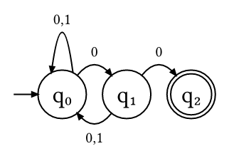

# finite (v0.4.1)

**finite** is a [Typst](https://github.com/typst/typst) package for rendering finite automata on top of [CeTZ](https://github.com/johannes-wolf/typst-canvas).

## Usage

For Typst 0.6.0 or later, import the package from the Typst preview repository:

```js
#import "@preview/finite:0.4.1": automaton
```

After importing the package, simply call `#automaton()` with a dictionary holding a transition table:
```js
#import "@preview/finite:0.4.1": automaton

#automaton((
  q0: (q1:0, q0:"0,1"),
  q1: (q0:(0,1), q2:"0"),
  q2: (),
))
```

The output should look like this:


## Further documentation

See `manual.pdf` for a full manual of the package.

## Development

The documentation is created using [Mantys](https://github.com/jneug/typst-mantys), a Typst template for creating package documentation.

To compile the manual, Mantys needs to be available as a local package. Refer to Mantys' manual for instructions on how to do so.
