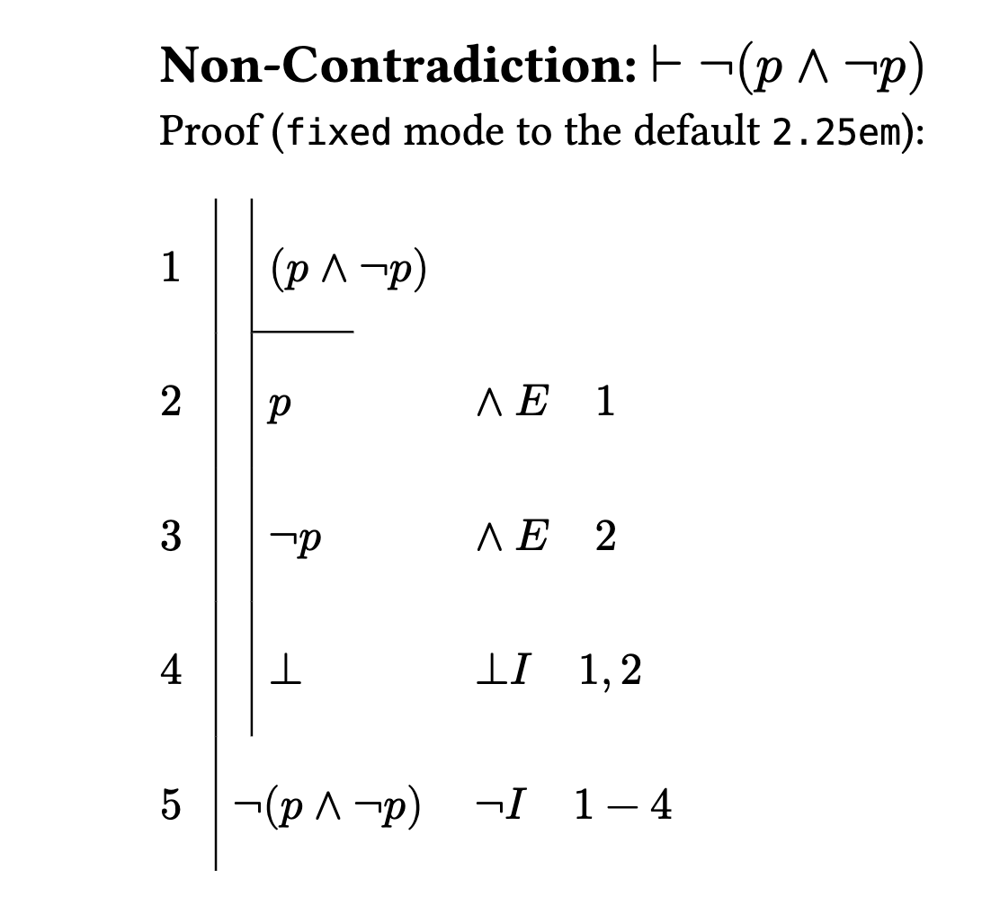

# fitch
A Typst library for visualisation of [Fitch-style](https://en.wikipedia.org/wiki/Fitch_notation) proof diagrams, with custom syntax optimized for speedy writing and conciseness.

While the main functionality of the library is ready, the library is still in development. See the roadmap [here](roadmap.md).

## Usage
For more information see the [manual](manual.pdf).

## Example

```typ
#import "@preview/fitch:1.0.0": *

== Non-Contradiction: $tack.r not (p and not p)$
Proof (`fixed` mode to the default `2.25em`): 
#proof((
open,
  $(p and not p)$,
  assume,
  ($p$, $and E  quad 1$),
  ($not p$, $and E  quad 2$),
  ($tack.t$, $tack.t I quad 1,2$),
close,
($not (p and not p)$, $not I quad 1-4$)
))
```



See the [examples](examples.pdf) file for more.