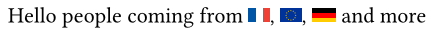
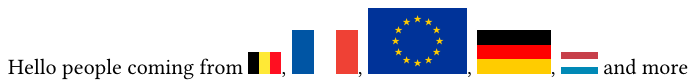
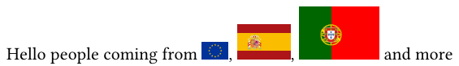
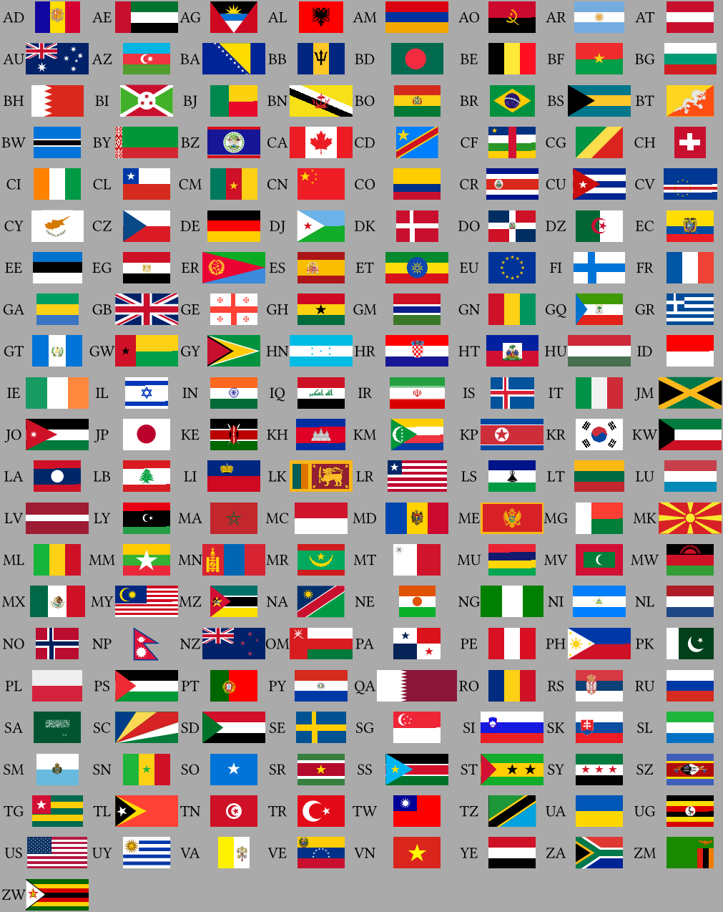

# Flagada

A typst package to display **country flags** in your Typst documents. This first version is extremely simple, as the only two arguments is the country and the height of the flag to display in the document.

## Loading the package

```typst
#import "@preview/flagada:0.1.0" : *
```

## Calling a flag

You need to know the ISO 3166-1 code of the country (string of 2 characters) to display.

Either call the flag as with the long call version `flag-zz()` or short call `flag("ZZ")`,  `zz` or `"ZZ"` being the ISO 3166-1 code.

Please note that long call version, like `flag-zz()`, must use _lowercase_ of the ISO 3166-1 code. Short version can use both _lowercase_ or _uppercase_ of the ISO 3166-1

### Example

```typst
Hello people coming from #flag-fr(), #flag-eu(), #flag("DE") and more
```



## Modifying the height

By default the flag height is `0.65em`, which is usually the default text size.

To modify the height, include the `height` parameter in your call.

Either call the flag as `flag-zz(height:6em)` or `flag("ZZ",height:6em)`, `zz` or `"ZZ"` being the ISO 3166-1 code.

### Example for height

```typst
Hello people coming from #flag-be(height: 1em), #flag-fr(height: 2em), #flag-eu(height:3em), #flag("DE",height: 2em), #flag("LU",height: 1em) and more
```



## Comments

### Coat of arms

Some flags include coat of arms or other specific components. As ususally these components are hard to build in Typst, a SVG version from wikimedia is used. The coat of arms for countries are in directory `coat of arms/`

#### Example of coat of arms



In this example, coats of arms are used for Spanish and Portuguese flags (but not for European flag as stars can be constructed or displayed from an unicode like `U+2605`)

### Width not updatable

For the moment, the official format defined by each country has been used to build their flag (e.g. 1:2 fro GB, 2:3 for FR, 10:19 for US ...). No possibility to modify the width has been considered. As a consequence, when you display two or more flags close to each other at the same height, their width might not be equal for each flag.

### Flags covered so far

Flags for the following ISO 3166-1 codes are available in the initial version (0.1.0):

AD AE AG AL AM AO AR AT AU AZ BA BB BD BE BF BG BH BI BJ BN BO BR BS BT BW BY BZ
CA CD CF CG CH CI CL CM CN CO CR CU CV CY CZ DE DJ DK DO DZ EC EE EG ER ES ET EU FI
FR GA GB GE GH GM GN GQ GR GT GW GY HN HR HT HU ID IE IL IN IQ IR IS IT JM JO JP KE
KH KM KP KR KW LA LB LI LK LR LS LT LU LV LY MA MC MD ME MG MK ML MM MN MR MT
MU MV MW MX MY MZ NA NE NG NI NL NO NP NZ OM PA PE PH PK PL PS PT PY QA RO RS RU
SA SC SD SE SG SI SK SL SM SN SO SR SS ST SY SZ TG TL TN TR TW TZ UA UG US UY VA VE VN YE ZA ZM ZW

For these flags, comments are welcome



### Flags not yet covered so far

The flags for remaining ISO 3166-1 codes have not been developped and might be developped for the next version

AF AI AQ AS AW AX BL BM BQ BV CC CK CW CX DM EH FJ FK FM FO GD GF GG GI GL GP GS
GU HK HM IM IO JE KG KI KN KY KZ LC MF MH MO MP MQ MS NC NF NR NU PF PG PM PN
PR PW RE RW SB SH SJ SV SX TC TD TF TH TJ TK TM TO TT TV UM UZ VC VG VI VU WF WS
YT
