[](https://typst.app/universe/package/fletcher/)
[](https://github.com/Jollywatt/typst-fletcher)
[](https://github.com/Jollywatt/typst-fletcher/tree/main)

# fletcher

_**fletcher** (noun) a maker of arrows_

A [Typst](https://typst.app/) package for drawing diagrams with arrows,
built on top of [CeTZ](https://github.com/johannes-wolf/cetz).

See the [manual](docs/manual.pdf?raw=true) for documentation or ask the community for help.

[](docs/manual.pdf?raw=true)
[](https://forum.typst.app)
[](https://discord.com/channels/1054443721975922748/1260973351900414102)


```typ
#import "@preview/fletcher:0.5.8" as fletcher: diagram, node, edge
```


<picture>
  <source media="(prefers-color-scheme: dark)" srcset="docs/readme-examples/1-first-isomorphism-theorem-dark.svg">
  
</picture>

```typ
#diagram(cell-size: 15mm, $
	G edge(f, ->) edge("d", pi, ->>) & im(f) \
	G slash ker(f) edge("ur", tilde(f), "hook-->")
$)
```

<picture>
  <source media="(prefers-color-scheme: dark)" srcset="docs/readme-examples/2-flowchart-trap-dark.svg">
  
</picture>

```typ
// https://xkcd.com/1195/
#import fletcher.shapes: diamond
#set text(font: "Comic Neue", weight: 600) // testing: omit

#diagram(
	node-stroke: 1pt,
	node((0,0), [Start], corner-radius: 2pt, extrude: (0, 3)),
	edge("-|>"),
	node((0,1), align(center)[
		Hey, wait,\ this flowchart\ is a trap!
	], shape: diamond),
	edge("d,r,u,l", "-|>", [Yes], label-pos: 0.1)
)
```

<picture>
  <source media="(prefers-color-scheme: dark)" srcset="docs/readme-examples/3-state-machine-dark.svg">
  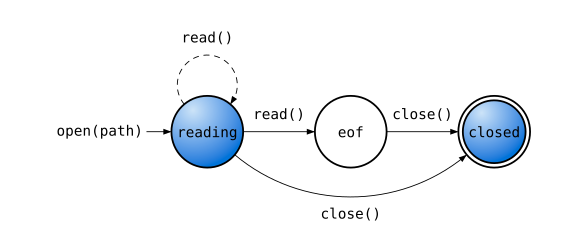
</picture>

```typ
#set text(10pt)
#diagram(
	node-stroke: .1em,
	node-fill: gradient.radial(blue.lighten(80%), blue, center: (30%, 20%), radius: 80%),
	spacing: 4em,
	edge((-1,0), "r", "-|>", `open(path)`, label-pos: 0, label-side: center),
	node((0,0), `reading`, radius: 2em),
	edge(`read()`, "-|>"),
	node((1,0), `eof`, radius: 2em),
	edge(`close()`, "-|>"),
	node((2,0), `closed`, radius: 2em, extrude: (-2.5, 0)),
	edge((0,0), (0,0), `read()`, "--|>", bend: 130deg),
	edge((0,0), (2,0), `close()`, "-|>", bend: -40deg),
)
```

<picture>
  <source media="(prefers-color-scheme: dark)" srcset="docs/readme-examples/4-feynman-diagram-dark.svg">
  
</picture>

```typ
#diagram($
	e^- edge("rd", "-<|-") & & & edge("ld", "-|>-") e^+ \
	& edge(gamma, "wave") \
	e^+ edge("ru", "-|>-") & & & edge("lu", "-<|-") e^- \
$)
```


# More examples
Pull requests are most welcome!

<table>
  <tr>
    <td style="background: white;">
      <a href="docs/gallery/01-commutative.typ">
        <center>
          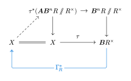
        </center>
      </a>
    </td>
    <td style="background: white;">
      <a href="docs/gallery/02-algebra-cube.typ">
        <center>
          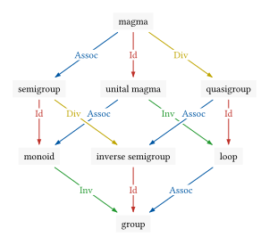
        </center>
      </a>
    </td>
  </tr>
  <tr>
    <td style="background: white;">
      <a href="docs/gallery/03-ml-architecture.typ">
        <center>
          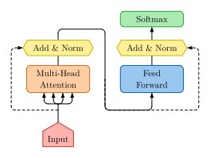
        </center>
      </a>
    </td>
    <td style="background: white;">
      <a href="docs/gallery/04-io-flowchart.typ">
        <center>
          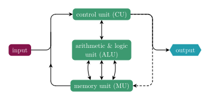
        </center>
      </a>
    </td>
  </tr>
  <tr>
    <td style="background: white;">
      <a href="docs/gallery/05-digraph.typ">
        <center>
          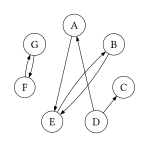
        </center>
      </a>
    </td>
    <td style="background: white;">
      <a href="docs/gallery/06-node-groups.typ">
        <center>
          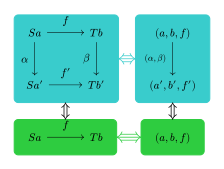
        </center>
      </a>
    </td>
  </tr>
  <tr>
    <td style="background: white;">
      <a href="docs/gallery/07-uml-diagram.typ">
        <center>
          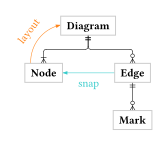
        </center>
      </a>
    </td>
    <td style="background: white;">
      <a href="docs/gallery/08-tree.typ">
        <center>
          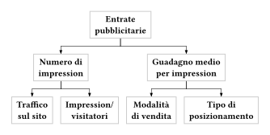
        </center>
      </a>
    </td>
  </tr>
  <tr>
    <td style="background: white;">
      <a href="docs/gallery/09-feynman-diagram.typ">
        <center>
          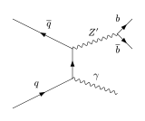
        </center>
      </a>
    </td>
    <td style="background: white;">
      <a href="docs/gallery/10-category-theory.typ">
        <center>
          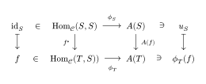
        </center>
      </a>
    </td>
  </tr>
</table>


## Change log

### 0.5.8

- Added bracket and parenthesis mark types, with shorthands `"["`, `"]"`, `"("`, `")"`, `"bracket"`, `"parenthesis"` (#102).
- Added `cylinder`, `brace`, `bracket`, `paren` and `stretched-glyph` node shapes (#99, #109).
- Allow specifying label positions as `(segment, position)` (#107, #112, [@deffi](https://github.com/deffi)).
- Fix bugs with anchors of absolutely-positioned enclose nodes (#95, #113).
- Fix some instabilities with edges related to division by zero (#100, #105).

### 0.5.7

- Update `cetz` dependency to `0.3.4` fixing bugs with `typst` version `0.13.1` (#89, #90, #91).

### 0.5.6

- **Require `typst` version `>=0.13.0`.**
- Update `cetz` dependency to `0.3.3`.
- Support CeTZ anchors on nodes which dynamically enclose other nodes (#81).
- Allow nested enclosing of nodes (#45).
- Add `floating` option to `edge()` to make certain objects not affect the diagram's bounds (#38).
- Make `debug` annotations "floating" so they don't affect diagram size and layout.

### 0.5.5

- Update `cetz` dependency to `0.3.2`.
- Fix deprecated type comparisons (#75).
- Add space ` ` line style for empty stroke (#70).
- Fix bug with `label-side` for corner edges (#74).

### 0.5.4

- Allow relative lengths for the `label-pos` option of `edge()` (#61).
- Fix layout bugs for diagrams with non-default `axes` options (#62, #66).
- Fix a line breaking issue with justified text in nodes (#64).

### 0.5.3

- Support CeTZ anchors in edge coordinates, e.g., `edge(<a.east>, ..)`.
- Fix crash when `stroke: none` set on polyline edges (#60, [@SillyFreak](https://github.com/SillyFreak!)).
- Fix bug with crossing edges in math mode (#54).
- Fix layout bugs for diagrams with non-default `axes` options (#62, #66).

### 0.5.2

- **Require `typst` version `>=0.12.0`.**
- Update `cetz` dependency to `0.3.1`. **Note:** This may slightly change edge label positions.
- Add `loop-angle` option to `edge()` (#36).

### 0.5.1

- Fix nodes which `enclose` absolute coordinates.
- Allow CeTZ-style coordinate expressions in node `enclose` option.
- Fix crash with polar coordinates.
- Fix edges which bend at 0deg or 180deg (e.g., `edge("r,r")` or `edge("r,l")`) and enhance the way the corner radius adapts to the bend angle. **Note:** This may change diagram layout from previous versions.
- Improve error messages.
- Add marks for crow's foot notation: `n` (many), `n?` (zero or more), `n!` (one or more), `1` (one), `1?` (zero or one), `1!` (exactly one).
- Add `node-shape` option to `diagram()`.

### 0.5.0

- Greatly enhance coordinate system.
  - Support CeTZ-style coordinate expressions (relative, polar, interpolating, named coordinates, etc).
  - Absolute coordinates (physical lengths) can be used alongside "elastic" coordinates (row/column positions).
- Add `label-angle` option to `edge()`.
- Add `label-wrapper` option to allow changing the label inset, outline stroke, and so on (#26).
- Add `label-size` option to control default edge label text size (#35)
- Add `trapezium` node shape.
- Disallow string labels to be passed as positional arguments to `edge()` (to eliminate ambiguity). Used named argument or pass content instead.

### 0.4.5

- Add isosceles triangle node shape (#31).
- Add `fit` and `dir` options to various node shapes to adjust sizing and orientation.
- Allow more than one consecutive edge to have an implicit end vertex.
- Allow `snap-to` to be `none` to disable edge snapping (#32).

### 0.4.4

- Support fully customisable marks/arrowheads!
  - Added new mark styles and tweaked some existing defaults. **Note.** This may change the micro-typography of diagrams from previous versions.
- Add node groups via the `enclose` option of `node()`.
- Node labels can be aligned inside the node with `align()`.
- Node labels wrap naturally when label text is wider than the node. **Note:** This may change diagram layout from previous versions.
- Add a `layer` option to nodes and edges to control drawing order.
- Add node shapes: `ellipse`, `octagon`.

### 0.4.3

- Fixed edge crossing backgrounds being drawn above nodes (#14).
- Add `fletcher.hide()` to hide elements with/without affecting layout, useful for incremental diagrams in slides (#15).
- Support `shift`ing edges by coordinate deltas as well as absolute lengths (#13).
- Support node names (#8).

### 0.4.2

- Improve edge-to-node snapping. Edges can terminate anywhere near a node (not just at its center) and will automatically snap to the node outline. Added `snap-to` option to `edge()`.
- Fix node `inset` being half the amount specified. If upgrading from previous version, you will need to divide node `inset` values by two to preserve diagram layout.
- Add `decorations` option to `edge()` for CeTZ path decorations (`"wave"`, `"zigzag"`, and `"coil"`, also accepted as positional string arguments).

### 0.4.1

- Support custom node shapes! Edges connect to node outlines automatically.
  - New `shapes` submodule, containing `diamond`, `pill`, `parallelogram`, `hexagon`, and other node shapes.
- Allow edges to have multiple segments.
  - Add `vertices` an `corner-radius` options to `edge()`.
  - Relative coordinate shorthands may be comma separated to signify multiple segments, e.g., `"r,u,ll"`.
- Add `dodge` option to `edge()` to adjust end points.
- Support `cetz:0.2.0`.

### 0.4.0

- Add ability to specify diagrams in math-mode, using `&` to separate nodes.
- Allow implicit and relative edge coordinates, e.g., `edge("d")` becomes `edge(prev-node, (0, 1))`.
- Add ability to place marks anywhere along an edge. Shorthands now accept an optional middle mark, for example `|->-|` and `hook-/->>`.
- Add “hanging tail” correction to marks on curved edges. Marks now rotate a bit to fit more comfortably along tightly curving arcs.
- Add more arrowheads for the sake of it: `}>`, `<{`, `/`, `\`, `x`, `X`, `*` (solid dot), `@` (solid circle).
- Add `axes` option to `diagram()` to control the direction of each axis in the diagram's coordinate system.
- Add `width`, `height` and `radius` options to `node()` for explicit control over size.
- Add `corner-radius` option to `node()`.
- Add `stroke` option to `edge()` replacing `thickness` and `paint` options.
- Add `edge-stroke` option to `diagram()` replacing `edge-thickness`.

### 0.3.0

- Make round-style arrow heads better approximate the default math font.
- Add solid arrow heads with shorthand `<|-`, `-|>` and double-bar `||-`, `-||`.
- Add an `extrude` option to `node()` which duplicates and extrudes the node's stroke, enabling double stroke effects.

### 0.2.0

- Experimental support for customising arrowheads.
- Add right-angled edges with `edge(..., corner: left/right)`.

## Star History

<a href="https://star-history.com/#jollywatt/typst-fletcher&Date">
 <picture>
   <source media="(prefers-color-scheme: dark)" srcset="https://api.star-history.com/svg?repos=jollywatt/typst-fletcher&type=Date&theme=dark" />
   <source media="(prefers-color-scheme: light)" srcset="https://api.star-history.com/svg?repos=jollywatt/typst-fletcher&type=Date" />
   
 </picture>
</a>