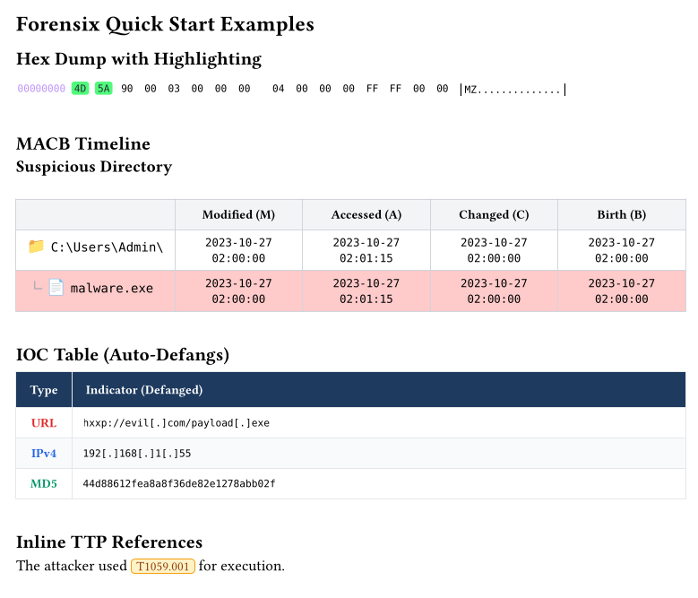

# Forensix

A professional Typst package for digital forensics, incident response, and malware analysis reports.

## Features

| Module | Description |
|--------|-------------|
| **[Hex Dump](https://github.com/teismar/typst-forensix/blob/216289ed8d031518045083f90c5c0d21013e47d8/docs/hexdump.md)** | Canonical hex dumps with highlighting, annotations, themes |
| **[MACB Timeline](https://github.com/teismar/typst-forensix/blob/216289ed8d031518045083f90c5c0d21013e47d8/docs/macb-timeline.md)** | File tree with MACB timestamps for forensic analysis |
| **[IOC Table](https://github.com/teismar/typst-forensix/blob/216289ed8d031518045083f90c5c0d21013e47d8/docs/ioc-table.md)** | Auto-defanging indicators of compromise |
| **[TTP References](https://github.com/teismar/typst-forensix/blob/216289ed8d031518045083f90c5c0d21013e47d8/docs/ttp.md)** | Inline MITRE ATT&CK technique cards |



## Installation

```typst
#import "@preview/forensix:0.1.0": *
```

## Quick Start

```typst
// Hex dump with highlighting
#hexdump(
  file: "/evidence/malware.bin",
  highlight: (0x4d, 0x5a),
  theme: "dracula",
)

// MACB timeline
#macb-timeline(entries: (
  folder-entry("C:\\Users\\Admin\\", depth: 0,
    modified: "2023-10-27 02:00:00", accessed: "2023-10-27 02:01:15",
    changed: "2023-10-27 02:00:00", birth: "2023-10-27 02:00:00"),
  file-entry("malware.exe", depth: 1, highlight: rgb("#fecaca"),
    modified: "2023-10-27 02:00:00", accessed: "2023-10-27 02:01:15",
    changed: "2023-10-27 02:00:00", birth: "2023-10-27 02:00:00"),
))

// IOC table (auto-defangs!)
#ioc-table(indicators: (
  "http://evil.com/payload.exe",
  "192.168.1.55",
  "44d88612fea8a8f36de82e1278abb02f",
))

// Inline TTP references
The attacker used #ttp("T1059.001") for execution.
```

## Documentation

The full documentation is available online at [teismar.github.io/typst-forensix/](https://teismar.github.io/typst-forensix/).

## License

MIT
