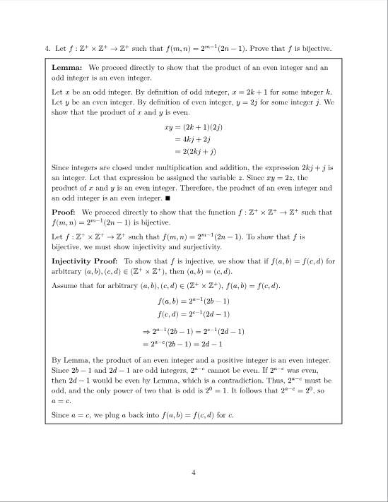
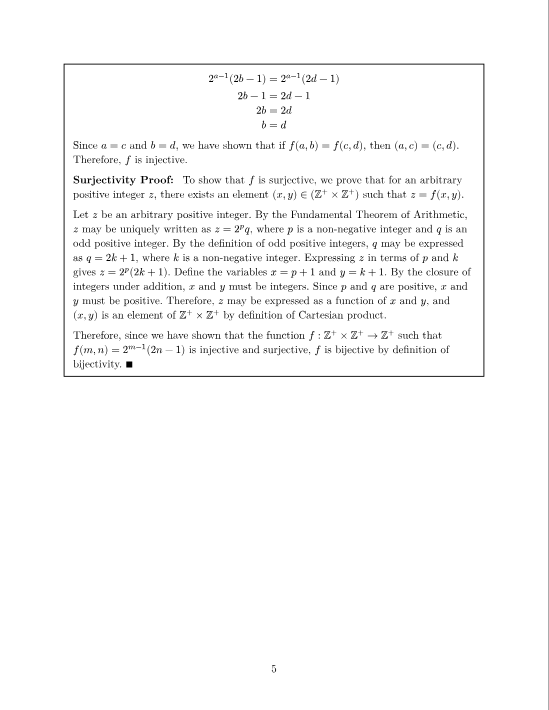
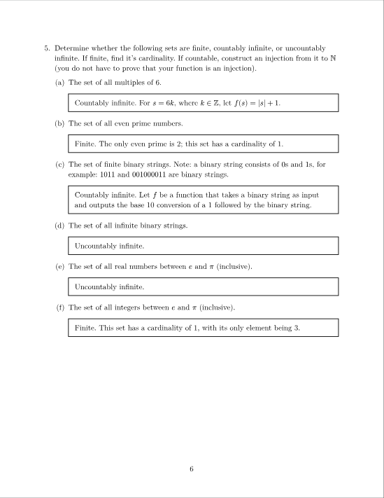

# formal-homework

`formal-homework` is a small [Typst](https://typst.app) package that provides an easy way to start writing formal homework documents.


## Usage

First, create a new `.typ` file and import this package at the top:

```typst
#import "@preview/formal-homework:0.1.0": hw, q, a, br
```

The entirety of the homework portion of your document will be contained in `hw()[]`, including the title page. Call it and pass the following (optional) parameters:

- `title-text` -> Text to be used as title of document

- `number` -> Number of the homework, only used if `title_text` is omitted

- `author` -> Your name

- `class` -> Name of the class/course that the homework is for

- `due-date` -> Date that the homework is due

```typst
#hw(
  number: 5,
  author: "George P. Burdell",
  class: "CS 2050",
  due-date: "January 1, 1970"
)[
    Your content goes here.
]
```


New Computer Modern is the default font, aiming for semblance to vanilla LaTeX, which professors likely prefer. To revert it, insert `#set text(font: "libertinus serif")` into the body of `#hw()[]`.

The content of the document is laid out with the remaining macros: `#q[]`, `#a[]`, and `#br()`

`#q[]` -> Contains the question, automatically enumerated
`#a[]` -> Contains the answer, bordered with a black box
`#br()` -> Shortcut for `#pagebreak()`, may be used to keep questions on their own page

Note that `#q[]`s may embed `#a[]`, which is often useful for multi-part questions. An exhaustive example is provided below.

```typst

#q[
    Let $f: ZZ^+ times ZZ^+ -> ZZ^+$ such that $f(m,n) = 2^(m - 1) (2n - 1)$. Prove that $f$ is bijective.
]

#a[
    *Lemma:* #h(0.5em) We proceed directly to show that the product of an even integer and an odd integer is an even integer.

    Let $x$ be an odd integer. By definition of odd integer, $x = 2k + 1$ for some integer $k$. Let $y$ be an even integer. By definition of even integer, $y = 2j$ for some integer $j$. We show that the product of $x$ and $y$ is even.

    $
    x y &= (2k + 1)(2j) \
    &= 4 k j + 2 j \
    &= 2 (2 k j + j) \
    $

    Since integers are closed under multiplication and addition, the expression $2 k j + j$ is an integer. Let that expression be assigned the variable $z$. Since $x y = 2z$, the product of $x$ and $y$ is an even integer. Therefore, the product of an even integer and an odd integer is an even integer. #sym.qed

    *Proof:* #h(0.5em) We proceed directly to show that the function $f: ZZ^+ times ZZ^+ -> ZZ^+$ such that $f(m, n) = 2^(m - 1) (2n - 1)$ is bijective.

    Let $f: ZZ^+ times ZZ^+ -> ZZ^+$ such that $f(m, n) = 2^(m - 1) (2n - 1)$. To show that $f$ is bijective, we must show injectivity and surjectivity.

    *Injectivity Proof:* #h(0.5em) To show that $f$ is injective, we show that if $f(a,b) = f(c,d)$ for arbitrary $(a,b), (c,d) in (ZZ^+ times ZZ^+)$, then $(a,b) = (c,d)$.

    Assume that for arbitrary $(a,b), (c,d) in (ZZ^+ times ZZ^+)$, $f(a,b) = f(c,d)$.

    $ 
    f(a,b) &= 2^(a - 1) (2b - 1) \
    f(c,d) &= 2^(c - 1) (2d - 1) \
    $
    $
    &=> 2^(a - 1) (2b - 1) = 2^(c - 1) (2d - 1) \
    &= 2^(a - c) (2b - 1) = 2d - 1 \
    $

    By Lemma, the product of an even integer and a positive integer is an even integer. Since $2b - 1$ and $2d - 1$ are odd integers, $2^(a - c)$ cannot be even. If $2^(a - c)$ was even, then $2d - 1$ would be even by Lemma, which is a contradiction. Thus, $2^(a - c)$ must be odd, and the only power of two that is odd is $2^0 = 1$. It follows that $2^(a - c) = 2^0$, so $a = c$. 

    Since $a = c$, we plug $a$ back into $f(a,b) = f(c,d)$ for $c$.

    $
    2^(a - 1) (2b - 1) &= 2^(a - 1) (2d - 1) \
    2b - 1 &= 2d - 1 \
    2b &= 2d \
    b &= d
    $

    Since $a = c$ and $b = d$, we have shown that if $f(a,b) = f(c,d)$, then $(a,c) = (c,d)$. Therefore, $f$ is injective.

    *Surjectivity Proof:* #h(0.5em) To show that $f$ is surjective, we prove that for an arbitrary positive integer $z$, there exists an element $(x, y) in (ZZ^+ times ZZ^+)$ such that $z = f(x, y)$.

    Let $z$ be an arbitrary positive integer. By the Fundamental Theorem of Arithmetic, $z$ may be uniquely written as $z = 2^p q$, where $p$ is a non-negative integer and $q$ is an odd positive integer. By the definition of odd positive integers, $q$ may be expressed as $q = 2k + 1$, where $k$ is a non-negative integer. Expressing $z$ in terms of $p$ and $k$ gives $z = 2^p (2k + 1)$. Define the variables $x = p + 1$ and $y = k + 1$. By the closure of integers under addition, $x$ and $y$ must be integers. Since $p$ and $q$ are positive, $x$ and $y$ must be positive. Therefore, $z$ may be expressed as a function of $x$ and $y$, and $(x,y)$ is an element of $ZZ^+ times ZZ^+$ by definition of Cartesian product.

    Therefore, since we have shown that the function $f: ZZ^+ times ZZ^+ -> ZZ^+$ such that $f(m, n) = 2^(m - 1) (2n - 1)$ is injective and surjective, $f$ is bijective by definition of bijectivity. #sym.qed
]

#br()

#q[
    Determine whether the following sets are finite, countably infinite, or uncountably infinite. If finite, find it's cardinality. If countable, construct an injection from it to $NN $ (you do not have to prove that your function is an injection).

    +  The set of all multiples of 6.

      #a[Countably infinite. For $s = 6k$, where $k in ZZ$, let $f(s) = |s| + 1$.]

    +  The set of all even prime numbers.

      #a[Finite. The only even prime is 2; this set has a cardinality of 1.]

    +  The set of finite binary strings. Note: a binary string consists of $0 $s and $1 $s, for example: $1 0 1 1 $ and $0 0 1 0 0 0 0 1 1 $ are binary strings.

      #a[Countably infinite. Let $f$ be a function that takes a binary string as input and outputs the base 10 conversion of a 1 followed by the binary string. ]

    +  The set of all infinite binary strings.

      #a[Uncountably infinite.]

    +  The set of all real numbers between $e $ and $pi $ (inclusive).

      #a[Uncountably infinite.]

    +  The set of all integers between $e $ and $pi $ (inclusive).

      #a[Finite. This set has a cardinality of 1, with its only element being 3.]

]
```

  

