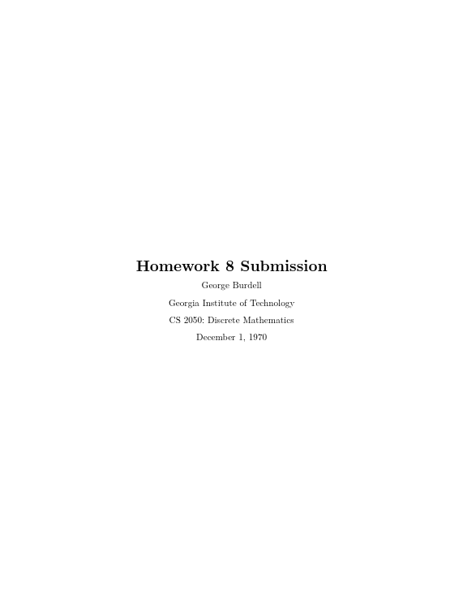
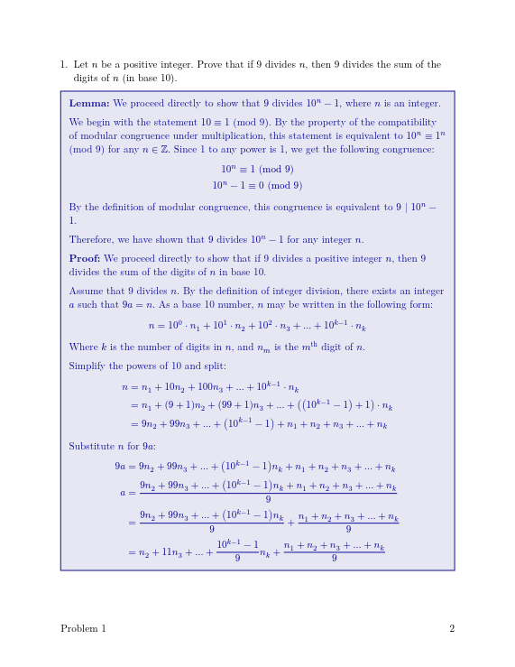
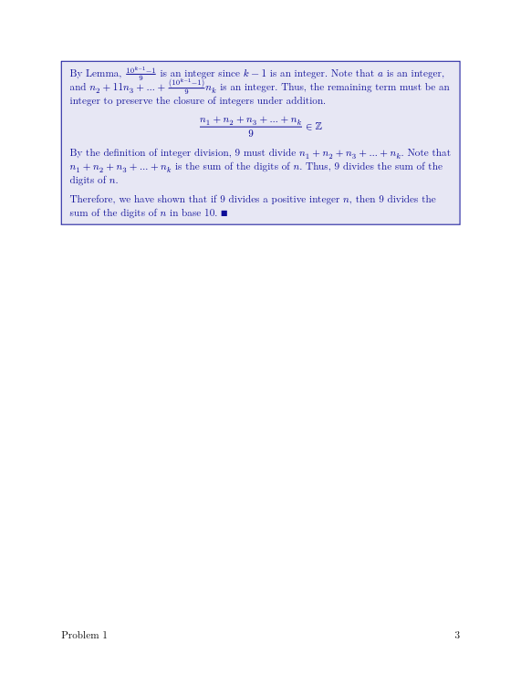
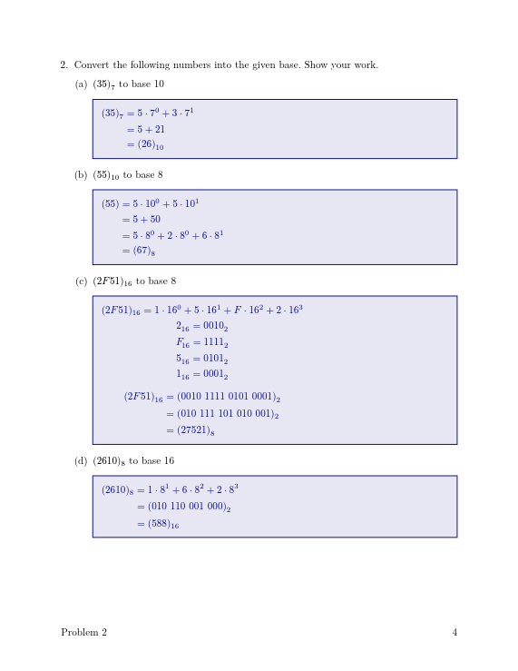

# formal-homework

`formal-homework` is a small [Typst](https://typst.app) package that provides an easy way to start writing formal homework documents.


## Usage

First, create a new `.typ` file and import this package at the top:

```typst
#import "@preview/formal-homework:0.1.1": hw, q, a, br
```

The entirety of the homework portion of your document will be contained in `#hw()[]`, including the title page. Call it and pass the following (optional) parameters:

- `title-text` -> Text to be used as title of document (str)

- `number` -> Number of the homework, only used if `title_text` is omitted (int)

- `author` -> Your name (str)

- `class` -> Name and/or code of the course that the homework is for (str)

- `institution` -> Institute you represent, or are submitting to (str)

- `professor` -> Name of the class professor (str)

- `due-date` -> Date that the homework is due

```typst
#hw(
  number: 8,
  author: "George Burdell",
  institution: "Georgia Institute of Technology",
  class: "CS 2050: Discrete Mathematics",
  due-date: "December 1, 1970",
  answer-color: rgb("#0E0E97"),
  answer-background-fill: true,
)[
  Your homework goes here
]
```



New Computer Modern is the default font, aiming for semblance to vanilla LaTeX, which professors likely prefer. To revert it, insert `#set text(font: "libertinus serif")` into the body of `#hw()[]`.

The content of the document is laid out with the remaining macros: `#q[]`, `#a[]`, and `#br()`

`#q[]` -> Contains the question, automatically enumerated
`#a[]` -> Contains the answer, bordered with a black box
`#br()` -> Shortcut for `#pagebreak()`, may be used to keep questions on their own page

Note that `#q[]`s may embed `#a[]`, which is often useful for multi-part questions. Ensure that embedded `#a[]`s are indented, otherwise the enumeration will be reset.

An example showcasing most features is provided below.

```typst
  #q[
    Let $n$ be a positive integer. Prove that if 9 divides $n$, then 9 divides the sum of the digits of $n$ (in base 10).
  ]

  #a[

    *Lemma:* We proceed directly to show that $9$ divides $10^n - 1$, where $n$ is an integer.

    We begin with the statement $10 equiv 1$ (mod 9). By the property of the compatibility of modular congruence under multiplication, this statement is equivalent to $10^n equiv 1^n$ (mod 9) for any $n in ZZ$. Since 1 to any power is 1, we get the following congruence:

    $
      10^n equiv 1 "(mod 9)" \
      10^n - 1 equiv 0 "(mod 9)" \
    $

    By the definition of modular congruence, this congruence is equivalent to $9 | 10^n - 1$.

    Therefore, we have shown that $9$ divides $10^n - 1$ for any integer $n$.

    *Proof:* We proceed directly to show that if 9 divides a positive integer $n$, then 9 divides the sum of the digits of $n$ in base 10.

    Assume that 9 divides $n$. By the definition of integer division, there exists an integer $a$ such that $9 a = n$. As a base 10 number, $n$ may be written in the following form:

    $
      n = 10^0 dot n_1 + 10^1 dot n_2 + 10^2 dot n_3 + ... + 10^(k - 1) dot n_k \
    $

    Where $k$ is the number of digits in $n$, and $n_m$ is the $m^"th"$ digit of $n$.

    Simplify the powers of 10 and split:

    $
      n & = n_1 + 10 n_2 + 100 n_3 + ... + 10^(k - 1) dot n_k \
        & = n_1 + (9 + 1) n_2 + (99 + 1) n_3 + ... + ((10^(k - 1) - 1) + 1) dot n_k \
        & = 9 n_2 + 99 n_3 + ... + (10^(k - 1) - 1) + n_1 + n_2 + n_3 + ... + n_k \
    $

    Substitute $n$ for $9a$:

    $
      9a & = 9 n_2 + 99 n_3 + ... + (10^(k - 1) - 1) n_k + n_1 + n_2 + n_3 + ... + n_k \
      a & = frac(9 n_2 + 99 n_3 + ... + (10^(k - 1) - 1) n_k + n_1 + n_2 + n_3 + ... + n_k, 9) \
      & = frac(9 n_2 + 99 n_3 + ... + (10^(k - 1) - 1) n_k, 9) + frac(n_1 + n_2 + n_3 + ... + n_k, 9) \
      & = n_2 + 11 n_3 + ... + frac(10^(k - 1) - 1, 9) n_k + frac(n_1 + n_2 + n_3 + ... + n_k, 9) \
    $

    By Lemma, $frac(10^(k - 1) - 1, 9)$ is an integer since $k - 1$ is an integer. Note that $a$ is an integer, and $n_2 + 11 n_3 + ... + frac((10^(k - 1) - 1), 9) n_k$ is an integer. Thus, the remaining term must be an integer to preserve the closure of integers under addition.

    $ frac(n_1 + n_2 + n_3 + ... + n_k, 9) in ZZ $

    By the definition of integer division, 9 must divide $n_1 + n_2 + n_3 + ... + n_k$. Note that $n_1 + n_2 + n_3 + ... + n_k$ is the sum of the digits of $n$. Thus, 9 divides the sum of the digits of $n$.

    Therefore, we have shown that if 9 divides a positive integer $n$, then 9 divides the sum of the digits of $n$ in base 10. #sym.qed
  ]

  #br()

  #q[
    Convert the following numbers into the given base. Show your work.

    + $(35)_7$ to base 10

      #a[
        $
          (35)_7 & = 5 dot 7^0 + 3 dot 7^1 \
                 & = 5 + 21 \
                 & = (26)_10
        $
      ]

    + $(55)_10$ to base 8

      #a[
        $
          (55) & = 5 dot 10^0 + 5 dot 10^1 \
               & = 5 + 50 \
               & = 5 dot 8^0 + 2 dot 8^0 + 6 dot 8^1 \
               & = (67)_8 \
        $
      ]

    + $(2 F 51)_16$ to base 8

      #a[
        $
          (2 F 51)_16 = 1 dot 16^0 + 5 dot 16^1 + F dot 16^2 + 2 dot 16^3 \
          2_16 = 0010_2 \
          F_16 = 1111_2 \
          5_16 = 0101_2 \
          1_16 = 0001_2 \
        $
        $
          (2 F 51)_16 & = ("0010 1111 0101 0001")_2 \
                      & = ("010 111 101 010 001")_2 \
                      & = (2 7 5 2 1)_8 \
        $
      ]

    + $(2610)_8$ to base 16

      #a[
        $
          (2610)_8 & = 1 dot 8^1 + 6 dot 8^2 + 2 dot 8^3 \
                   & = ("010 110 001 000")_2 \
                   & = (588)_16
        $
      ]
  ]
```

  

