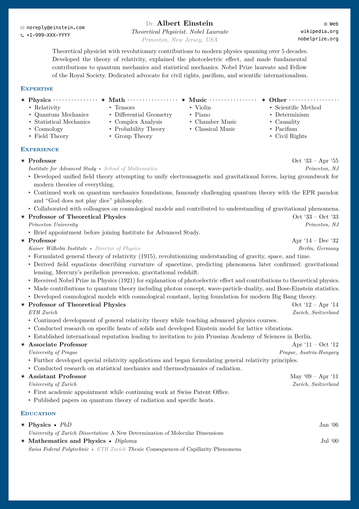
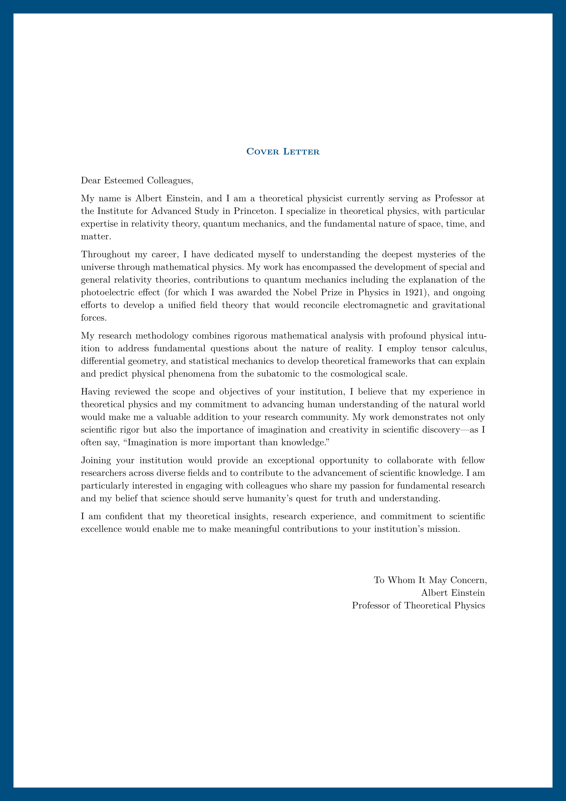
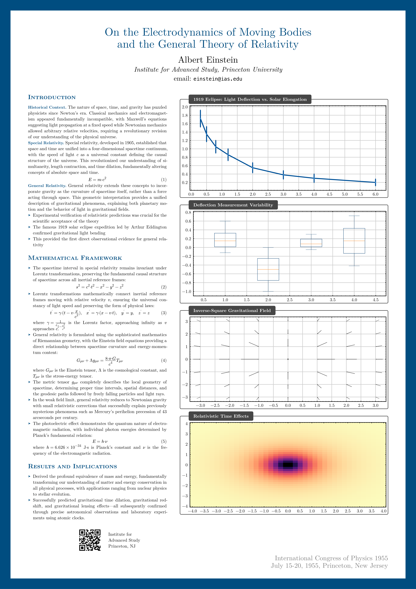

# Formal

A template collection for [Typst](https://typst.app) to create professional and formal documents. This collection includes CV, letter, and poster layouts.

## Installation

Install the package using Typst's package registry:

```typst
#import "@preview/formal:0.1.0": formal-cv, formal-letter, formal-poster
```

## Usage

Explore usage examples in the [GitHub repository](https://github.com/vsheg/formal) under the `template/` directory, or click on the images below.

| CV | Letter | Poster |
|---|---|---|
| [](template/formal-cv.typ) | [](template/formal-letter.typ) | [](template/formal-poster.typ) |

## License

The source code is licensed under [MIT License](LICENSE) and is available on [GitHub repository](https://github.com/vsheg/formal). Templates use the more permissive [MIT-0](https://opensource.org/licenses/MIT-0) license and can be found in the `template/` directory of the repository.
