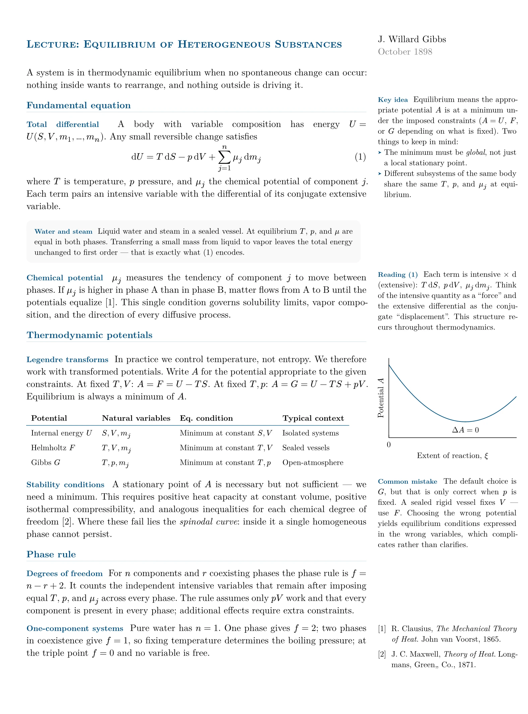
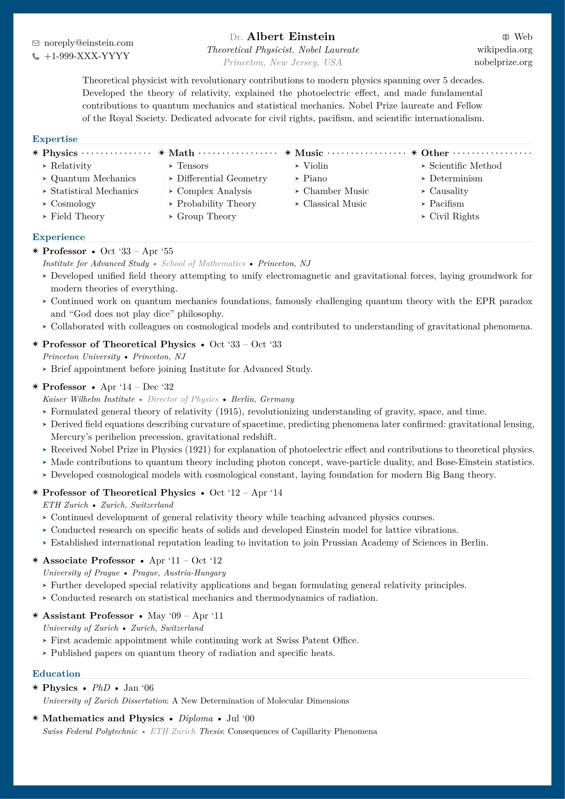
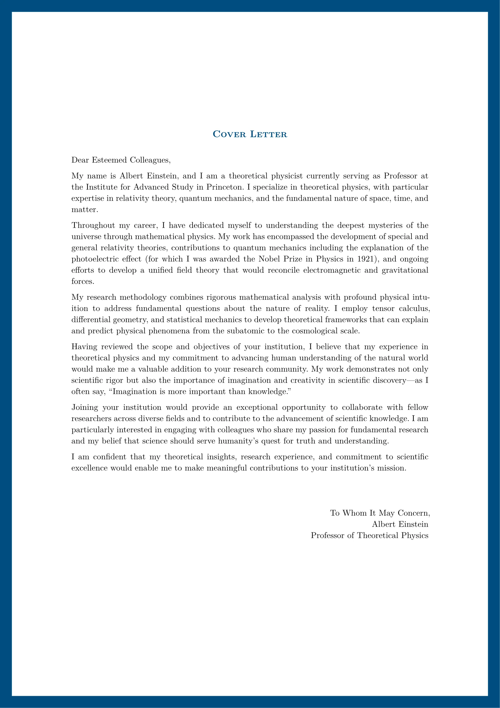
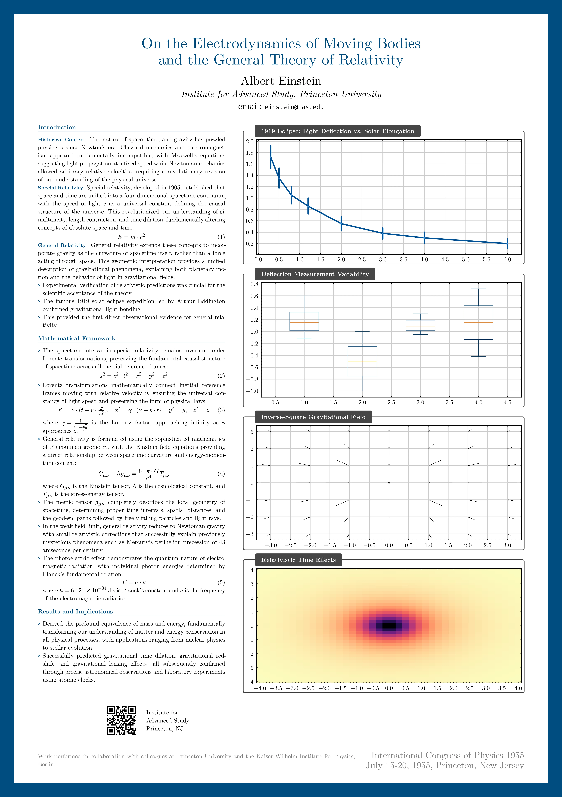

# Formal

A template collection for [Typst](https://typst.app) to create professional and formal documents. This collection includes text, CV, letter, and poster layouts.

## Installation

Install the package using Typst's package registry:

```typst
#import "@preview/formal:0.2.0": formal-text, formal-cv, formal-letter, formal-poster, marginalia
```

## Usage

Explore usage examples in the [GitHub repository](https://github.com/vsheg/formal) under the `template/` directory, or click on the images below.

<table>
  <tr>
    <td align="center" valign="top">
      <strong><a href="template/formal-text.typ">Text</a></strong>
      <br />
      <a href="docs/formal-text.webp">
        
      </a>
      <br /><br />
      <strong><a href="template/formal-cv.typ">CV</a></strong>
      <br />
      <a href="docs/formal-cv.webp">
        
      </a>
      <br /><br />
      <strong><a href="template/formal-letter.typ">Letter</a></strong>
      <br />
      <a href="docs/formal-letter.webp">
        
      </a>
    </td>
    <td align="center" valign="middle">
      <strong><a href="template/formal-poster.typ">Poster</a></strong>
      <br />
      <a href="docs/formal-poster.webp">
        
      </a>
    </td>
  </tr>
</table>

## License

The source code is licensed under [MIT License](LICENSE) and is available on [GitHub repository](https://github.com/vsheg/formal). Templates use the more permissive [MIT-0](https://opensource.org/licenses/MIT-0) license and can be found in the `template/` directory of the repository.
