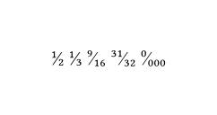

# The `frackable` Package
<div align="center">Version 0.1.0</div>

Provides a function, `frackable(numerator: 1, denominator: 2)`, to typeset vulgar fractions

```typ
#import "@preview/frackable:0.1.0": *

#frackable()
#frackable(denominator: 3)
#frackable(numerator: 9, denominator: 16)
#frackable(numerator: 31, denominator: 32)
#frackable(numerator: 0, denominator: "000")
```


