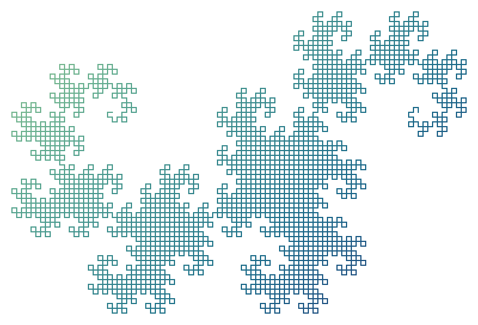
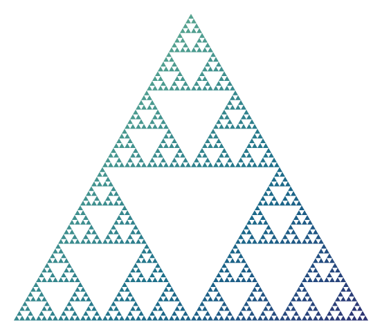
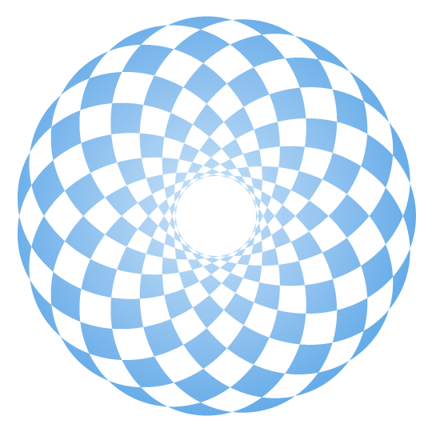
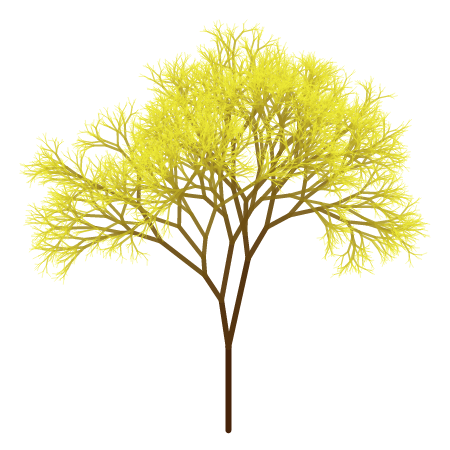
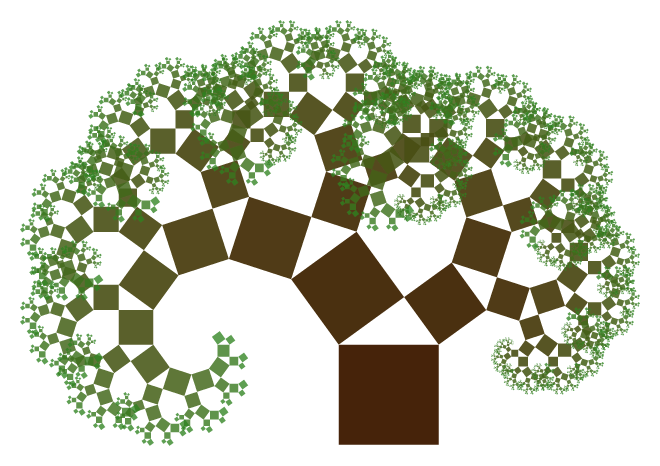

# Fractusist

Create a variety of wonderful fractals and curves in Typst.


## Examples

<table>
<tr>
  <td>
    <a href="examples/dragon-curve-ex.typ">
      
    </a>
  </td>
  <td>
    <a href="examples/koch-snowflake-ex.typ">
      
    </a>
  </td>
  <td>
    <a href="examples/sierpinski-triangle-ex.typ">
      
    </a>
  </td>
</tr>
<tr>
  <td>Dragon Curve</td>
  <td>Koch Snowflake</td>
  <td>Sierpiński Triangle</td>
</tr>
<tr>
  <td>
    <a href="examples/hypotrochoid-ex.typ">
      
    </a>
  </td>
  <td>
    <a href="examples/random-fractal-tree-ex.typ">
      
    </a>
  </td>
  <td>
    <a href="examples/pythagorean-tree-ex.typ">
      
    </a>
  </td>
</tr>
<tr>
  <td>Hypotrochoid</td>
  <td>Random Fractal Tree</td>
  <td>Pythagorean Tree</td>
</tr>
</table>

*Click on the example image to jump to the code.*


## Features

- Generate fractals using [L-system](https://en.wikipedia.org/wiki/L-system). The grammar, number of iterations, drawing styles, etc. could be customized.
- Over 30 preset parameters are provided for the L-system to facilitate the drawing of fractals.
- Generate fractals using iterative methods, including Fibonacci word fractal and Z-order curve.
- Generate fractals using recursive methods, including various fractal trees and Sierpiński carpet.
- Generate parametric curves, such as spirographs and Lissajous curves.


## Usage

Import the latest version of this package with:

```typ
#import "@preview/fractusist:0.3.0": *
```

Each drawing function (see reference) generates a type of fractal or curve, with a variety of configurable parameters. And the fill and stroke style arguments are equivalent to those in the `curve` function. The returned graph is contained within the `box` element.

This package comes with some unit tests under the [tests](https://github.com/liuguangxi/fractusist/tree/main/tests) directory.


## Reference

### L-system Fractal

- `lsystem-names`: Get all names in L-system generator library
```typ
#let lsystem-names = {...}
```

- `lsystem-use`: Get arguments in L-system generator library by name
```typ
#let lsystem-use(name) = {...}
```

- `lsystem`: L-system generator

```typ
#let lsystem(
  draw-forward-sym: "F", move-forward-sym: "", axiom: "F", rule-set: ("F": "F-F++F-F"),
  angle: 1/3, cycle: false,
  order: 3, step-size: 10, start-angle: 1, padding: 0,
  fill: none, stroke: black + 1pt
) = {...}
```


### Iterative Method Fractal

- `fibonacci-word-fractal`: Generate Fibonacci word fractal (n: integer range **[3, 24]**)
```typ
#let fibonacci-word-fractal(n, skip-last: true, step-size: 10, start-dir: 0, padding: 0, stroke: black + 1pt) = {...}
```

- `z-order-curve`: Generate Z-order curve (n: integer range **[1, 8]**)
```typ
#let z-order-curve(n, step-size: 10, start-dir: 0, padding: 0, stroke: black + 1pt) = {...}
```


### Recursive Method Fractal

- `fractal-tree`: Generate fractal tree (n: integer range **[1, 14]**)
```typ
#let fractal-tree(n, root-color: rgb("#46230A"), leaf-color: rgb("#228B22"), trunk-len: 100, trunk-rad: 3.0, theta: 1/2, angle: 1/4, ratio: 0.8, padding: 0) = {...}
```

- `random-fractal-tree`: Generate random fractal tree (n: integer range **[1, 14]**)
```typ
#let random-fractal-tree(n, seed: 42, root-color: rgb("#46230A"), leaf-color: rgb("#228B22"), trunk-len: 100, trunk-rad: 3.0, theta: 1/2, angle: 1/4, ratio: 0.8, padding: 0) = {...}
```

- `pythagorean-tree`: Generate Pythagorean tree (n: integer range **[1, 14]**)
```typ
#let pythagorean-tree(n, root-color: rgb("#46230A"), leaf-color: rgb("#228B22"), trunk-len: 50, theta: 1/5, padding: 0, filling: true) = {...}
```

- `sierpinski-carpet`: Generate Sierpiński carpet (n: integer range **[0, 5]**)
```typ
#let sierpinski-carpet(n, size: 243, padding: 0, fill: none, stroke: black + 1pt) = {...}
```


### Parametric Curve

- `hypotrochoid`: Generate hypotrochoid (a, b, h: integer range **[1, 100]**)
```typ
#let hypotrochoid(a, b, h, size: 100, padding: 0, fill: none, fill-rule: "non-zero", stroke: black + 1pt) = {...}
```

- `epitrochoid`: Generate epitrochoid (a, b, h: integer range **[1, 100]**)
```typ
#let epitrochoid(a, b, h, size: 100, padding: 0, fill: none, fill-rule: "non-zero", stroke: black + 1pt) = {...}
```

- `lissajous-curve`: Generate Lissajous curve (a, b: integer range **[1, 100]**, d: float range **[0, 2]**)
```typ
#let lissajous-curve(a, b, d, x-size: 100, y-size: 100, padding: 0, fill: none, fill-rule: "non-zero", stroke: black + 1pt) = {...}
```
