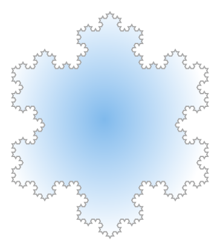
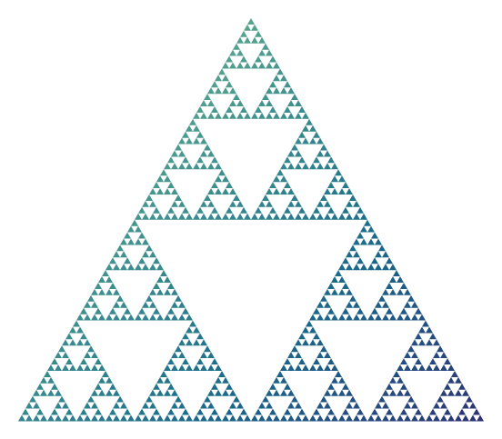
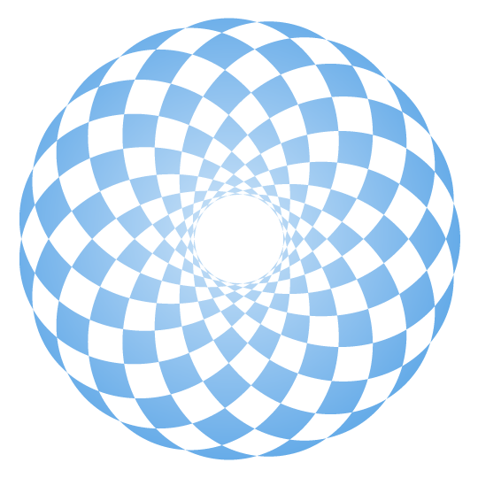
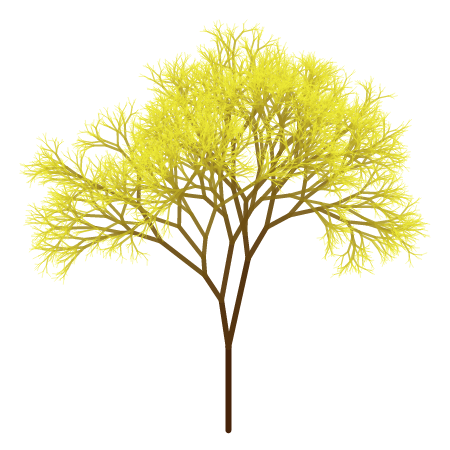

# Fractusist

Create a variety of wonderful fractals and curves in Typst.


## Examples

<table>
<tr>
  <td>
    <a href="examples/dragon-curve-ex.typ">
      
    </a>
  </td>
  <td>
    <a href="examples/koch-snowflake-ex.typ">
      
    </a>
  </td>
  <td>
    <a href="examples/sierpinski-triangle-ex.typ">
      
    </a>
  </td>
</tr>
<tr>
  <td>Dragon Curve</td>
  <td>Koch Snowflake</td>
  <td>Sierpiński Triangle</td>
</tr>
<tr>
  <td>
    <a href="examples/hypotrochoid-ex.typ">
      
    </a>
  </td>
  <td>
    <a href="examples/random-fractal-tree-ex.typ">
      
    </a>
  </td>
  <td>
    <a href="examples/pythagorean-tree-ex.typ">
      
    </a>
  </td>
</tr>
<tr>
  <td>Hypotrochoid</td>
  <td>Random Fractal Tree</td>
  <td>Pythagorean Tree</td>
</tr>
</table>

*Click on the example image to jump to the code.*


## Features

- Generate fractals using [L-system](https://en.wikipedia.org/wiki/L-system). The grammar, number of iterations, drawing styles, etc. could be customized.
- Over 30 preset parameters are provided for the L-system to facilitate the drawing of fractals.
- Generate fractals using iterative methods, including Fibonacci word fractal and Z-order curve.
- Generate fractals using recursive methods, including various fractal trees and Sierpiński carpet.
- Generate parametric curves, such as spirographs and Lissajous curves.
- Generate three types of Penrose tiling: original pentagonal Penrose tiling (P1), kite and dart tiling (P2) and rhombus tiling (P3).


## Usage

Import the latest version of this package with:

```typ
#import "@preview/fractusist:0.3.2": *
```

Each drawing function generates a type of fractal or curve, with a variety of configurable parameters.

For more information, see the [manual](https://github.com/liuguangxi/fractusist/blob/main/doc/manual.pdf).

This package comes with some unit tests under the [tests](https://github.com/liuguangxi/fractusist/tree/main/tests) directory.
