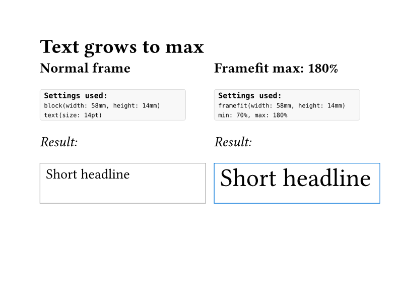
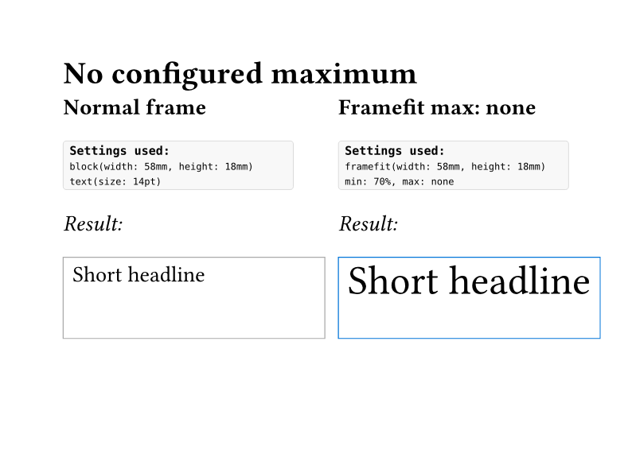
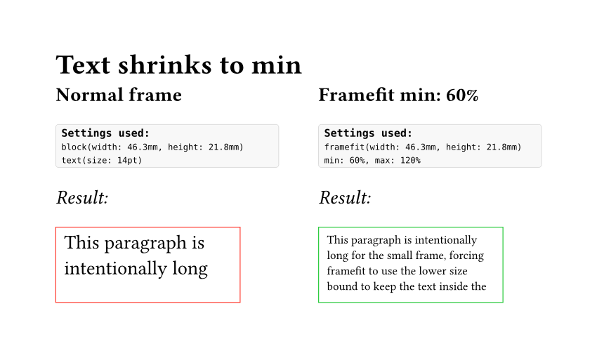
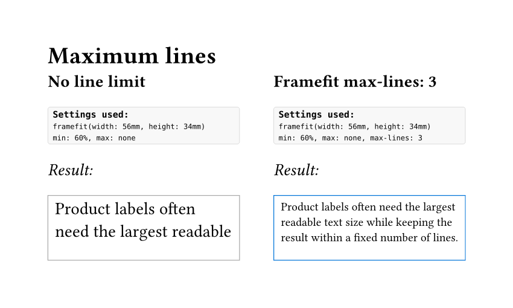
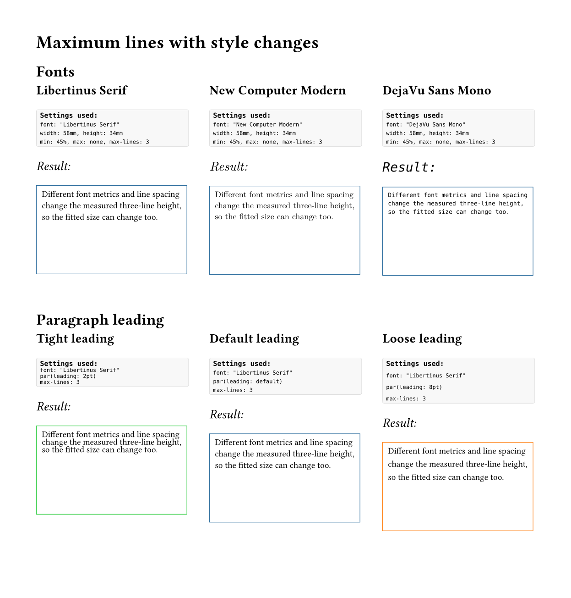

# Framefit

Fit text into fixed Typst frames by adjusting the text size.

Framefit is useful when the frame size is fixed but the text is variable:
labels, badges, cards, flyers, product sheets, certificates, data-driven
templates, or any layout where user-provided copy must stay inside a known box.

The package measures the rendered text and chooses a font-size percentage that
fits the available width and height. It can grow short text, shrink long text,
cap the allowed growth, or keep text within a maximum number of lines.

## Preview

Finite maximum:



No configured maximum:



Shrink to minimum:



Maximum lines:



Font and line spacing sensitivity:



## Features

- Fit text to a fixed `width` and `height`.
- Grow short text up to the largest fitting size.
- Shrink overflowing text down to a configured minimum.
- Use `max: none` or `max: -1` for no configured upper limit.
- Use a finite `max`, for example `max: 140%`, to cap growth.
- Use `max-lines`, for example `max-lines: 3`, to keep text within a measured
  line count.
- Use `only-if-overflow: true` to keep normal text unchanged unless it would
  overflow.

## Installation

Use the package from Typst Universe:

```typst
#import "@preview/framefit:0.1.0": framefit, fit-copy
```

## Quick Start

Create a fitted frame directly:

```typst
#import "@preview/framefit:0.1.0": framefit

#framefit(
  width: 70mm,
  height: 24mm,
  min: 70%,
  max: none,
  inset: 6pt,
  stroke: 0.5pt,
)[
  This text grows or shrinks until it fits the frame.
]
```

Use the lower-level helper inside an existing frame:

```typst
#import "@preview/framefit:0.1.0": fit-copy

#block(width: 70mm, height: 24mm, stroke: 0.5pt, inset: 6pt)[
  #fit-copy(min: 70%)[
    This text uses the surrounding block as the frame.
  ]
]
```

## Common Recipes

### Grow Until The Frame Is Full

`max: none` is the default. Framefit grows the text until it first overflows,
then backs off to the largest fitting size.

```typst
#framefit(width: 60mm, height: 18mm, min: 70%, max: none)[
  Short headline
]
```

`max: -1` is accepted as an alias for `max: none`.

### Cap Growth

Use a percentage `max` when text should grow, but not beyond a design limit.

```typst
#framefit(width: 60mm, height: 18mm, min: 70%, max: 180%)[
  Short headline
]
```

### Shrink Only If Text Overflows

Use `only-if-overflow: true` to keep text at `100%` when it already fits.

```typst
#framefit(
  width: 70mm,
  height: 24mm,
  min: 70%,
  max: 130%,
  only-if-overflow: true,
)[
  Text stays at normal size unless it would overflow.
]
```

### Limit The Number Of Lines

Use `max-lines` when the text should stay within a fixed number of measured
lines as well as the physical frame.

```typst
#framefit(
  width: 70mm,
  height: 30mm,
  min: 60%,
  max: none,
  max-lines: 3,
)[
  This text is fitted while staying within three measured lines.
]
```

Line spacing is configured with Typst's normal paragraph setting:

```typst
#set par(leading: 4pt)

#framefit(width: 70mm, height: 30mm, max-lines: 3)[
  This text is fitted using the active paragraph leading.
]
```

## API

### `framefit`

```typst
#framefit(
  width: auto,
  height: auto,
  min: 70%,
  max: none,
  max-lines: none,
  steps: 24,
  inset: 0pt,
  stroke: none,
  fill: none,
  radius: 0pt,
  only-if-overflow: false,
  body,
)
```

Creates a `block` frame and fits `body` inside it.

Key arguments:

- `width`, `height`: frame dimensions passed to `block`.
- `min`: smallest allowed text size as a percentage of the current text size.
- `max`: largest allowed text size as a percentage, or `none` / `-1` for no
  configured maximum.
- `max-lines`: maximum measured line count, or `none`.
- `steps`: binary-search iterations. The default is usually enough.
- `inset`, `stroke`, `fill`, `radius`: forwarded to the created `block`.
- `only-if-overflow`: if `true`, text that already fits stays at `100%`.

### `fit-copy`

```typst
#fit-copy(
  min: 70%,
  max: none,
  max-lines: none,
  steps: 24,
  only-if-overflow: false,
  body,
)
```

Fits `body` to the size of the surrounding layout container. Use this when you
already have a custom `block` or another layout container and only need the
text-fitting behavior.

## How It Works

Framefit uses Typst's layout measurement:

1. Measure the content at a candidate font-size percentage.
2. Check whether the measured width and height fit the available frame.
3. If `max-lines` is set, measure an equivalent line-count sample in the
   current text style and compare heights.
4. Use binary search to choose the largest fitting percentage.

Conceptually, `max-lines` is the maximum allowed text height for the requested
line count. Framefit lets Typst calculate that height instead of multiplying
manually, because the real line box depends on font metrics, text size,
top/bottom edges, and `par(leading:)`.

## Examples

The `examples/` folder contains rendered documents for the main cases:

- [`grows-to-max.typ`](examples/grows-to-max.typ): finite maximum percentage.
- [`no-maximum.typ`](examples/no-maximum.typ): calculated maximum with
  `max: none`.
- [`shrinks-to-min.typ`](examples/shrinks-to-min.typ): tight frame that reaches
  the minimum size.
- [`max-lines.typ`](examples/max-lines.typ): line-count limiting.
- [`max-lines-styles.typ`](examples/max-lines-styles.typ): different fonts and
  paragraph leading.
- `demo.typ`: combined overview.

Each example includes a visible "Settings used" block before each result.

## Overflow Behavior

If text still does not fit at `min`, compilation fails with a clear error:

```text
framefit: content does not fit at the minimum size.
Make the frame larger, reduce the content, or lower `min`.
```

This is intentional. It prevents silent clipping or hidden layout failures.

## Limitations

- Designed for paged output: PDF, PNG, and SVG.
- The fitting calculation uses Typst layout measurement, so unusual content may
  need manual checking.
- `max-lines` is intended for ordinary text. It is less exact for content that
  changes style inside the body, includes non-text elements, uses manual line
  breaks, or relies on hyphenation.
- The MVP focuses on text content. Other content can work, but is not the
  primary target.

## Development

Compile all examples:

```sh
for file in examples/*.typ; do
  [ "$file" = "examples/_helpers.typ" ] && continue
  docker run --rm -v "$PWD":/work -w /work ghcr.io/typst/typst:latest \
    compile --root /work "$file" "${file%.typ}.pdf"
done
```

Run the compile checks:

```sh
for file in tests/*.typ; do
  [ "$file" = "tests/impossible.typ" ] && continue
  docker run --rm -v "$PWD":/work -w /work ghcr.io/typst/typst:latest \
    compile --root /work "$file" "${file%.typ}.svg"
done
```

`tests/impossible.typ` is expected to fail because it verifies the minimum-size
overflow error.
