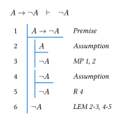
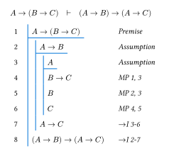

# `frederic`

> Typst package for [Fitch-style](https://en.wikipedia.org/wiki/Fitch_notation) natural deduction proofs in formal logic.

It supports premises, assumptions, derivation steps, subproofs, and arbitrary nesting, with line numbering, scope bars, and customizable styling.

_The name comes as a tribute to the American logician [Frederic Fitch](https://en.wikipedia.org/wiki/Frederic_Fitch), who developed this proof notation._

## Quick Start

Import the package in your Typst document:

```typst
#import "@preview/frederic:0.1.0": *
```

Then, create proofs using the `proof` function.
Here's a simple example proving $\neg A$ from $A \rightarrow \neg A$ using the Law of Excluded Middle:

$$ A \rightarrow \neg A \quad \vdash \quad \neg A $$

```typst
#proof(
  premise(1, $A -> not A$),
  subproof(
    assume(2, $A$),
    step(3, $not A$, rule: "MP 1, 2"),
  ),
  subproof(
    assume(4, $not A$),
    step(5, $not A$, rule: "R 4"),
  ),
  step(6, $not A$, rule: "LEM 2-3, 4-5"),
)
```

The output will look like this:

[](docs/assets/example1.typ)

Another example demonstrating nested subproofs:

[](docs/assets/example2.typ)

## Usage Guide

### Basic Proof Structure

A proof consists of:

1. **Premises** (optional): The initial assumptions
2. **Steps**: Derived conclusions
3. **Subproofs** (optional): Nested scopes for temporary assumptions

```typst
#proof(
  premise(1, $P$),
  premise(2, $P -> Q$),
  step(3, $Q$, rule: "MP 1, 2"),
)
```

### Function Reference

#### `premise(num, content, rule: none)`

Creates a premise (given fact). Must appear before other lines in a proof.

```typst
premise(1, $A and B$)
premise(2, $A -> C$, rule: "Hypothesis")
```

#### `step(num, content, rule: none)`

Creates a derivation step (derived conclusion).

```typst
step(3, $C$, rule: "MP 1, 2")
step(5, $not A$, rule: [DNE 4])  // Rules can be any Typst content
```

#### `assume(num, content, rule: none)`

Creates an assumption. Must be the first line in a `subproof()`.

```typst
subproof(
  assume(2, $A$),
  step(3, $B$, rule: "from 1"),
)
```

#### `subproof(..lines)`

Creates an indented scope containing assumptions and steps. Can be nested.

```typst
// Simple subproof
subproof(
  assume(2, $A$),
  step(3, $B$, rule: "1"),
)

// Nested subproof
subproof(
  assume(2, $A$),
  subproof(
    assume(3, $B$),
    step(4, $A and B$, rule: "2, 3"),
  ),
  step(5, $B -> A and B$, rule: [$->$I 3-4]),
)
```

#### `proof(..nodes, style: (:))`

Renders the complete proof as a grid with line numbers, scope bars, and justifications.

```typst
#proof(
  premise(1, $A$),
  step(2, $B$, rule: "1"),
  style: (stroke: 1pt + red, col-gutter: 1em)  // Custom styling
)
```

### Customizing Appearance

Use the `style` parameter to customize colors, spacing, and fonts:

```typst
#proof(
  premise(1, $A$),
  step(2, $B$, rule: "1"),
  style: (
    stroke: 1pt + red,          // Scope bars and underlines
    col-gutter: 1.2em,          // Space between columns
    row-gutter: 0.5em,          // Space between rows
    indent: 1.2em,              // Scope bar indentation
    pad: 0.6em,                 // Cell padding
    rule-style: (style: "oblique"),  // Rule text style
  )
)
```

## Examples

See examples in `docs/assets/`:

- `example1.typ`: Law of Excluded Middle proof
- `example2.typ`: Nested subproofs demonstration

Run `just doc` to compile examples to SVG.

## Advanced Features

### Custom Line Numbers

For complex proofs with special notation, you can use any value for line numbers:

```typst
#proof(
  premise(1, $A$),
  step(2, $B$, rule: "1"),
  step("∴", $B$, rule: ""),  // Using ∴ symbol
)
```

### Custom Rules

Rules accept any Typst content, including colors, sizes, and styled text:

```typst
step(5, $C$, rule: text(blue)[*Important rule* 1, 2])
step(6, $D$, rule: [$->$ Intro 5])
```

## License

[MIT](LICENSE)
