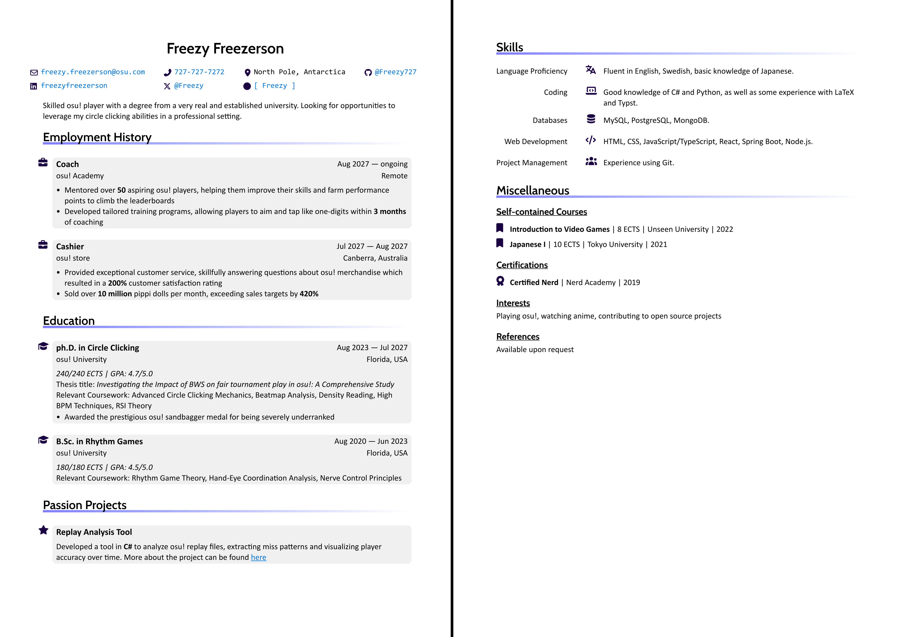

# FreeCV
A spacious and colorful CV written in Typst. Previously had my CV written in LaTeX, but it was a bit difficult to maintain so I've migrated it over to Typst. Couldn't find an existing template which aligned with my preferences, so made my own design inspired from [A Customised CurVe CV](https://www.overleaf.com/latex/templates/a-customised-curve-cv/mvmbhkwsnmwv) by LianTze Lim. The basic template looks as follows (see [template](template) folder for PDF):

## Usage

FreeCV requires [Font Awesome 7](https://fontawesome.com/download). After cloning the repo, the PDF can be recompiled using ``typst watch example.typ``, which requires the [Typst CLI](https://typst.app/open-source/#download) to run. The CV information can be personalized by editing the [conf.yaml](template/conf.yaml) file and sections can be restructured by modifying [example.typ](template/example.typ). Appearance, such as color scheme, can be further customized in [freeCV.typ](freeCV.typ).
