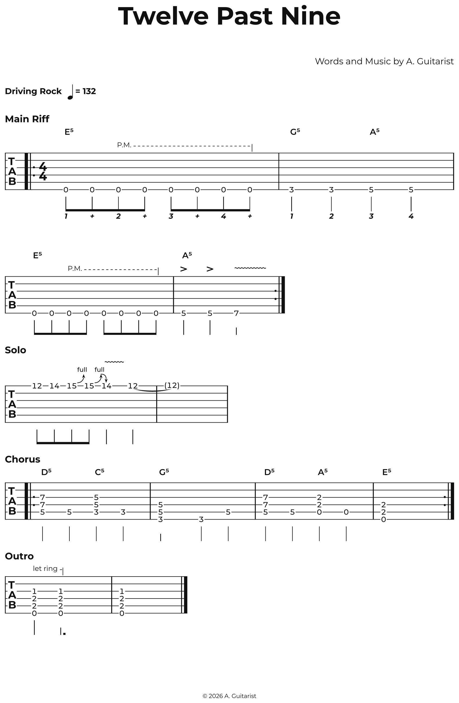
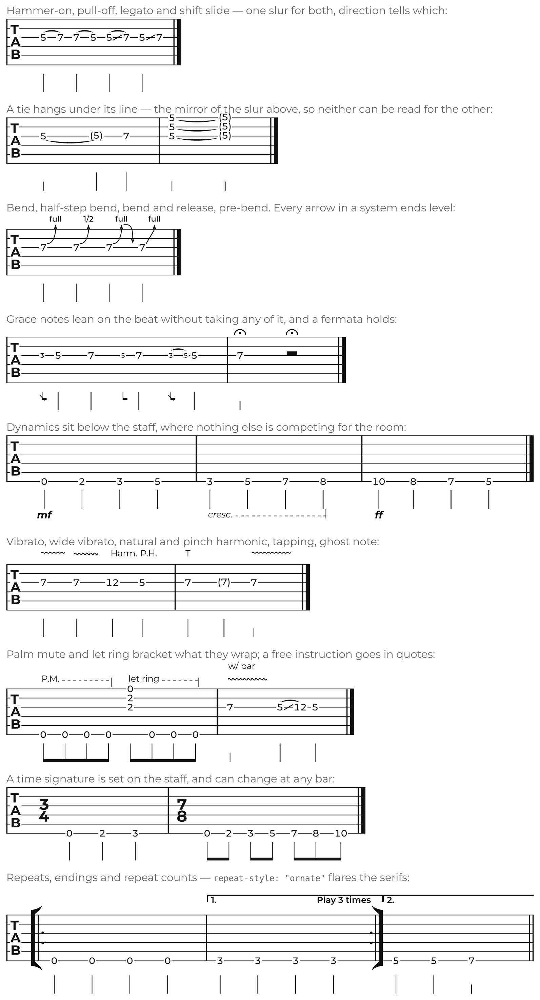
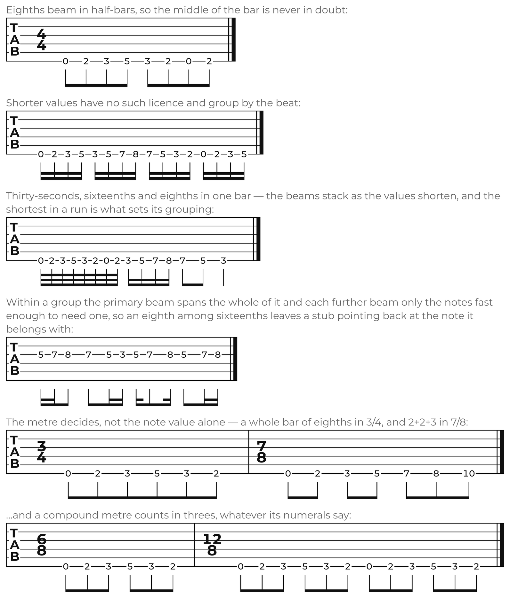
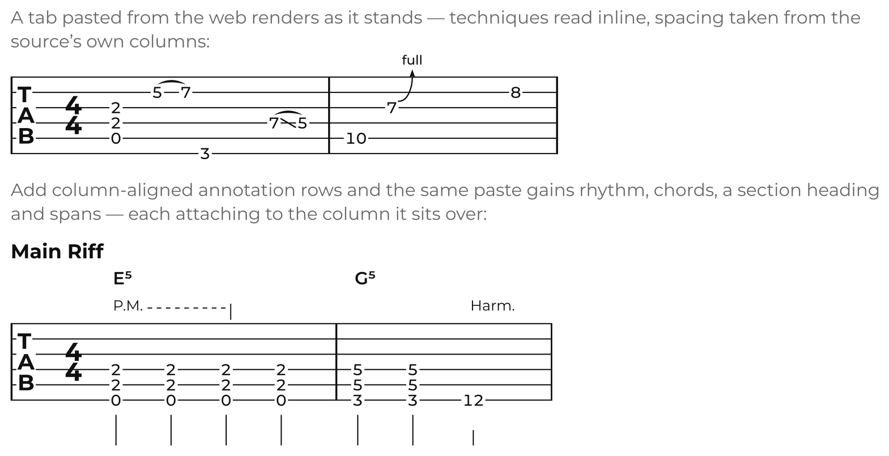

# fretwork

Guitar tablature of publishing quality, written as text.

Existing Typst packages draw chord diagrams or set standard notation; none sets a
guitar tab that looks like a published song sheet. `fretwork` does: optical
spacing, string lines broken around the fret numbers, beams grouped by the metre,
and the technique symbols of an engraved rock transcription — bends, slurs,
harmonics, palm mutes, repeat signs with flared serifs.

**No music font is required.** Every music symbol — every flag, rest, arrowhead,
repeat sign and articulation — is a vector curve. Typst packages cannot ship
fonts, and a package that needs one you must install by hand is a package that
renders wrong for most people. Text still needs a text font, of course; any sans
will do, and the Fonts section below covers the default.

<picture>
  <source media="(prefers-color-scheme: dark)" srcset="docs/hero-dark.png">
  
</picture>

That whole sheet is one `song` show rule and four `tab` calls.

## Quick start

```typst
#import "@preview/fretwork:0.2.0": *

#show: song.with(
  title: "Twelve Past Nine",
  words: "A. Guitarist",
  music: "A. Guitarist",
  tempo: 132,
  tempo-words: "Driving Rock",
)

#section("Main Riff")

#tab(```
|: @E5 e 0/6 0/6 {PM: 0/6 0/6 0/6 0/6 0/6 0/6}
 |  @G5 q 3/6 3/6 @A5 5/6 5/6 :|
```)
```

A note is `fret/string`, string 1 being the highest. Note values — `w h q e s t`
for whole down to thirty-second, `.` for each augmentation dot — are **sticky**,
so you write one only when it changes. `|` is a barline, `|:` and `:|` are
repeats, `@E5` names a chord over the next event, `{PM: … }` brackets a span, and
`x` deadens a string.

## Techniques

Techniques are suffixes after the string number. They chain — `5/3h7v` — and a
suffix after a closing parenthesis binds to every note of a chord.

<picture>
  <source media="(prefers-color-scheme: dark)" srcset="docs/techniques-dark.png">
  
</picture>

| | |
|---|---|
| `5/3h7` `7/3p5` | hammer-on / pull-off to a fret |
| `5/3s7` `5/3S7` | legato slide / shift slide |
| `5/3h` `5/3s` | …running to the next event on that string instead of naming a fret, which is what crosses a barline |
| `5/3sU` `5/3sN` | slide out of the note, up or down, reaching nothing |
| `7/3b` `7/3b(1/2)` `7/3b(1/4)` | bend — a whole step, or the size given |
| `7/3br` `7/3B` `7/3Br` | bend and release / pre-bend / pre-bend and release |
| `7/3v` `7/3V` | vibrato / wide vibrato |
| `12/3*` `5/3PH` `5/3AH` `7/3HH` `7/3TH` | natural / pinch / artificial / harp / tap harmonic |
| `7/3~` | tie into the next note on that string |
| `7/3>` `7/3^` `7/3!` `7/3-` | accent / marcato / staccato / tenuto |
| `7/3n` `7/3u` | downstroke / upstroke |
| `7/3T` `7/3g` | tapping / ghost note |
| `7/3tr9` `7/3TP` | trill / tremolo picking |
| `x/3PS1` `x/3PS` | pick scrape — to the fret named, or to the next note on the string |
| `7/3W` `7/3F` | tremolo-bar vibrato / fermata — `rF` and `xF` too |
| `(…)An` `(…)Au` `(…)Rn` | arpeggiate or rake, thick string to thin or back |
| `0/4SL` `3/3PO` `x/3DS` | bass: slap / pop / dead slap |

A standalone `g` or `G` makes the next event a grace note, before the beat or on
it. `!mf` sets a dynamic, printed below the staff. `[7/8]` at the start of a
measure changes the time signature there.

Groups are one mechanism doing five jobs: `{PM: … }` and `{LR: … }` are palm mute
and let ring, `{3: … }` is a triplet, `{7/4: … }` states a tuplet ratio outright,
`{V1: … }` `{V2: … }` are first and second endings, and `{cresc: … }` `{dim: … }`
are the stretches that change in loudness. They nest.

## Rhythm

Note values are written once and stick until they change — `w h q e s t` for
whole down to thirty-second, `.` for each augmentation dot. How they beam is not
written at all: the grouping follows the time signature, the way an engraver
sets it.

<picture>
  <source media="(prefers-color-scheme: dark)" srcset="docs/rhythm-dark.png">
  
</picture>

Eighths beam into half-bars, and shorter values group by the beat. The shortest
value in a run decides for the whole run, so one sixteenth among eighths pulls
the run back to the beat. A group ends only where a note falls exactly on a
boundary, which is what lets a syncopated figure carry its beam across one. The
rules are Gould's (*Behind Bars* p. 153), and an irregular metre gets the
counting it is written for: 2+2+3 in 7/8, threes in the compound metres.

## Lyrics

Syllables are not written among the notes — they would drown them. They run
parallel to the music instead, spent one per sung note:

```typst
#tab(lyrics: "Some- thing I can ne- ver say _", ```
q 0/6 2/6 e 3/6 3/6 q 5/6 h 3/6
```)
```

Rests, grace notes and the far end of a tie are passed over, since none of them
is sung. A trailing `-` hyphenates into the next syllable, and the hyphen is
drawn centred in the gap between the two. `_` spends a note without printing
anything, which is how a word held over several notes is written — published
sheets write it once and draw no line after it.

Several verses are `lyrics: ("verse one …", "verse two …")`, one lane each at the
foot of the system. Syllables left over after the last note are reported on the page,
because miscounting a verse against the music is the mistake this makes easy.

## Importing ASCII tab

Paste a tab from the web and it renders. It carries no rhythm, so there are no
stems — the layout follows the source's own columns instead, which is already far
better than monospaced text.

<picture>
  <source media="(prefers-color-scheme: dark)" srcset="docs/ascii-dark.png">
  
</picture>

Everything the format cannot carry can be supplied a little at a time, and
column-aligned annotation rows are the main way, because each fact attaches to
exactly the column it sits over:

```typst
#ascii-tab(```
S:  Main Riff
R:  q   q   q   q    q   q   h
C:  E5               G5
D:  mf               ff
PM: ---------
e|----------------|----------------|
B|----------------|----------------|
G|----------------|----------------|
D|--2---2---2---2-|--5---5---------|
A|--2---2---2---2-|--5---5---------|
E|--0---0---0---0-|--3---3---12----|
```)
```

`R:` note values, `C:` chord names, `L:` sung syllables — one row per verse —
`S:` a section heading, `T:` a playing instruction, `D:` dynamics, `PM:`/`LR:`
spans, `1:`/`2:` first and second endings. `R:` uses the same tokens as the
native syntax, so there is no second notation to learn. A value in it standing
over a column where nothing is struck is a rest that long, which is the only way
ASCII tab can say silence at all.

Structure written into the rows themselves is read too: `|:` opens a repeat,
`:|` closes one, `:|:` does both, and `:|x3` says how many times to play it.
Ultimate Guitar's harmonic marks are read against the fret — `7PH`, `5AH`,
`12NH`, `9HH`, `7TH` — and a pick scrape the same way, but against an `x`, since
it has no pitch of its own: `xPS1` drags to the first fret, `xPS` to whatever
plays the string next. A fret in parentheses that repeats the note
before it on the same string is a tie rather than a ghost note.

When the rhythm is regular one argument replaces the row — `rhythm: even(1/8)`,
`rhythm: fill`, or `rhythm: "q q e e"`, and `lyrics:` likewise for a source with
no `L:` rows to align against. Facts about the whole piece are named arguments:
`tuning`, `time`, `tempo`, `capo`, `anacrusis`. `enrich` takes the parsed part
and hands back a modified one, for whatever those do not cover.

Once a tab is fully annotated it is as complete as one written by hand, and
`#ascii-to-dsl(source)` prints it back as native source, ready to keep.

## Tunings

Eleven ship with the package — standard, drop D, a half and a whole step down,
open G, open D, DADGAD, seven-string, four- and five-string bass, and ukulele —
and `tuning("E4 B3 G3 D3 A2 E2 B1", name: "7-string")` builds any other. The
number of staff lines follows from the tuning, so a bass or seven-string tab
needs nothing else said.

Pitch is in the model even though no notation staff is rendered yet: string,
fret and tuning already determine the sounding pitch, and `to-pitch` is public.

## Themes

Every measurement derives from one unit, so `theme(staff-space: 3.2mm)` rescales
a sheet without its proportions drifting.

```typst
#tab(theme: theme(staff-space: 3.2mm, repeat-style: "ornate"), ```
|: q 0/6 3/6 5/6 3/6 :|
```)
```

`mask: "box"` prints fret numbers on an opaque patch instead of breaking the
string lines; `repeat-style: "ornate"` gives repeat signs the flared serifs of an
engraved sheet; `color` and `font` are arguments too — which is how the
illustrations above are set for a dark page.

## Diagnostics

`validate` checks a part against its time signature. It is advisory, not fatal: a
partially filled model is legal, and an imported tab is often musically imperfect
but still worth setting. `tab` and `ascii-tab` print what it finds on the page,
because Typst gives a package no other channel for a problem that must not stop
the compile — `panic` is its only diagnostic and it is fatal. Pass `warn: false`
once a sheet is as intended.

## Fonts

Only the text needs a font: fret numbers, chord names, section headings and the
technique words. The default chain is
`("Montserrat", "Noto Sans", "DejaVu Sans")`, and any of the three sets a correct
sheet.

Montserrat is the one the proportions were drawn against, and Typst does not
bundle it. Without it a sheet still sets correctly in the next font of the chain,
but Typst prints an `unknown font family: montserrat` warning naming what to
install. Either install it:

```sh
mkdir -p ~/.local/share/fonts/montserrat
base=https://raw.githubusercontent.com/google/fonts/main/ofl/montserrat
curl -sL -o "$HOME/.local/share/fonts/montserrat/Montserrat[wght].ttf" \
  "$base/Montserrat%5Bwght%5D.ttf"
fc-cache -f ~/.local/share/fonts
```

or name a chain you already have:

```typst
#tab(theme: theme(font: ("Noto Sans", "DejaVu Sans")), ```
q 0/6 e 2/5 2/4 h 3/6 |
```)
```

Montserrat ships as a variable font, which is why the manifest requires Typst
0.15: earlier versions load it but ignore the requested weight, setting the fret
numbers as thin outlines. Music symbols are unaffected either way — they are
vectors, not glyphs.

## The whole syntax

[`GUIDE.md`](https://github.com/snaggen/fretwork/blob/v0.2.0/GUIDE.md) is a
table of every construct the package understands, with what each one draws set
beside it — rendered from the same string, so a row cannot be out of date.

## Scope

Version 0.2 is tablature and lyrics: no notation staff and no chord diagrams.
The model and layout engine were built so a notation staff can be added as one
more lane without rewriting them —
[`SPEC.md`](https://github.com/snaggen/fretwork/blob/v0.2.0/SPEC.md) says how,
and gives the reasoning behind the design.
[`CHANGELOG.md`](https://github.com/snaggen/fretwork/blob/v0.2.0/CHANGELOG.md)
lists what each release changed.

## Examples

The [repository](https://github.com/snaggen/fretwork/tree/v0.2.0/examples)
carries five example documents. They are not part of the published bundle, so
clone it to compile them:

```sh
git clone https://github.com/snaggen/fretwork
cd fretwork
typst compile --root . examples/demo.typ        # a tour of every feature
typst compile --root . examples/songsheet.typ   # a complete song sheet
typst compile --root . examples/ascii.typ       # ASCII import, enriched in stages
typst compile --root . examples/bends.typ       # bend arrows on every string
typst compile --root . examples/glyphs.typ      # every vector glyph, three sizes
```

`--root .` is needed because the examples import the package from source rather
than by name, as `/src/lib.typ`, and Typst resolves an absolute path like that
against the project root — which defaults to the file's own directory unless you
say otherwise.

## Licence

EUPL-1.2 — see
[`LICENSE`](https://github.com/snaggen/fretwork/blob/v0.2.0/LICENSE).
Copyright © 2026 Mattias Eriksson.
