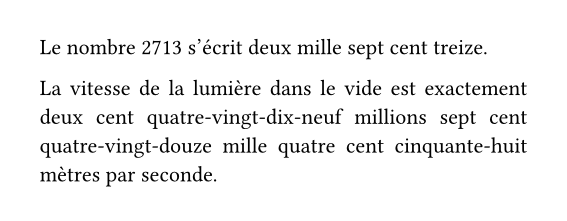

# frogst

A [typst](https://github.com/typst/typst) package for writing numbers in french.
This package deals about the literal naming of numbers in French before the 1990 orthograph reform.

## Example
```typst
#import "@preview/frogst:1.0.0": fr-nb
#set page(width: 10cm, height: auto, margin: 0.7cm)
#set par(justify: true)

Le nombre 2713 s'écrit #fr-nb(2713).

La vitesse de la lumière dans le vide est exactement #fr-nb(299792458) mètres par seconde.
```


## Future improvements
- orthorapgh of 1990 reform variant
- Swiss, Belgian, etc. variants
