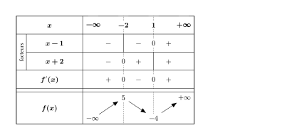
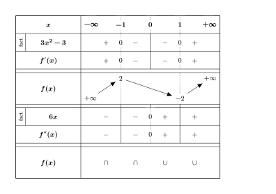
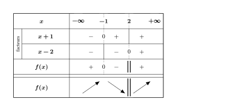
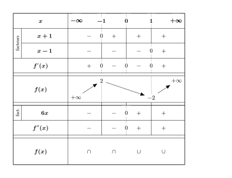
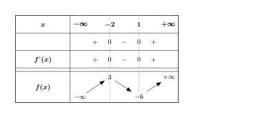
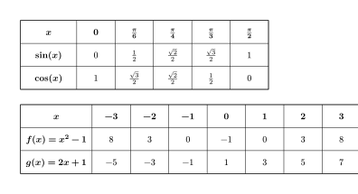

# functable

[](https://typst.app/universe/package/functable)
[](https://github.com/nathan-ed/typst-package-functable/blob/645f7014a482edd3c97059fbbb60a48c6d7b9480/docs/manual.pdf)
[](LICENSE)

Sign, variation and convexity tables in the French tkz-tab style, plus value tables (tableaux de valeurs).
Supports auto-computed signs and values from Typst functions.

| | | |
|---|---|---|
| [](gallery/sign-table.typ) | [](gallery/full-analysis.typ) | [](gallery/rational.typ) |
| Basic sign + variation | Full f'/f'' analysis | Rational function / pole |
| [](gallery/auto-sign.typ) | [](gallery/simple.typ) | [](gallery/fun-table.typ) |
| Auto-signs with `fn` | Simple (no strip) | Value table (`fun-table`) |

## Usage

```typst
#import "@preview/functable:0.1.0": sign-table, fun-table
```

### Basic sign + variation table

```typst
#sign-table(
  factors: (
    (expr: $x - 1$, zeros: ((value: $1$, approx: 1),), signs: ("-", "+")),
    (expr: $x + 2$, zeros: ((value: $-2$, approx: -2),), signs: ("-", "+")),
  ),
  summary-label: $f'(x)$,
  variation: true,
  variation-label: $f(x)$,
  start-value: $-oo$,
  end-value: $+oo$,
  variation-values: (
    (at: -2, label: $5$),
    (at:  1, label: $-4$),
  ),
)
```

### Auto-computed signs with `fn`

Provide a Typst function for each factor instead of (or in addition to) `signs`.
The sign in each interval is inferred by evaluating the function at a test point:

```typst
#sign-table(
  factors: (
    (
      expr: $x + 1$,
      zeros: ((value: $-1$, approx: -1),),
      fn: x => x + 1,   // signs inferred automatically
    ),
    (
      expr: $x - 1$,
      zeros: ((value: $1$, approx: 1),),
      fn: x => x - 1,
    ),
  ),
  summary-label: $f'(x)$,
  variation: true,
  variation-label: $f(x)$,
)
```

`signs` always takes precedence over `fn` if both are provided. Return `none` from `fn`
to mark an interval as HD (hors-domaine):

```typst
fn: x => if x <= 0 { none } else { 1 / (2 * calc.sqrt(x)) }
```

### Full analysis table (f' + variation + f'' + convexity)

```typst
#sign-table(
  factors: (
    (expr: $3x^2 - 3$, zeros: (
      (value: $-1$, approx: -1),
      (value: $1$,  approx:  1),
    ), signs: ("+", "-", "+")),
  ),
  summary-label: $f'(x)$,
  variation: true,
  variation-label: $f(x)$,
  start-value: $+oo$,
  end-value: $+oo$,
  variation-values: (
    (at: -1, label: $2$),
    (at:  1, label: $-2$),
  ),
  second-factors: (
    (expr: $6x$, zeros: ((value: $0$, approx: 0),), signs: ("-", "+")),
  ),
  second-summary-label: $f''(x)$,
  convexity: true,
  convexity-label: $f(x)$,
)
```

### Rational function with pole (valeur interdite)

Mark a zero as `pole: true` to draw a double bar (‖) and break the variation arrows:

```typst
#sign-table(
  factors: (
    (expr: $x + 1$, zeros: ((value: $-1$, approx: -1),), signs: ("-", "+")),
    (
      expr: $x - 2$,
      zeros: ((value: $2$, approx: 2, pole: true),),
      signs: ("-", "+"),
    ),
  ),
  summary-label: $f(x)$,
  variation: true,
  variation-label: $f(x)$,
)
```

### Value table (explicit)

```typst
#fun-table(
  x-values: ($0$, $1$, $2$, $3$),
  rows: (
    (label: $f(x)$, values: ($1$, $3$, $5$, $7$)),
  ),
)
```

### Value table with auto-computed values

Provide numeric `x-values` and a `fn` closure — values are computed automatically:

```typst
#fun-table(
  x-values: (-3, -2, -1, 0, 1, 2, 3),
  rows: (
    (label: $f(x) = x^2 - 1$, fn: x => x * x - 1),
  ),
)
```

For irrational x values or custom display, use dictionary entries:

```typst
#fun-table(
  x-values: (
    (display: $-pi\/2$, value: -calc.pi / 2),
    (display: $0$,      value: 0.0),
    (display: $pi\/2$,  value: calc.pi / 2),
  ),
  rows: (
    (label: $sin(x)$, fn: x => calc.sin(x), format: x => $#str(calc.round(x, digits: 4))$),
  ),
)
```

## `sign-table` reference

| Parameter | Type | Default | Description |
|-----------|------|---------|-------------|
| `factors` | array | `()` | Factor rows for f'. Each: `(expr, zeros, signs, fn, interdit)`. |
| `summary-label` | content, none | `none` | Label for the f' summary row. |
| `variation` | bool | `false` | Show variation row with diagonal arrows. |
| `variation-label` | content, none | `none` | Label for the variation row. |
| `variation-values` | array | `()` | Values on the variation row: `(at, label, pos)`. |
| `bounds` | auto, none, dict | `auto` | Domain bounds in x header. `auto` → $-∞$/$+∞$. |
| `start-value` | content, none | `none` | Function value at left edge of variation row. |
| `start-pos` | string | `"auto"` | `"top"`, `"bottom"`, or `"auto"`. |
| `end-value` | content, none | `none` | Function value at right edge of variation row. |
| `end-pos` | string | `"auto"` | `"top"`, `"bottom"`, or `"auto"`. |
| `col-width` | length | `1.5cm` | Width of each interval column. |
| `row-height` | length | `0.9cm` | Height of sign/factor rows. |
| `var-row-height` | auto, length | `auto` | Height of variation/convexity rows. |
| `second-factors` | array | `()` | Factor rows for f''. Same structure as `factors`. |
| `second-summary-label` | content, none | `none` | Label for the f'' summary row. |
| `convexity` | bool | `false` | Show convexity row with ∪/∩ symbols. |
| `convexity-label` | content, none | `none` | Label for the convexity row. |
| `hd-fill` | color | `rgb("#cfe2f3")` | Fill color for HD bands when `hd-style: "fill"`. |
| `hd-style` | string | `"hatch"` | HD rendering: `"hatch"`, `"fill"`, or `"blank"`. |
| `show-facteurs` | bool | `true` | Show rotated "facteur(s)" strip at left. |
| `background` | color | `white` | Background for label knockout rects. Match your page/container fill. |

### Factor dictionary keys

| Key | Type | Description |
|-----|------|-------------|
| `expr` | content | Math expression for the row label. |
| `zeros` | array | Zero declarations (see below). |
| `signs` | array | `"+"`, `"-"`, `""` (blank), or `"HD"` per interval. Takes precedence over `fn`. |
| `fn` | function | `x => number` for auto-sign inference. Return `none` for HD intervals. Used when `signs` is absent. |
| `interdit` | bool | All zeros of this factor are forbidden values (shorthand for `pole: true` on each). |

### Zero dictionary keys

| Key | Type | Description |
|-----|------|-------------|
| `value` | content | Displayed label (e.g. `$sqrt(2)$`). |
| `approx` | float | Numeric approximation used for sorting and interval test points. |
| `pole` | bool | Valeur interdite — double bar ‖ in summary/variation/convexity. |
| `mark` | content, `"bar"`, `"hd"` | Custom marker in factor and summary rows. |
| `summary-mark` | content, `"bar"`, `"hd"` | Custom marker in summary row only. |

### HD intervals

Set `signs: (..., "HD", ...)` for intervals where the expression does not exist,
or return `none` from `fn`. The interval renders as a hatched band (controlled by `hd-style`).

Use `mark: "hd"` on a zero to continue the hatch **through** a boundary point (e.g. a cusp
or vertical tangent where f' is undefined but f continues), as opposed to `mark: "bar"` which
draws the asymptote double-bar.

## `fun-table` reference

| Parameter | Type | Default | Description |
|-----------|------|---------|-------------|
| `x-values` | array | `()` | x column headers. Numbers are displayed in math mode and passed to `fn`. Dictionaries `(display, value)` use custom display with numeric value. Content is display-only. |
| `x-label` | content | `$x$` | Label for the x row. |
| `rows` | array | `()` | Function rows: `(label, values?, fn?, format?)`. |
| `col-width` | length | `1.5cm` | Column width. |
| `row-height` | length | `0.9cm` | Row height. |
| `label-width` | auto, length | `auto` | Label column width; `auto` sizes to fit. |
| `stroke` | stroke | `0.5pt` | Table border and separator stroke. |
| `decimals` | auto, int | `auto` | Decimal places for computed values. `auto` trims trailing zeros. |

### Row dictionary keys

| Key | Type | Description |
|-----|------|-------------|
| `label` | content | Row label. |
| `values` | array | Explicit content cells, one per x column. Use `none` for blank. Takes precedence over `fn` for non-numeric x. |
| `fn` | function | `x => number` used when `x-values` entries are numeric. Return `none` for a blank cell. |
| `format` | function, none | `number => content` to customise how computed values render. Default: smart integer/decimal. |

## Changelog

### [0.1.0] - 2026-07-14

#### Added
- `sign-table`: sign/variation/convexity tables in the tkz-tab style
- `fun-table`: simple function value tables (tableaux de valeurs)
- `fn` parameter on factors for auto-sign inference by numeric evaluation
- `fn` parameter on `fun-table` rows for auto-computed values from numeric x-values
- HD (hors-domaine) hatching with `"hatch"`, `"fill"`, and `"blank"` styles
- Pole / valeur interdite rendering with double bars (‖) and broken arrows
- Dual f'/f'' block with convexity row (∪/∩)
- Variation arrows with auto-positioned function value labels
- Automatic zero merging across factors
- `mark: "hd"` for domain-boundary points without asymptote implication
