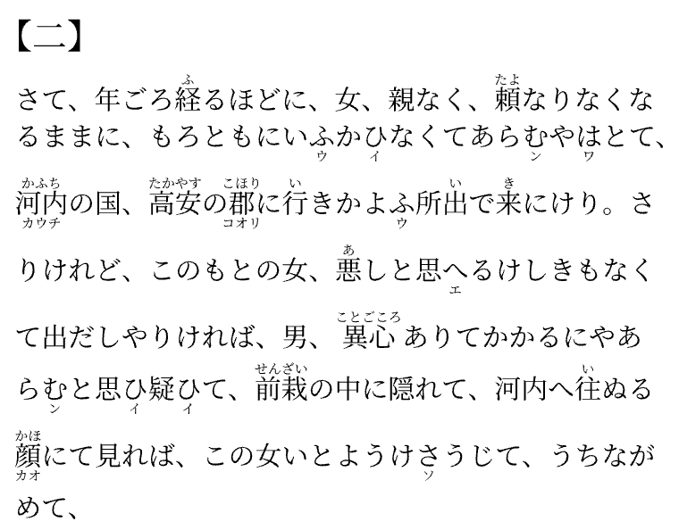

# FuriRuby

  
_Using FuriRuby, a figure showing the legacy Furigana (top) and modern pronunciation (bottom) of the classic text of Tales of Ise, episode 23._

FuriRuby allows to insert rubies into text. The rubies can be displayed simultaneously at the top and bottom of the body to correspond to the furigana display of classical Japanese text.

<br />

**Why was this made?**

In languages like Japanese that use both logograms and phonograms, a single logogram (Kanji) can often have multiple readings. Furthermore, in historical texts of these languages, the orthography (spelling) used to represent the same pronunciation may differ between the archaic and modern systems. In cases where it is necessary to represent both the archaic and modern readings simultaneously, this can be achieved by applying ruby characters both above and below the base text.

## Usage

```typ
#import "@preview/furiruby:0.1.0": ruby

#ruby(
  t: [Top Ruby],
  b: [Bottom Ruby],
  rt: [Right Top Ruby],
  lt: [Left Top Ruby],
  rb: [Right Bottom Ruby],
  lb: [Left Bottom Ruby],
)[Body]
```

<br />

```typ
#import "@preview/furiruby:0.1.0": (ruby, rt)
#rt[Top Ruby][Body] is an alias of #ruby(t: [Top Ruby])[Body]
```

```typ
#import "@preview/furiruby:0.1.0": (ruby, rb)
#rb[Bottom Ruby][Body] is an alias of #ruby(b: [Bottom Ruby])[Body]
```

```typ
#import "@preview/furiruby:0.1.0": (ruby, rrt)
#rrt[Right Top Ruby][Body] is an alias of #ruby(rt: [Right Top Ruby])[Body]
```

```typ
#import "@preview/furiruby:0.1.0": (ruby, rlt)
#rlt[Left Top Ruby][Body] is an alias of #ruby(lt: [Left Top Ruby])[Body]
```

```typ
#import "@preview/furiruby:0.1.0": (ruby, rrb)
#rrb[Right Bottom Ruby][Body] is an alias of #ruby(rb: [Right Bottom Ruby])[Body]
```

```typ
#import "@preview/furiruby:0.1.0": (ruby, rlb)
#rlb[Left Bottom Ruby][Body] is an alias of #ruby(lb: [Left Bottom Ruby])[Body]
```

### Options

```typ
#ruby(layout: (
  inline-mode: "expand" | "float",
))[Expand is a default value]

#let ruby = ruby.with(layout: (inline-mode: "float",))
```
