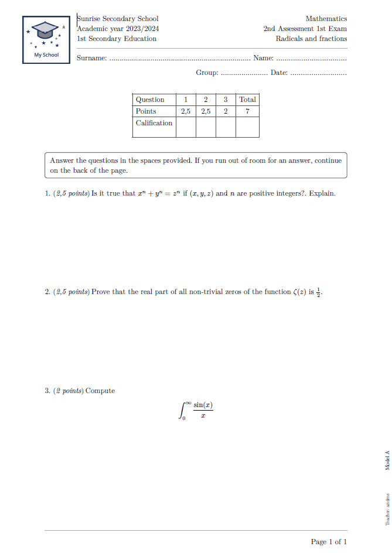

# g-exam 

This template provides a way to generate exams. You can create questions and sub-questions, header with information about the academic center, score box, subject, exam, header with student information, clarifications, solutions, watermark with information about the exam model and teacher.

#### Features 

- Scoreboard.
- Scoring by questions and subquestions.
- Student information, on the first page or on all odd pages.
- Question and subcuestion.
- Show solutions and clarifications
- List of clarifications.
- Teacher's Watermark
- Exam Model Watermark

## Usage 

For information, see the [manual](https://github.com/MatheSchool/typst-g-exam/blob/master/doc/g-exam-manual.pdf?raw=true). 

To use this package, simply add the following code to your document:

## Examples 



### Minimal Example

```typ
#import "@preview/g-exam:0.3.0": *

#show: g-exam.with(
    #g-question(point: 2)[List prime numbers]
    #v(1fr)

    #g-question(point: 2)[Complete the following sentences]
      #g-subquestion[Don Quixote was written by ...]
      #v(1fr)
      
      #g-subquestion[The name of the continent we live on is ...]
      #v(1fr)
)
```

## Changelog

### v0.3.0

- Include parameter question-text-parameters.
- Show solution.
- Expand documentation.
- Possibility of estrablecer question-point-position to none.
- Bug fix show watermark.

### v0.2.0

- Control the size of the logo image.
- Convert to template
- Allow true and false values in show-studen-data.
- Show clarifications.
- Widen margin points.
- Show solution.

### v0.1.1

- Fix loading image.

### v0.1.0

- Initial version submitted to typst/packages.
