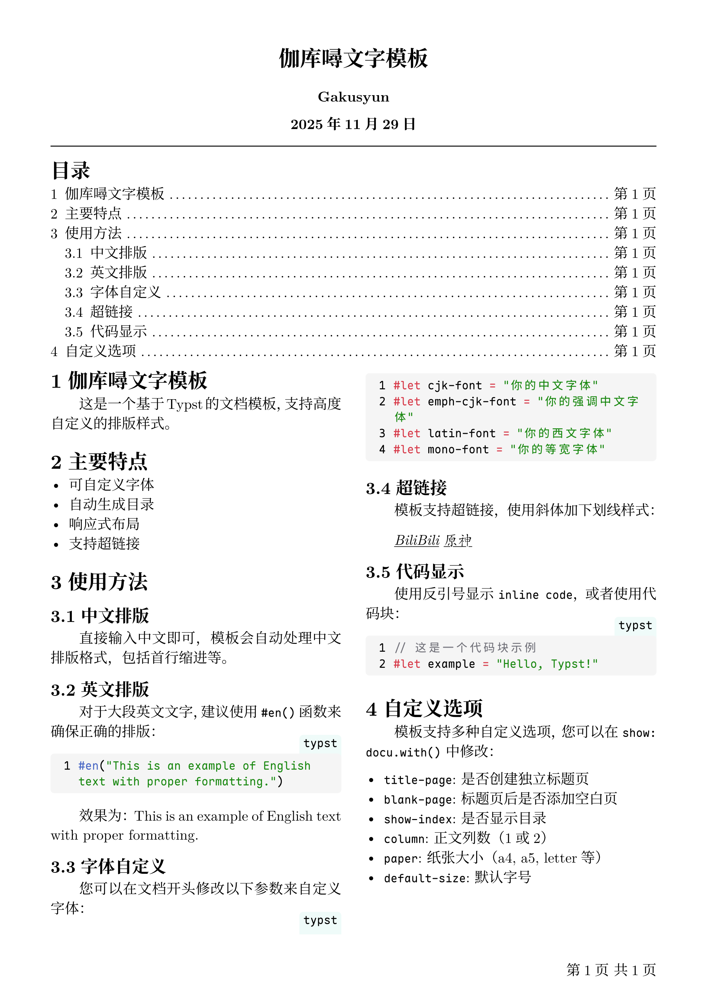

# 伽库噚文字模板

[English](README.md) 简体中文

一个专为中文排版设计的Typst文档模板，适合快速开始记录，也提供了高度自定义的参数设置。

## 使用方法

通过以下命令使用此模板：

```bash
typst init @preview/gakusyun-doc:1.0.0
```

然后在Typst中打开生成的项目即可开始编写

## 快速开始

### 基本使用

模板已经预配置了常用的设置，您只用在文档前添加下面内容，便可以开始编写内容：

```
#import "@preview/gakusyun-doc:1.0.0": *
#show: docu.with(
  title: "文档标题",
  author: "作者",
)
```

## 参数说明

- `title`: 标题
- `subtitle`: 副标题
- `author`: 作者，支持使用数组 `("author1", "author2")` 来设置多位作者

### 字体设置

- `cjk-font`: 中文字体名称
- `emph-cjk-font`: 中文强调字体（斜体等），默认是楷体
- `latin-font`: 西文字体名称
- `mono-font`: 等宽字体名称
- `default-size`: 默认字号，支持中文字号（小四、五号等）

### 页面设置

- `paper`: 纸张大小（a4、a5、letter等）
- `column`: 正文栏数（1或2）

### 文档结构

- `title-page`: 是否创建独立标题页
- `blank-page`: 标题页后是否添加空白页
- `show-index`: 是否显示目录
- `index-page`: 目录是否在新页面开始
- `column-of-index`: 目录栏数

## 英文排版

对于英文内容，建议使用 `#en()` 函数：

```
#en("This is English text with proper formatting.")
```

这样可以确保英文内容的正确排版。

## 示例效果



## 许可证

本项目采用 [MIT](LICENSE) 许可证。

## 贡献

欢迎提交问题报告和功能建议。如果您想贡献代码，请：

1. Fork 本项目
2. 创建功能分支
3. 提交更改
4. 创建 Pull Request